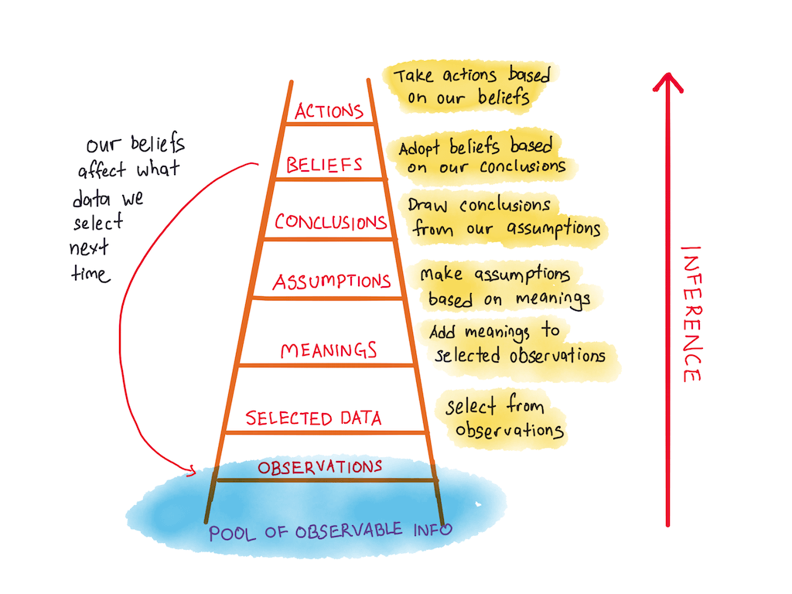

---
layout:
  width: default
  title:
    visible: true
  description:
    visible: true
  tableOfContents:
    visible: true
  outline:
    visible: false
  pagination:
    visible: true
  metadata:
    visible: true
---

# Ladder of Inference

<figure><figcaption>
Image by <a href="https://www.holistics.io/blog/ladder-of-inference-communicating-analytics/">Holistics</a>
</figcaption></figure>

The Ladder of Inference, a conceptual model developed by organisational psychologist Chris Argyris, illustrates the rapid, often unconscious, mental path people ascend from raw observation to action. It explains how personal experiences and beliefs can lead individuals to quickly jump to conclusions, a process that frequently results in flawed decisions or misunderstandings. The model is essentially a framework for reflective practice, designed to make one's own thinking process visible and challengeable.

The process is depicted as a ladder with several ascending rungs. It begins at the bottom with the pool of Observable Data and Experiences, which represents the objective reality of a situation. The first upward step involves Selecting Data, where the mind, constrained by its inability to process everything, filters the information and chooses what to focus on, a selection inherently guided by existing beliefs and past experiences. Next, the selected data is Interpreted and assigned a meaning based on one's own cultural, emotional, and historical context. Climbing higher, the individual makes Assumptions about the situation, which then solidify into Conclusions. These conclusions, once drawn, are used to reinforce or adjust one's deeply held Beliefs about the world. Finally, an Action is taken that is deemed correct based on this self-constructed belief system. The model highlights a reflexive loop, wherein established beliefs influence the initial selection of data, creating a self-reinforcing cycle that insulates the individual from alternative interpretations of reality. To use the tool effectively, one must consciously slow down and work back down the ladder, examining the data, assumptions, and meanings applied to ensure conclusions are grounded in objective facts rather than unchallenged inference.


















