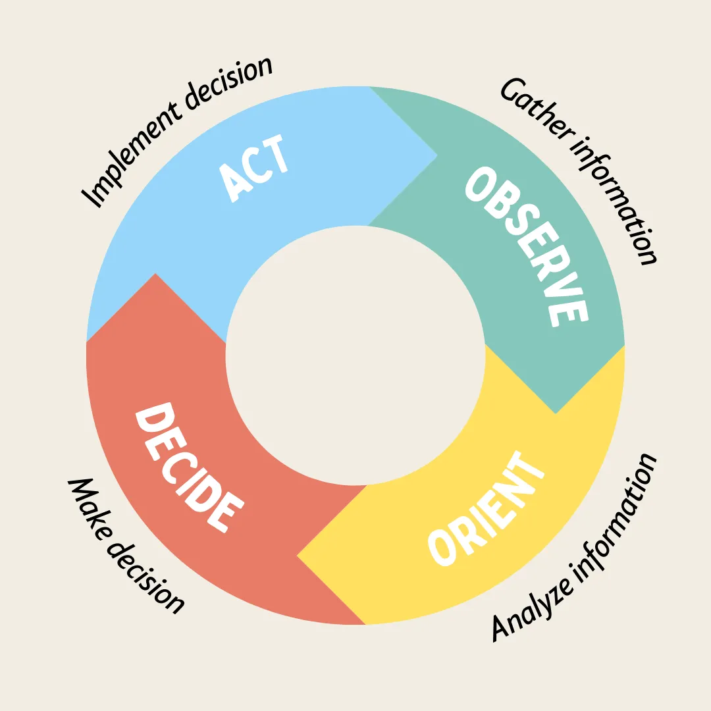

# OODA Loop

<figure><figcaption>
Image by <a href="https://medium.com/illumination/10-powerful-leadership-tools-that-will-put-you-in-top-gear-a449181a9d47">Gaurav Jain</a>
</figcaption></figure>

The OODA Loop, a decision-making framework, is a cycle of four stages: observe, orient, decide, and act. It's a way to navigate complex and rapidly changing situations effectively.

#### 1. Observe

You start by observing your surroundings, gathering information, and paying attention to what's happening.

#### 2. Orient

Then, you orient yourself, making sense of the information you've gathered, understanding the context, and identifying potential opportunities or threats.

#### 3. Decide

Next, you decide on a course of action based on your understanding of the situation.

#### 4. Act

Finally, you act on your decision, implementing your plan and taking the necessary steps. The key to the OODA Loop is its cyclical nature.

After acting, you return to the observation stage, assessing the results of your actions, gathering new information, and adjusting your plan as needed. This continuous cycle allows you to adapt to changing circumstances, respond quickly, and maintain an advantage over your opponents or challenges.

#### Further Reading














