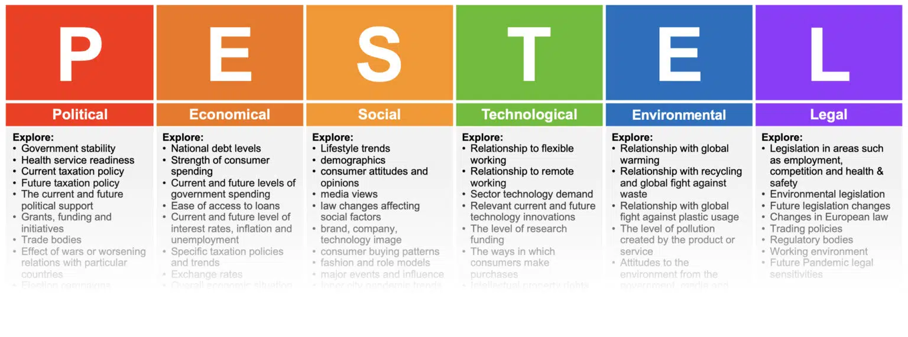

# PESTLE Analysis

<figure><figcaption>
Image by <a href="https://www.linkedin.com/pulse/pestle-analysis-saleh-zeer-k7mxf/">Saleh Zeer</a>
</figcaption></figure>

PESTLE Analysis is a widely-used strategic framework for auditing the macro-environmental external factors that influence an organization or business decision. The acronym P.E.S.T.L.E. stands for Political, Economic, Social, Technological, Legal, and Environmental, each representing a broad category of forces that are generally outside of an organization's direct control.&#x20;

The goal of this analytical tool is to provide a comprehensive, structured understanding of the external landscape, enabling better strategic planning, decision-making, and risk management.

The process functions by systematically examining the relevant current and future factors within each of the six domains. Political factors involve the influence of government policy and political stability, such as tax laws, trade tariffs, and political climate. Economic factors concern the local, national, and global economy, including interest rates, inflation, economic growth trends, and consumer disposable income.&#x20;

Social factors relate to the shared values, beliefs, attitudes, and demographics of the population, such as cultural trends, health consciousness, and population growth rate. Technological factors focus on the rate of innovation, research and development, automation, and how emerging technologies may create new opportunities or disruptions.&#x20;

Legal factors involve the laws and regulatory requirements that affect operations, like labour laws, consumer protection acts, and industry-specific regulations. Finally, Environmental factors consider ecological and environmental aspects, such as sustainability, climate change, pollution targets, and ethical sourcing.&#x20;

By gathering and analysing data for each of these areas, organisations can identify potential threats to mitigate and opportunities to capitalise on, thereby informing the external half of a subsequent SWOT analysis.

#### Further Viewing





#### Further Reading








