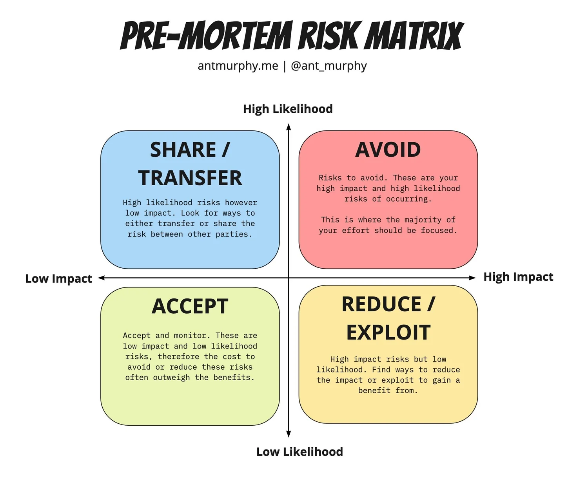

# Pre-Mortem

<figure><figcaption>
Image by <a href="https://www.antmurphy.me/newsletter/2023/4/13/pre-mortems">Ant Murphy</a>
</figcaption></figure>

The Pre-Mortem is a foresight strategy, typically employed in planning phases for projects in software design, product development, and other fields, designed to anticipate and neutralise potential failures before the work even begins. Unlike a post-mortem, which is a retrospective analysis performed after a project has already failed, the pre-mortem proactively leverages "prospective hindsight" to enhance decision-making and reduce overconfidence.

The technique operates by assembling the project team, key stakeholders, and relevant subject matter experts and asking them to engage in a mental exercise, imagining that the project, product launch, or design initiative has failed spectacularly in the future, often six or twelve months out. This shared vision of failure is crucial, creating a safe space for dissent and encouraging individuals to identify potential causes of the disaster that they might otherwise be reluctant to mention. Participants are then asked to individually and privately generate a list of all plausible reasons, technical, organisational, market-related, or otherwise, that could have led to this failure. The collected reasons for the hypothetical failure are then discussed openly, grouped by themes, and prioritised based on their likelihood and potential impact. Following this brainstorming and prioritisation, the final step involves integrating these findings back into the current project plan. This translates the identified risks into concrete mitigation strategies and contingency plans, with assigned ownership and deadlines, effectively strengthening the overall design and development approach before the first line of code is written or the first feature is finalised.
















