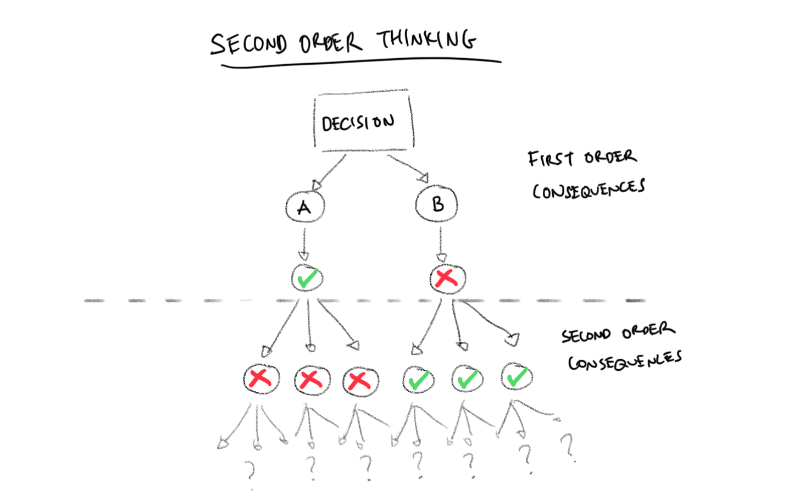

# Second-order Thinking

<figure><figcaption>
Image by <a href="https://mannhowie.com/second-order-thinking">Howie Mann</a>
</figcaption></figure>

Second-order thinking is the practice of considering the long-term consequences of a decision, rather than just the immediate effects. It involves thinking beyond the first-order consequences, which are the most obvious and immediate results of an action, to the second-order consequences, which are the less obvious and often unintended consequences that may arise later.

For example, if you're considering quitting your job to start your own business, first-order thinking would focus on the immediate benefits, such as increased freedom and the potential for higher earnings. Second-order thinking, on the other hand, would also consider the potential drawbacks, such as the risk of financial instability and the loss of job security.

Second-order thinking is a valuable skill that can help you make better decisions in all areas of your life. It can help you avoid making mistakes that you may later regret, and it can help you achieve your long-term goals.

#### Further Reading














