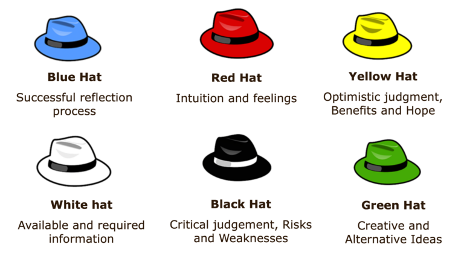

# Six Thinking Hats

<figure><figcaption>
Image by <a href="https://mycoachingtoolkit.com/how-to-use-the-bono-six-thinking-hats-technique-in-your-coaching-practice/">My Coaching Toolkit</a>
</figcaption></figure>

The Six Thinking Hats is a powerful, parallel thinking technique, developed by Dr Edward de Bono, designed to improve the effectiveness of group discussion and individual thought by separating out different modes of thinking.&#x20;

The method provides a means for groups to switch their thinking focus deliberately and simultaneously, ensuring that all aspects of a problem or idea are explored without the interference of emotional reactions or premature judgment.

The technique works by assigning a different coloured, metaphorical hat to each of six distinct thinking styles, which participants are asked to adopt in sequence.&#x20;

* The **White Hat** calls for a focus purely on objective facts, figures, and existing data, remaining neutral and impartial.&#x20;
* The **Red Hat** allows for the expression of feelings, intuition, and emotions without the need for justification or logic.&#x20;
* The **Black Hat** represents caution and critical judgment, identifying potential risks, problems, and why an idea may not work.&#x20;
* The **Yellow Hat** is optimistic, focusing on the positive aspects, benefits, and value of an idea, highlighting feasibility and opportunity.&#x20;
* The **Green Hat** is creative, encouraging the generation of new ideas, alternatives, and possibilities, promoting deliberate change.&#x20;
* Finally, the **Blue Hat** serves as the control and process management, defining the thinking sequence, managing the discussion, and summarising the group's findings.

By imposing a structure where everyone "wears" the same colour hat at the same time, the method ensures comprehensive exploration and prevents the chaos often caused by individuals thinking in different modes simultaneously.

#### Further Reading










