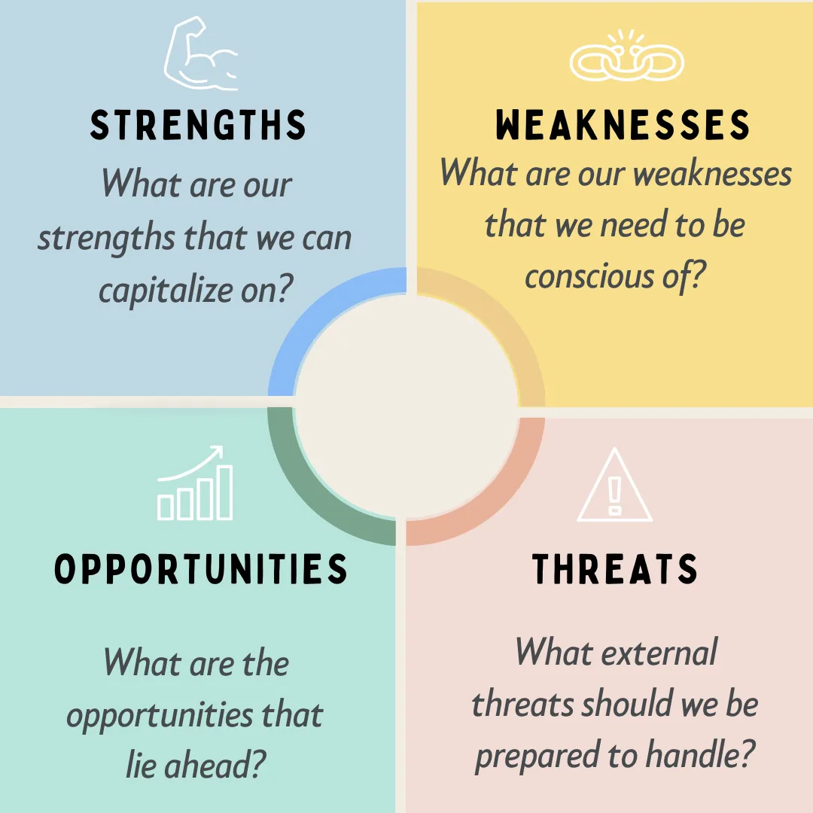

# SWOT Analysis

<figure><figcaption>
Image by <a href="https://medium.com/illumination/10-powerful-leadership-tools-that-will-put-you-in-top-gear-a449181a9d47">Gaurav Jain</a>
</figcaption></figure>

### Overview

A SWOT Analysis is a strategic framework used to evaluate the Strengths, Weaknesses, Opportunities, and Threats of a business, product, or project. It identifies internal and external factors that influence decision-making, goal setting, and strategic planning. This tool is widely used across various business functions, including design, to align efforts with the competitive landscape.

A SWOT analysis can help pinpoint strengths and opportunities that can lead to design innovations, helping differentiate products in the market. It also highlights weaknesses and threats, enabling proactive responses to market challenges such as emerging competitors or shifts in consumer preferences.

By regularly applying a SWOT analysis, design managers can make informed decisions, understand the factors shaping their design strategy, and create stronger plans for their teams and products. Revisiting the analysis regularly ensures adaptability and keeps the strategy responsive to internal and external changes.

**1. Strengths**

Strengths refer to the internal factors that give your design team or project a competitive advantage. These could include:

* **Strong Design Capabilities**: High-quality design skills within the team, such as expertise in UI/UX design, prototyping, or design systems.
* **Resource Availability**: Access to strong tools, technologies, or cross-functional teams that help elevate the design process.
* **Brand Reputation**: The design team's ability to deliver results that align with or enhance the company’s brand values and goals.

_Example for design teams_: Your team has extensive experience with responsive design, enabling fast adaptation to new devices and platforms.

**2. Weaknesses**

Weaknesses are internal limitations that might hinder the effectiveness of your design efforts. These could include:

* **Lack of Design Resources**: Limited access to design tools, software, or time to iterate and test designs.
* **Skill Gaps**: Areas where the team might lack expertise, whether in specific design methods or technologies.
* **Communication Issues**: Challenges in collaborating with other departments, such as development or marketing, which can lead to misaligned expectations.

_Example for design teams_: There might be limited knowledge of accessibility standards, which could lead to designs that aren’t fully inclusive.

**3. Opportunities**

Opportunities are external factors or trends that your design team can capitalise on to improve its work or gain a competitive advantage. These might include:

* **Emerging Design Trends**: New trends in UX, interaction design, or visual design that could enhance the user experience and align with market demands.
* **Technological Advances**: New software, tools, or technologies that could improve the efficiency or creativity of your team's output.
* **Market Changes**: A shift in consumer behaviour or needs that opens up opportunities for designing new features or products.

_Example for design teams_: The rise of AI tools offers an opportunity to improve prototyping efficiency or personalise user experiences.

**4. Threats**

Threats are external factors that could negatively impact your design efforts or the success of your product. These might include:

* **Competitive Pressure**: Competitors who are offering superior designs or user experiences, potentially leading to loss of market share.
* **Changing Consumer Preferences**: A shift in what users expect or value, which may make your current designs less relevant.
* **Resource Constraints**: External factors like budget cuts or staffing shortages that affect the team’s ability to deliver high-quality designs on time.

_Example for design teams_: Competitors introducing new design elements that resonate more with your target audience.

### Applications in Design

As a design manager, you can use SWOT analysis in several key ways:

1. **Assess Design Projects**: Before starting a new design project, conduct a SWOT analysis to evaluate what strengths you can leverage, what weaknesses you need to address, and where the opportunities and threats lie. This will provide clarity on how to approach the project effectively.
2. **Team Health Check**: Conduct SWOT analyses regularly to assess your team's dynamics, growth, and challenges. This can help in making decisions around professional development, hiring, or reallocating resources.
3. **Strategy Planning**: When setting strategic goals or deciding on future design directions, use SWOT to ensure that your approach takes full advantage of strengths and opportunities, while mitigating weaknesses and threats.

### SWOT Example

Let's say you're preparing for a Design Sprint. Before the sprint begins, use SWOT to clarify the following:

* **Strengths**: Does your team have a deep understanding of the target audience? Do you have a solid design system in place?
* **Weaknesses**: Are there any areas of the problem you don't fully understand yet? Are there missing resources, like user research?
* **Opportunities**: Are there new technologies or tools you could use during the sprint to accelerate prototyping?
* **Threats**: Could tight deadlines impact your team's ability to iterate on designs properly? Are competitors moving quickly with similar solutions?

By addressing these factors, you can approach the sprint more confidently, knowing the potential challenges and opportunities you’ll encounter.

### How to Conduct a SWOT Analysis

_A Step-by-Step Guide_

#### **Step 1: Set Clear Objectives for the SWOT Analysis**

Start by defining the purpose of the analysis. Determine what you are analysing — is it a particular project, a team, a business strategy, or the organisation as a whole? Having clear objectives ensures that you stay focused on the relevant factors.

_Example_: Are you analysing your company's overall strategy, a new product launch, or your team's performance?

#### **Step 2: Gather Relevant Data and Stakeholder Input**

Collect insights from a variety of sources to ensure your SWOT analysis is well-rounded. Speak to key stakeholders and team members, review data, and consider external factors. Sources could include:

* **Internal stakeholders**: Employees, managers, departments.
* **External stakeholders**: Customers, clients, suppliers.
* **External research**: Industry reports, market trends, competitive analysis.

#### **Step 3: Brainstorm Strengths**

Identify the internal Strengths — factors that give your organisation or project a competitive edge. These are the positive attributes and resources that help achieve your goals.

Questions to ask:

* What advantages do we have over others in the market?
* What resources, skills, or capabilities do we possess that others don’t?
* What do we do well that differentiates us from competitors?

Example Answers:

* Strong brand reputation and customer loyalty.
* Access to advanced technology or proprietary tools.
* A skilled and experienced workforce.

#### **Step 4: Identify Weaknesses**

Next, identify internal Weaknesses — areas where your organisation or project could improve. These are challenges or gaps that could hold you back from achieving your goals.

Questions to ask:

* What areas do we struggle with or lack expertise in?
* Where do we face inefficiencies or resource shortages?
* Are there any internal processes or systems that need improvement?

Example Answers:

* Outdated technology or infrastructure.
* Gaps in team skills or knowledge.
* Poor internal communication or coordination.

#### **Step 5: Explore Opportunities**

Look for external Opportunities — trends, changes, or conditions in the market or environment that you can leverage to your advantage. Opportunities might arise from technological advancements, shifts in customer behaviour, or market gaps.

Questions to ask:

* Are there new market trends or emerging technologies that we can use to our advantage?
* Are there untapped markets or customer segments we could target?
* What external factors could we take advantage of to grow or improve?

Example Answers:

* An increasing demand for sustainable products.
* New technologies that could improve operational efficiency.
* Expanding into new geographic regions or market segments.

#### **Step 6: Assess Threats**

Consider external Threats — factors outside your control that could negatively affect your success. These might include economic downturns, increasing competition, regulatory changes, or shifts in customer preferences.

Questions to ask:

* What external factors could harm our business or project?
* Are there any emerging competitors or disruptive innovations?
* Are there any market changes, regulations, or economic factors that could negatively impact us?

Example Answers:

* Increased competition offering lower prices or better products.
* Economic downturns affecting consumer spending.
* New regulations or policies that could increase costs or limit operations.

#### **Step 7: Map Out the SWOT Matrix**

Once you've gathered all the relevant information, create a visual SWOT matrix to organise your findings. This is typically represented as a 2x2 grid:

| **Strengths**    | **Weaknesses**    |
| ---------------- | ----------------- |
| - List strengths | - List weaknesses |

| **Opportunities**    | **Threats**    |
| -------------------- | -------------- |
| - List opportunities | - List threats |

#### **Step 8: Prioritise and Analyse the Results**

Review and prioritise each element within the SWOT matrix. Look at the factors and determine which ones will have the greatest impact on your objectives.

* **Strengths**: How can we use these strengths to our advantage? Can we exploit them to address weaknesses or capitalise on opportunities?
* **Weaknesses**: How can we address or reduce these weaknesses? Are there actions we can take to improve the situation?
* **Opportunities**: Which opportunities are the most aligned with our goals, and how can we act on them?
* **Threats**: What external threats need to be monitored, and how can we mitigate their impact?

This analysis will help you identify key areas to focus on and build a strategy around your findings.

#### **Step 9: Develop an Action Plan**

Based on your analysis, create a detailed action plan. Outline the steps needed to:

* **Leverage strengths** to maximise potential outcomes.
* **Address weaknesses** by improving processes or acquiring new resources.
* **Take advantage of opportunities** that align with your objectives.
* **Mitigate threats** by preparing contingency plans or strategic moves.

Ensure that the action plan is clear, actionable, and prioritised.

#### **Step 10: Monitor and Update Regularly**

SWOT is not a one-off exercise. As conditions change, both internally and externally, it’s essential to revisit and update the SWOT analysis regularly. This allows you to adapt your strategy and respond to new challenges and opportunities as they arise.

### Further Viewing



### Further Reading








