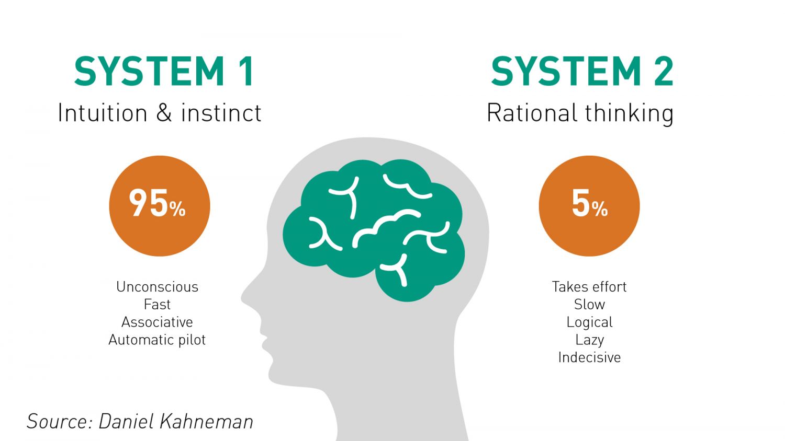

# System 1 & System 2 Thinking

<figure><figcaption>
Image by <a href="https://www.rogerleishman.com/2017/12/thing1.html">Reachfar</a>
</figcaption></figure>

Imagine your mind as a bustling city with two primary systems working in tandem.

**System 1**, the fast and intuitive thinker, operates automatically, making snap judgments and quick decisions. It's the system that recognises faces, understands simple sentences, and reacts instinctively to threats.

**System 2**, on the other hand, the slow and deliberate thinker, is responsible for focused attention, complex calculations, and logical reasoning. It's the system we engage when solving puzzles, making important decisions, or learning new skills. While System 1 often guides our everyday actions, it's crucial to recognise its limitations and to rely on System 2 when necessary to avoid errors and biases.

#### Further Reading




