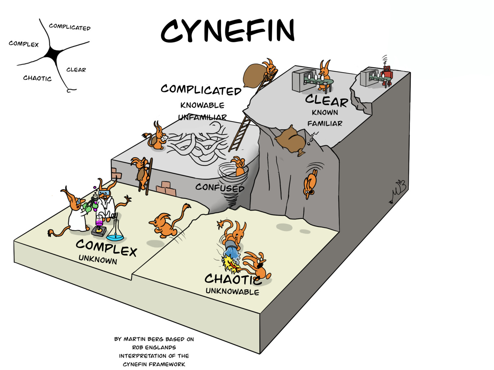

# The Cynefin Framework

<figure><figcaption>
Image by <a href="https://www.vige.se/blog/2020/6/20/cynefinvige">Martin Berg &#x26; Rob Englands</a>
</figcaption></figure>

The Cynefin (ke-nev-in) Framework is a valuable tool for understanding the nature of a situation and selecting the appropriate response. By recognising the domain of a situation, decision-makers can avoid common pitfalls, such as applying simple solutions to complex problems or overcomplicating straightforward issues.

<figure><figcaption>
Image by <a href="https://thecynefin.co/about-us/about-cynefin-framework/">The Cynefin Co</a>
</figcaption></figure>

The Cynefin Framework empowers individuals and organisations to make more informed and effective decisions and distinguishes between five domains:

1. **Clear**\
   In clear situations, cause and effect are obvious. Best practices and established procedures are sufficient to handle them.
2. **Complicated**\
   Complicated situations, while having known causes, offer multiple possible solutions. Experts can analyse the situation and determine the optimal course of action.
3. **Complex**\
   Complex situations lack clear cause-and-effect relationships. Experimentation and learning are essential to uncover underlying patterns and develop effective solutions.
4. **Chaotic**\
   Chaotic situations are characterised by high uncertainty and rapid change. Immediate action is necessary to stabilise the situation and prevent further deterioration.
5. **Disorder**\
   Disorder is the initial state of a situation, where its nature is unclear. Sense-making is required to categorise the situation into one of the other four domains.

#### Further Viewing



#### Further Reading








