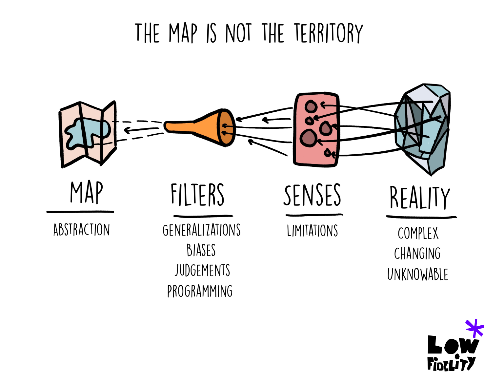

# The Map Is Not the Territory

<figure><figcaption>
Image by <a href="https://www.lowfidelity.io/p/the-map-is-not-the-territory">Low Fidelity</a>
</figcaption></figure>

"The Map Is Not the Territory" is a concept that has its roots in philosophy and science, reminding us that any plan or model we create is, by nature, an abstraction. No matter how detailed a map may seem, it can never fully capture the complexities of the real landscape.&#x20;

Similarly, when we plan strategies or frameworks, we're crafting a simplified version of reality, something that helps us navigate but doesn’t encompass all that’s actually there. This perspective offers a useful way to approach planning, as it highlights both the strengths and limitations of strategic thinking.

> "A map is not the territory it represents, but if correct, it has a similar structure to the territory, which accounts for its usefulness." — Alfred Korzybski, father of general semantics.

When we develop a strategy, we're effectively mapping out a course. We analyse data, anticipate challenges, and outline a path that will ideally lead to a successful outcome. However, like a map, a strategy is always a step removed from the reality it's meant to guide us through. Factors in the real world are constantly shifting, from market conditions to customer behaviour, and unexpected variables can emerge at any time.&#x20;

Even the best-laid plans may fall short because they can’t account for every single nuance of a live environment. This is the core message of "The Map Is Not the Territory", that no plan can wholly reflect the unpredictable nature of reality.

This idea doesn't mean that planning isn't valuable; it simply encourages flexibility. The process of making a map or a strategy has its own intrinsic worth. In creating a plan, we're forced to organise information, clarify our intentions, and understand our goals better.&#x20;

The plan becomes a tool for initial guidance, giving us a way to communicate a shared vision and bring people onto the same page. But when we start executing that strategy, we have to remain open to adapting as real-world conditions reveal themselves. We can use our strategy as a starting point, but the willingness to pivot based on real-time insights is essential.

The phrase "Well-planned strategies are still only an approximation of reality" serves as a reminder that good planning is about laying a foundation rather than defining an unchanging path.&#x20;

A map might show us the general direction, but it doesn't necessarily reflect all the details along the way, like sudden detours or unexpected roadblocks. In practice, this means that effective strategy requires an ongoing process of observation and adjustment. Being adaptable helps leaders and teams remain resilient, able to respond to opportunities or challenges as they appear.

In some ways, this approach fosters humility, encouraging us to accept that we may not know everything from the start. It's easy to fall into the trap of believing that a carefully constructed strategy is invincible. However, recognising the limitations of any plan can be freeing.&#x20;

We can put in the best possible preparation, but then remain open to the insights that come from actual experience. This approach helps prevent rigid thinking and allows us to stay grounded in the present, ready to respond to what is happening rather than what we anticipated might happen.

"The Map Is Not the Territory" teaches us the value of strategic planning while also underscoring the importance of adaptability. When we embrace this mindset, we're better equipped to navigate complexity and uncertainty.&#x20;

Our strategies become guides rather than strict instructions, empowering us to move forward confidently while still allowing space for real-world dynamics to shape our journey. In this way, we're able to honour the careful work that goes into planning without becoming overly attached to a version of reality that may, in the end, be only an approximation.

#### Further Reading










