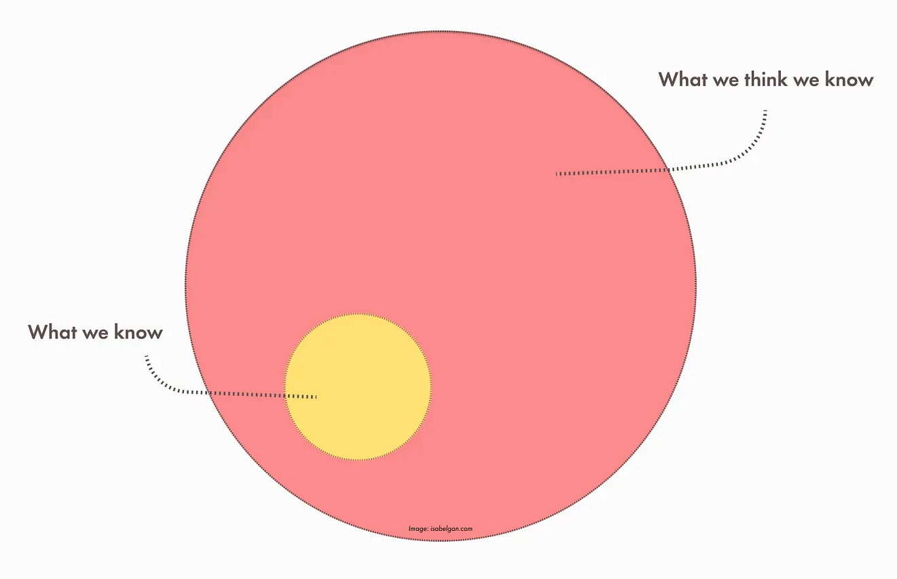

# Circle of Competence

<figure><figcaption>
Image by <a href="https://medium.com/mental-models-product/mental-models-product-3-circle-of-competence-898eec4b0944">Isabel Gan</a>
</figcaption></figure>

The concept of the "Circle of Competence" is a powerful mental model that helps individuals make smarter decisions by focusing on areas where they have genuine knowledge and expertise.&#x20;

Popularised by investor Warren Buffett, the idea is simple yet profound: each person has a unique set of skills and knowledge, and by staying within this “circle” when making choices or investments, they’re more likely to achieve success and avoid costly mistakes.&#x20;

This approach encourages humility, self-awareness, and thoughtful consideration of one’s strengths and limitations, making it an invaluable tool for both personal and professional growth.

The Circle of Competence is essentially the boundary that defines what we know well. Within this circle, we’re able to make informed judgments because we have experience, knowledge, or insight.&#x20;

Outside of it, however, lies territory that’s unfamiliar or underdeveloped, where our understanding is likely shallow or inaccurate. For example, an expert in finance may have a solid grasp of stock markets and investment strategies but may know very little about medicine or software engineering. By staying within their circle, they can make sound decisions based on a realistic assessment of what they know, while venturing outside it may lead to poor choices due to overconfidence or lack of awareness.

This idea has clear relevance in the world of investing, where even seasoned investors can fall prey to the allure of high-reward opportunities in fields they don’t fully understand. Warren Buffett, who uses this concept in his own investment philosophy, advises focusing on industries or companies that fall squarely within one’s area of expertise.&#x20;

For Buffett, this means avoiding industries he’s less familiar with, such as technology, even if they’re potentially profitable. Instead, he prioritises businesses he understands deeply, like consumer goods or insurance. This focus not only reduces risk but also allows for more accurate evaluations of an investment’s true value.

Beyond investing, the Circle of Competence applies broadly across life’s decisions. In a professional setting, it’s common to see individuals succeed by specialising in a field they understand well rather than trying to master everything. For instance, a designer may excel in visual design and user experience, but that doesn’t necessarily mean they’ll be equally proficient in coding or data science.&#x20;

Acknowledging this limitation allows them to focus their energy on honing the skills within their circle and to collaborate with others who complement their expertise in areas outside of it. This approach leads to higher-quality work and encourages the formation of well-rounded teams, where everyone’s strengths contribute to the collective success.

The Circle of Competence also promotes a mindset of continuous learning. While it encourages staying within one's strengths, it doesn’t imply stagnation. Instead, it suggests a balanced approach where we regularly assess the boundaries of our knowledge and make deliberate efforts to expand it where it makes sense.&#x20;

For example, a manager who recognises they lack understanding in emotional intelligence may choose to work on those skills, gradually bringing it within their circle of competence. This mindset of growth and self-improvement is key to personal and professional development, as it fosters a habit of lifelong learning while avoiding overextending into unfamiliar domains.

This mental model further teaches the importance of humility. Knowing the limits of our competence is an act of self-awareness that can prevent us from making errors rooted in overconfidence. In a fast-paced world where it can be tempting to portray ourselves as “experts” in many areas, the Circle of Competence provides a reminder that expertise is built through experience, study, and practice.&#x20;

Embracing this idea encourages us to stay grounded, seek advice from others, and avoid venturing into areas where we’re not equipped to make well-informed decisions. This kind of humility is often valued in leadership, as it not only leads to better decisions but also inspires trust and respect among colleagues.

One challenge, however, is accurately identifying where the boundaries of our circle lie. It’s common for people to overestimate their competence, especially in areas where they have surface-level knowledge. To counteract this, the Circle of Competence approach encourages frequent reflection and honest self-assessment.&#x20;

Asking questions like “How much do I really know about this?” or “Have I had enough experience to make this decision confidently?” can help clarify whether an area truly falls within one’s expertise. Seeking feedback from others and being open to constructive criticism can also help refine our understanding of where we’re genuinely competent.

Ultimately, the Circle of Competence is a model of smart decision-making based on recognising and valuing our true strengths. It allows us to leverage what we know well while minimising the risks that come with overreaching. By focusing on areas of genuine expertise, we increase our chances of success, make better-informed decisions, and develop a habit of learning that’s intentional and meaningful.&#x20;

In a world that often prizes breadth of knowledge, the Circle of Competence reminds us that depth is equally, if not more, valuable. When we operate within our circle, we bring our best to the table, making the most of what we know while remaining open to growth and collaboration.

#### Further Reading














