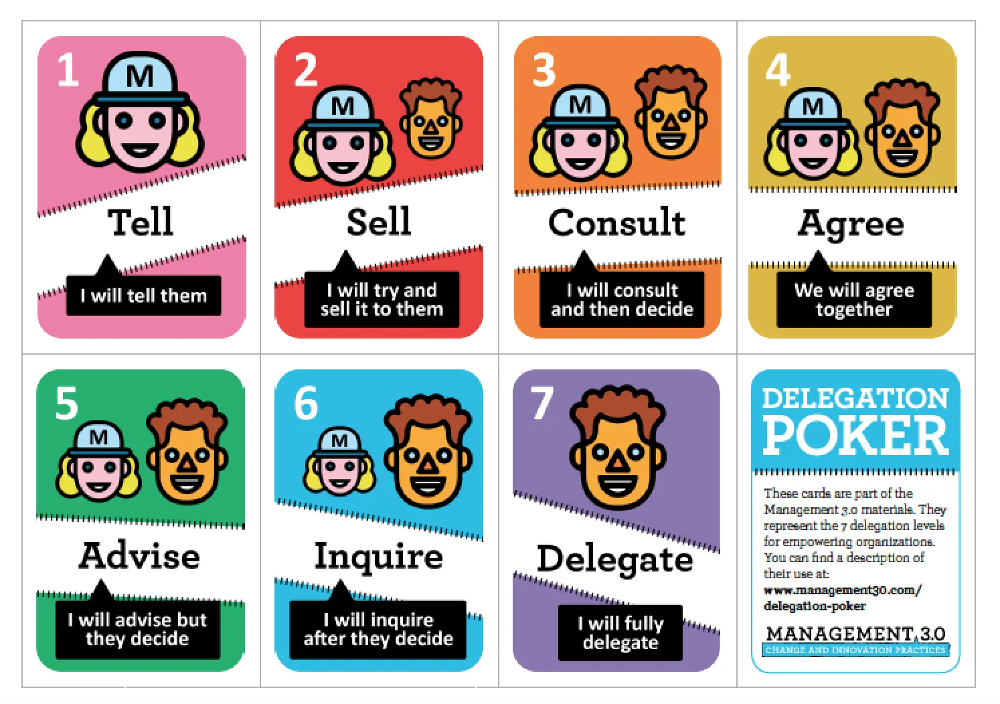

# Delegation Poker

<figure><figcaption></figcaption></figure>

Delegation Poker is an engaging management and collaboration tool, primarily associated with the [Management 3.0 framework](https://management30.com/), designed to clarify responsibilities and establish the appropriate level of decision-making authority for specific tasks or decision areas within a team.&#x20;

It operates on the principle that delegation is not a simple binary concept, but rather a spectrum of authority that should be intentionally discussed and agreed upon.

The method employs a set of cards, typically seven in number, each representing a distinct level of delegation. These levels range from complete managerial control, such as "Tell," where the manager makes the decision and simply informs the team, to full team autonomy, such as "Delegate," where the team makes the decision without consulting the manager beforehand. Intermediate levels, including "Sell," "Consult," and "Advise," chart the gradual shift of influence.

The process begins by identifying specific scenarios, decisions, or policy areas relevant to the team's work, for instance, approving vacation requests or defining project scope. For each scenario, team members, including the manager or decision-maker, privately choose the delegation card that reflects their preferred or perceived suitable level of authority.&#x20;

All players reveal their cards simultaneously. When discrepancies arise, the players who chose the highest and lowest levels of delegation are encouraged to articulate the reasoning behind their choices, fostering an open and productive discussion. The objective is to facilitate a consensus, or at least a clear agreement, on the final delegation level for that specific area. This exercise creates transparency and a shared understanding, serving to empower teams through controlled self-organisation and clarifying boundaries of decision-making power.

**Management 3.0 Framework**

Management 3.0 is a mindset, a new approach to leadership that redefines management as a shared responsibility, moving away from traditional top-down control toward a system that focuses on managing the system, not the people.&#x20;

The core idea is that organisations are complex adaptive systems where everyone's input is valued, aiming to grow the company while prioritising the happiness and engagement of its workers because motivated people create better products and services.&#x20;

This is achieved through six views of the organisation, represented by Martie the monster, which include:

1. Energise People
2. Empower Teams
3. Align Constraints
4. Develop Competence
5. Grow Structure
6. Improve Everything

All supported by a collection of practical tools, games, and practices like Delegation Poker and Kudo Cards.

#### Further Reading











#### Further Viewing


