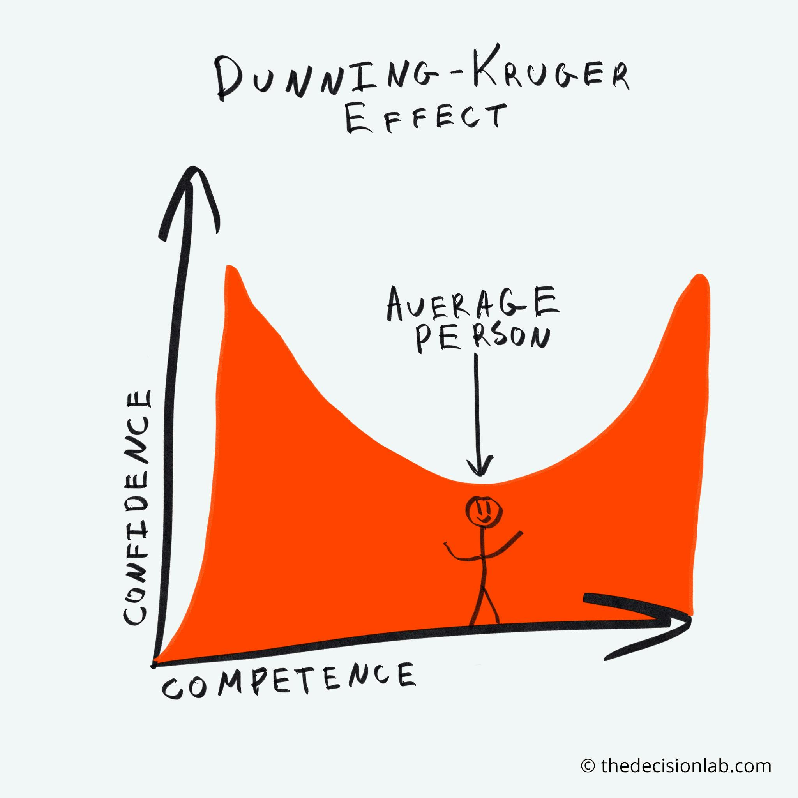

# Dunning-Kruger Effect

<figure><figcaption>
Image by <a href="https://thedecisionlab.com/biases/dunning-kruger-effect">The Decision Lab</a>
</figcaption></figure>

The Dunning-Kruger effect is a cognitive bias where people with limited knowledge or ability in a specific area greatly overestimate their own knowledge or ability. This happens because they lack the metacognitive skills to accurately assess their competence. In essence, their ignorance prevents them from recognising their own incompetence. This often leads to overconfidence and a tendency to make poor decisions or judgments.

Interestingly, the effect also suggests that those who are highly skilled in a particular area may underestimate their abilities, assuming that what is easy for them must be easy for everyone else. This double-edged phenomenon highlights the importance of humility and the value of seeking feedback and learning from others.

#### Further Reading






