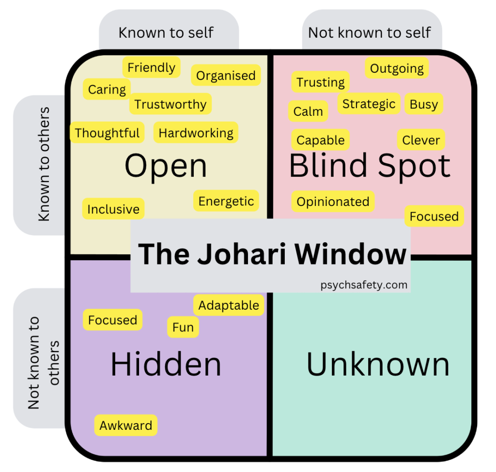

# Johari Window

<figure><figcaption>
Image by <a href="https://psychsafety.co.uk/the-johari-window/">Psych Safety</a>
</figcaption></figure>

The Johari Window is a psychological model that helps us understand how we relate to ourselves and others. By understanding these four quadrants, we can improve our self-awareness and our relationships with others.&#x20;

We can work to increase the size of our open area by sharing more about ourselves with others, and we can reduce the size of our blind area by seeking feedback from others.

It divides our personality into four quadrants:

* **Open Area**\
  This quadrant represents the aspects of ourselves that are known to both ourselves and others. These are the parts of us that we openly share with others.
* **Blind Area**\
  This quadrant represents the aspects of ourselves that others see but we are unaware of. These are often behaviours or habits that we may need to be more mindful of.
* **Hidden Area**\
  This quadrant represents the aspects of ourselves that we know but choose not to share with others. These are our private thoughts, feelings, and experiences.
* **Unknown Area**\
  This quadrant represents the aspects of ourselves that neither we nor others are aware of. These are the unconscious parts of our personality that may emerge through dreams, therapy, or other self-discovery processes.

#### Further Reading












