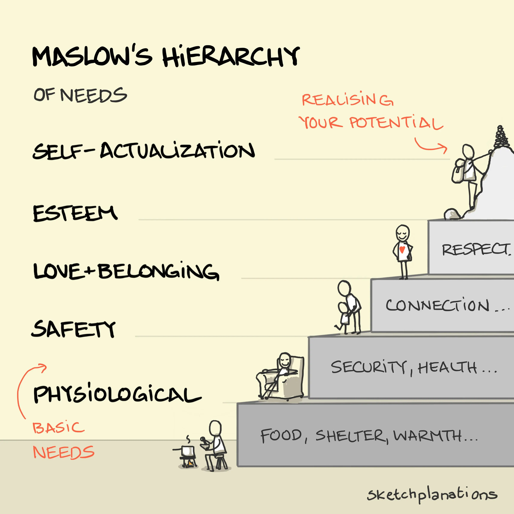

# Maslow's Hierarchy of Needs

<figure><figcaption>
Image by <a href="https://sketchplanations.com/maslows-hierarchy">Sketchplanations</a>
</figcaption></figure>

Maslow's Hierarchy of Needs is a psychological theory that suggests human motivations are organized in a hierarchical structure. At the base are physiological needs, such as food, water, and shelter, which must be satisfied before moving up the pyramid. Once these basic needs are met, safety needs, like security and stability, become important. After that, love and belonging needs, including social connections and intimacy, take precedence. With these needs satisfied, esteem needs, such as self-esteem and recognition, come into play. Finally, at the top of the pyramid is self-actualisation, the desire to reach one's full potential. This theory suggests that individuals must fulfill lower-level needs before higher-level needs can become significant motivators.

#### Further Reading








