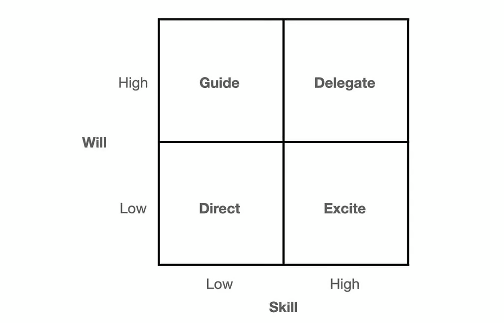

# Skill-Will Matrix

<figure><figcaption>
Image by <a href="https://simon-ash.medium.com/">Simon Ash</a>
</figcaption></figure>

The Skill-Will Matrix, made popular by Max Landsberg in The Tao of Coaching (2003), is a situational leadership model designed to help leaders adjust their approach to managing and motivating team members based on two key factors:

1. **Skill** – the individual's capability, knowledge, and competence to complete a specific task or role.
2. **Will** – the individual's level of motivation, enthusiasm, and confidence to perform that task.

By plotting team members on a matrix based on these two dimensions, leaders can tailor their management style to fit the specific needs of each person.

The matrix consists of four quadrants:

1. Low Skill / Low Will – Direct
2. High Will / Low Skill – Guide
3. Low Will / High Skill – Excite
4. High Skill / High Will – Delegate

#### 1. **Low Skill / Low Will** – **Direct**

* **Characteristics**: The person lacks both the skill to perform the task and the motivation or confidence to take it on.
* **Leadership Style**: Use a directive approach. This involves providing clear instructions, setting expectations, and closely monitoring progress. The leader needs to be hands-on to guide the individual through both developing the necessary skills and encouraging engagement.

#### 2. **High Will / Low Skill** – **Guide**

* **Characteristics**: The person is motivated and enthusiastic about the task but lacks the skills or experience to do it effectively.
* **Leadership Style**: Apply a guiding approach. The leader should focus on coaching and providing opportunities for learning while leveraging the individual's motivation. This involves offering support, answering questions, and gradually increasing the person's responsibility as their skills improve.

#### 3. **Low Will / High Skill** – **Excite**

* **Characteristics**: The individual has the skills and expertise needed to perform the task but may lack motivation or confidence.
* **Leadership Style**: The leader's role here is to re-engage and excite the person. This could involve offering praise, connecting the task to personal or professional goals, or adjusting the role to better align with the individual’s interests. The aim is to rekindle their enthusiasm for the work.

#### 4. **High Skill / High Will** – **Delegate**

* **Characteristics**: The person is both skilled and motivated to perform the task.
* **Leadership Style**: Delegation is the most appropriate approach here. The leader should trust the individual to take ownership of the task and make decisions independently. Minimal supervision is required, but the leader remains available for support if needed.

#### Application

The Skill-Will Matrix helps leaders adopt a more flexible leadership style, ensuring that their approach aligns with the team member’s current ability and motivation levels. It also encourages leaders to continuously assess and develop both skill and will to drive performance and engagement.


