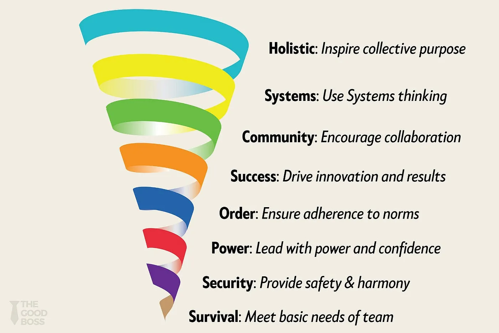

# Spiral Dynamics

<figure><figcaption>
Image by <a href="https://medium.com/the-good-boss/spiral-dynamics-the-hidden-patterns-that-shape-your-teams-behavior-44a3081bcdf9">Gaurav Jain</a>
</figcaption></figure>

Spiral Dynamics is a model of evolutionary psychology that describes the development of human consciousness, values, and cultures. Rather than viewing leadership or personality as a fixed set of traits, this framework suggests that individuals and societies navigate a series of "Value Systems" or "vMEMEs" in response to the complexity of their environment. Each level represents a distinct way of thinking, problem-solving, and perceiving the world, appearing as a colourful spectrum of human maturation.

#### The Core Philosophy

The model operates on the principle that human nature is not static. As life conditions become more complex, humans develop new psychological tools to cope. This is not a ladder where the top is "better" than the bottom; rather, it is a spiral where each new layer incorporates and transcends the previous ones. A healthy leader in this framework is "systemically fit," meaning they can communicate with and manage people residing at any level of the spiral.

#### The First Tier: Subsistence Levels

The first six stages of the spiral focus on survival, social cohesion, and individual achievement.

* **Beige (Instinctive):** Focused on biological survival and basic needs. In a modern corporate context, this is rarely seen except in cases of extreme crisis or survival.
* **Purple (Magical):** Driven by tribal safety and tradition. Leadership here is about being the "elder" or protector of the group’s rituals.
* **Red (Impulsive):** Focused on power, dominance, and immediate gratification. This manifest as the "lone wolf" or the authoritarian leader who demands absolute loyalty through strength.
* **Blue (Orderly):** Centred on discipline, morality, and the "one right way." Leadership is bureaucratic and focused on long-term stability and following the rules.
* **Orange (Achiever):** Driven by competition, success, and strategic gain. This is the dominant mode of modern capitalism, where leaders focus on meritocracy, results, and efficiency.
* **Green (Communitarian):** Focused on harmony, equality, and collective well-being. Leadership becomes facilitative and consensus-based, often prioritising the feelings of the group over raw profit.

#### The Second Tier: Being Levels

The transition to the Second Tier represents a major leap in human perspective. While First Tier levels often believe their way is the only "right" way, Second Tier thinking is multi-dimensional and integrative.

* **Yellow (Integrative):** This level values functionality and systemic flow. A Yellow leader is comfortable with chaos and focuses on how different parts of a system can work together without needing to force conformity.
* **Turquoise (Holistic):** This stage views the world as a single, interconnected organism. Leadership here is focused on global ethics and the long-term sustainability of the entire planet.

#### Leadership Application

To utilise Spiral Dynamics effectively, a leader must recognise the "centre of gravity" of their organisation. Attempting to lead a Blue (order-seeking) team with Green (consensus-based) methods often leads to confusion and a lack of direction.&#x20;

Conversely, applying Red (power-based) tactics to an Orange (achievement-based) team will likely stifle innovation and cause resentment. The goal is to provide the "next-step" challenge that allows individuals to evolve while respecting their current stage of development.

#### Further Reading


