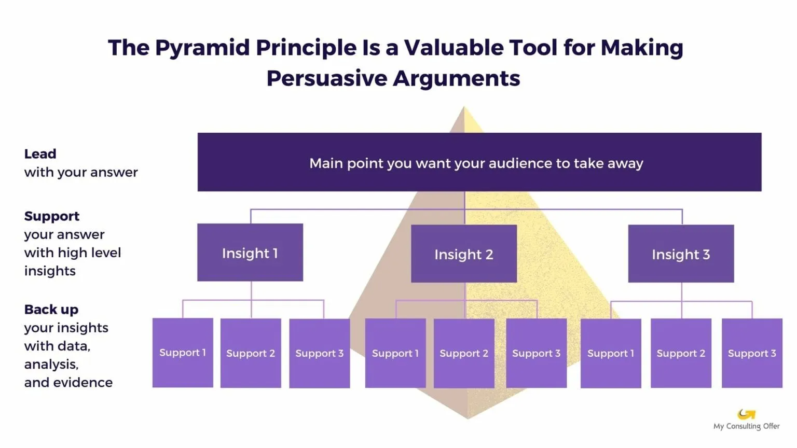
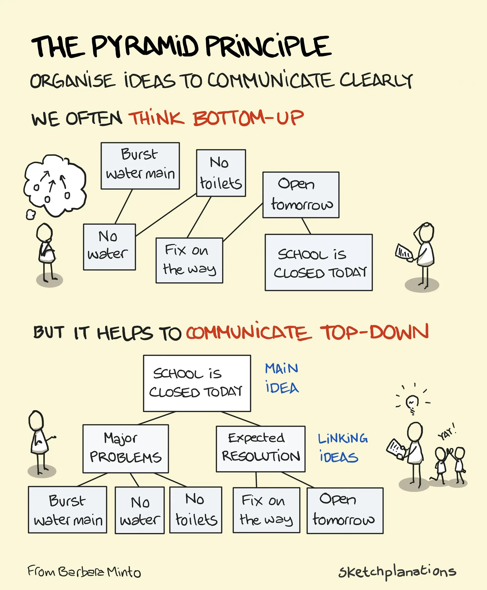

# Minto Pyramid


AKA The Pyramid Principle


<figure><figcaption>
Image by <a href="https://www.myconsultingoffer.org/case-study-interview-prep/pyramid-principle/">My Consulting Offer</a>
</figcaption></figure>

The Minto Pyramid is a communication framework that emphasises clarity and structure. It suggests organising ideas in a hierarchical structure, with the most important idea at the top and supporting details branching out below. This pyramidal structure mirrors how our minds naturally process information, making it easier to understand and remember. By starting with the main point and then gradually revealing supporting details, you ensure that your message is clear and focused. This approach is particularly useful for complex topics or when you need to persuade an audience. The Minto Principle encourages you to think critically about your ideas, identify their core message, and present it in a logical and compelling way.

<figure><figcaption>
Image by <a href="https://sketchplanations.com/the-pyramid-principle">Sketchplanations</a>
</figcaption></figure>

The Minto Pyramid and the Pyramid Principle are essentially the same concept. Both frameworks emphasise the importance of organising ideas in a hierarchical structure, starting with the main point and then progressively revealing supporting details. The goal is to present information in a clear, concise, and persuasive manner. While the specific terminology and nuances may differ slightly, the underlying principle of building a strong argument from the top down remains the same.

#### Further Reading














