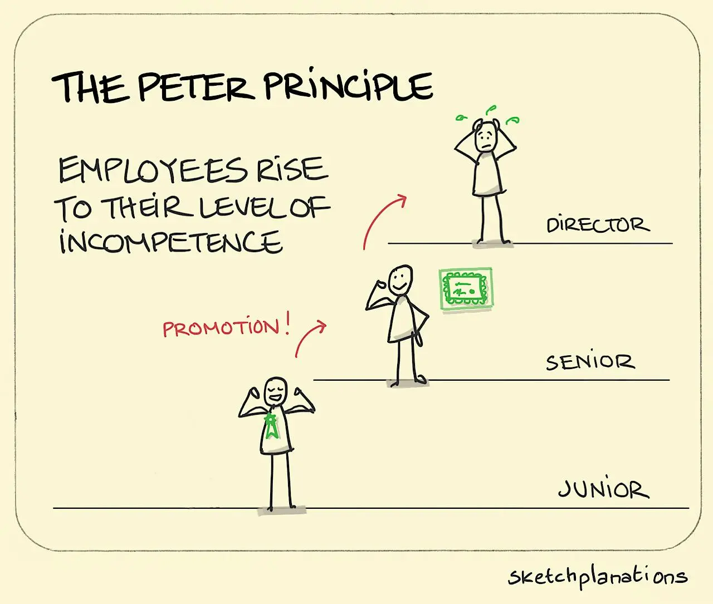

# Peter Principle

<figure><figcaption>
Image by <a href="https://sketchplanations.com/the-peter-principle">Sketchplanations</a>
</figcaption></figure>

The Peter Principle is a theory that states that employees in a hierarchical organisation tend to be promoted to their level of incompetence. In other words, individuals are promoted based on their performance in their current role, but once they reach a position where their skills are no longer sufficient, they are no longer promoted.

This principle is often used to explain why some organisations seem to have a large number of incompetent managers. It suggests that these managers were promoted to their positions because they were good at their previous jobs, but once they were in a role that required different skills, they were no longer able to perform effectively.

The Peter Principle raises some important questions about promotion policies and organisational structures. It suggests that organisations should be careful about promoting employees based solely on their performance in their current role, and that they should consider other factors, such as their potential for growth and development.

#### Further Reading








