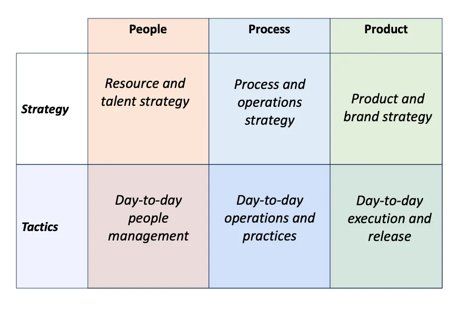

# 6 Box Framework

<figure><figcaption>
The 6-box Framework for Managers, Credit: <a href="https://medium.com/u/88b9a91000f9?source=post_page-----e6434efe06a3--------------------------------">Gaurav Jain</a>
</figcaption></figure>

The [6 Box Framework for Managers](https://medium.com/illumination/mind-boxing-how-leaders-should-spend-their-time-the-6-box-framework-e6434efe06a3) provides a structured approach for leaders to prioritise their time and maximise their impact for greater success. It focuses on three primary areas or verticals (People, Process, Product) and two layers (Tactics and Strategy).

#### The Three Verticals

* People: Building a trusting environment, fostering growth, and ensuring accountability.
* Process: Optimising efficiency, effectiveness, and decision-making.
* Product: Delivering value to customers, innovating, and staying competitive.

#### The Two Layers

* Tactics: Focusing on day-to-day operations, problem-solving, and execution.
* Strategy: Planning for the future, setting long-term goals, and anticipating trends.

#### Applying the Framework

1. Allocate Time: Determine how much time to spend on each box based on your goals and priorities.
2. Align Calendar: Ensure your tasks and meetings align with your time allocation.
3. Regular Review: Periodically reassess your allocation as priorities change.

#### Benefits

* Improve focus and efficiency.
* Enhance decision-making.
* Strengthen relationships with team members.
* Drive better results for the organisation.

#### Further Reading


