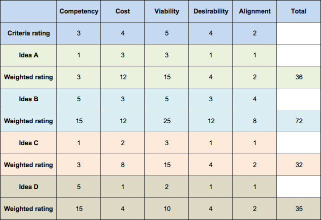

# Decision Matrix

<figure><figcaption>
Image by <a href="https://www.designorate.com/decision-matrix-decision-making/">Designorate</a>
</figcaption></figure>


AKA Pugh Matrix, Decision Grid


A Decision Matrix is a structured analytical tool designed to objectively evaluate and prioritise a set of options when the selection involves multiple, often competing, criteria. Its purpose is to guide stakeholders toward a logical, data-informed choice, thereby minimizing the influence of subjective preferences or emotional bias.

The methodology operates by translating a complex decision into a quantifiable process. The initial step involves clearly defining the problem or choice to be made, followed by listing all viable alternatives along one axis of a table, typically the rows. Next, the critical evaluation criteria, the factors truly influencing the decision, are identified and listed along the other axis, usually the columns. Since not all criteria possess equal importance, a weight is assigned to each factor, generally on a numerical scale, reflecting its relative significance to the final outcome. This weighting step is crucial, as it ensures that the most important considerations carry the greatest influence in the analysis.

Following the establishment of weights, each alternative is scored against every criterion using a consistent rating scale, for example, a one-to-five scale where a higher number denotes a better fit with the criterion. To arrive at a weighted score for each cell in the matrix, the initial rating is multiplied by the corresponding criterion's assigned weight.&#x20;

The final step involves summing the weighted scores horizontally for each alternative. The option accumulating the highest total score is theoretically the optimal choice, representing the best overall balance across all weighted criteria. This systematic decomposition and quantification of the decision-making process ensures transparency, allowing for the defence and explanation of the final selection.

#### Further Viewing





#### Further Reading










