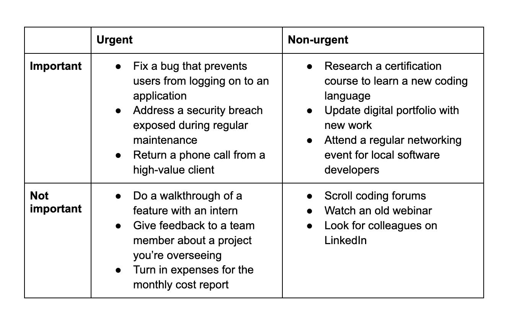

# Eisenhower Matrix

The Eisenhower Matrix is a four-square grid decision-making tool that prioritises tasks based on their urgency and importance.

|               | Urgent                                         | Not Urgent                          |
| ------------- | ---------------------------------------------- | ----------------------------------- |
| Important     | 
Do - - - -
                  | 
Schedule - - - -
 |
| Not Important | 
Delegate / Postpone - - - -
 | 
Don't Do - - - -
 |

#### 1. Urgent and important

* Do them.
* These are the tasks you need to focus on first.
* Tasks that demand immediate attention.

#### 2. Important but not urgent

* Schedule them.
* These are the tasks you should schedule for later.

#### 3. Urgent but not important

* Delegate them.
* These are tasks you should try and delegate to someone else.

#### 4. Not urgent and not important

* Don't do them.
* These are tasks you should eliminate altogether.

<figure><figcaption>
Image by <a href="https://www.notion.com/blog/eisenhower-matrix">Notion</a>
</figcaption></figure>

#### Further Reading








