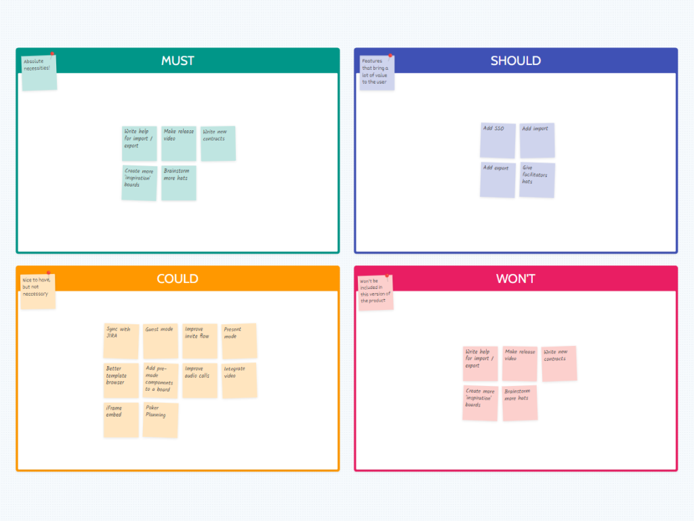

# MoSCoW Method

<figure><figcaption>
Image by <a href="https://metroretro.io/templates/product-boards/moscow-prioritization">Metro Retro</a>
</figcaption></figure>

When determining design priorities, the MoSCoW method (Must Have, Should Have, Could Have, Won't Have) is particularly useful. This method enables design managers to categorise design features based on their importance to the product and business objectives.

For example, a 'Must Have' might be an essential feature that ensures the product meets market standards, while a 'Could Have' might be a feature that enhances the user experience but isn't critical to the product’s core function.

This structured prioritisation helps the design team focus on delivering value in line with strategic goals, especially when managing limited resources.

#### Further Viewing



#### Further Reading




