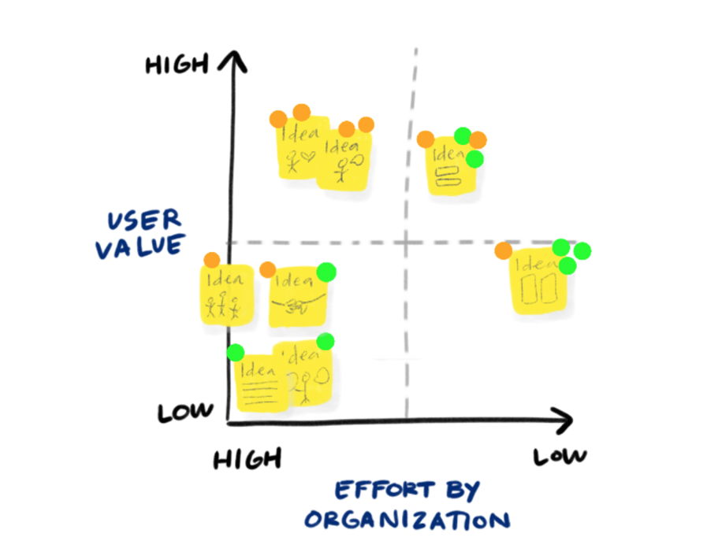
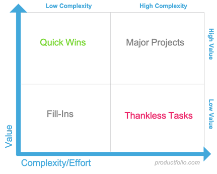

# Prioritisation Matrix

<figure><figcaption>
Image by <a href="https://www.flickr.com/photos/davegray/5172059225/">Dave Grey</a>
</figcaption></figure>


AKA Prioritisation Matrix, Value vs Complexity Matrix, Value vs Effort Matrix, Impact vs Effort Matrix


A prioritisation matrix is a strategic framework used to rank tasks, features, or projects by plotting them against two competing variables. It transforms subjective team debates into a structured, visual, and objective decision-making process.&#x20;

By mapping items on a two-by-two grid, organisations can move away from "gut feel" and instead allocate their limited resources, such as time, budget, and personnel, toward the activities that yield the highest return.

While many teams use specific versions like "Impact versus Effort" or "Value versus Complexity," the underlying principle remains the same: comparing the benefits of an action against the costs or risks required to achieve it.

#### How the Framework Works

The power of a prioritisation matrix lies in its flexibility. Depending on your goals, you can choose different criteria for your horizontal (X) and vertical (Y) axes.

* Select Your Variables: Choose two criteria that are most relevant to your current challenge. Common pairings include Value vs Risk, Urgency vs Importance, or Impact vs Feasibility.
* Define and Score: For every item in your backlog, assign a score for both variables. For instance, if you are measuring "Value," consider potential revenue or customer satisfaction. If measuring "Complexity," consider technical difficulty and man-hours.
* Plot on the Grid: Position each item on the matrix based on its scores. This visual layout immediately reveals which items are high-leverage and which are distractions.

<figure><figcaption>
Prioritisation Matrix image by <a href="https://www.nngroup.com/articles/prioritization-matrices/">Nielsen Norman Group</a>
</figcaption></figure>

#### Navigating the Four Quadrants

Regardless of the specific labels you use for your axes, the resulting four quadrants generally offer the same strategic guidance:

* High Benefit / Low Cost (Quick Wins): These are your top priorities. They offer significant rewards for a relatively small investment. Aim to complete these first to build momentum.
* High Benefit / High Cost (Strategic Initiatives): Often called "Big Bets," these projects offer long-term value but require substantial resources. These demand careful planning and are often broken down into smaller, more manageable phases.
* Low Benefit / Low Cost (Fill-ins): These tasks are minor improvements that don't move the needle significantly. They should be tackled only when time allows or during "lull" periods between larger projects.
* Low Benefit / High Cost (Money Pits): These items consume excessive resources for a poor return. In most cases, these should be deprioritised, delegated, or removed from the roadmap entirely.

<figure><figcaption>
Image by <a href="https://productfolio.com/value-vs-complexity/">Productfolio</a>
</figcaption></figure>

#### Choosing the Right Matrix for Your Needs

Because "Prioritisation Matrix" is a broad category, you should select the specific type that matches your current bottleneck:

#### Common Types of Prioritisation Matrices

* **Value vs Complexity Matrix**: This is the standard product management tool where "Value" represents the benefit to the user or business, and "Complexity" represents the technical difficulty or effort required. Good for Product Roadmapping.
* **Impact vs Effort Matrix**: Often used interchangeably with Value vs Complexity, this matrix focuses on the "Impact" a task will have versus the "Effort" (usually time or resources) needed to complete it. Good for Product Roadmapping.
* **Eisenhower Matrix (Urgency vs Importance)**: Primarily used for time management and task triaging, this matrix categorises tasks into four quadrants: Do First, Schedule, Delegate, and Eliminate. Good for Daily Task Management.
* **Value vs Risk Matrix**: This version is used when uncertainty is a major factor. It plots the potential "Value" against the "Risk" involved in implementation, helping teams decide if a high-value feature is worth the gamble. Good for Research and Development.
* [**MoSCoW Method Matrix**](moscow.md): While often a list, it can be visualised as a matrix to categorise items into Must have, Should have, Could have, and Won't have for this cycle.
* **Kano Model**: This is a more complex matrix that plots "Customer Satisfaction" against "Functionality" or investment. It helps distinguish between basic expectations, performance features, and "delighters" that provide an emotional boost.
* **Impact vs Feasibility**: Good for General Strategy.

#### Further Viewing







#### Further Reading
























