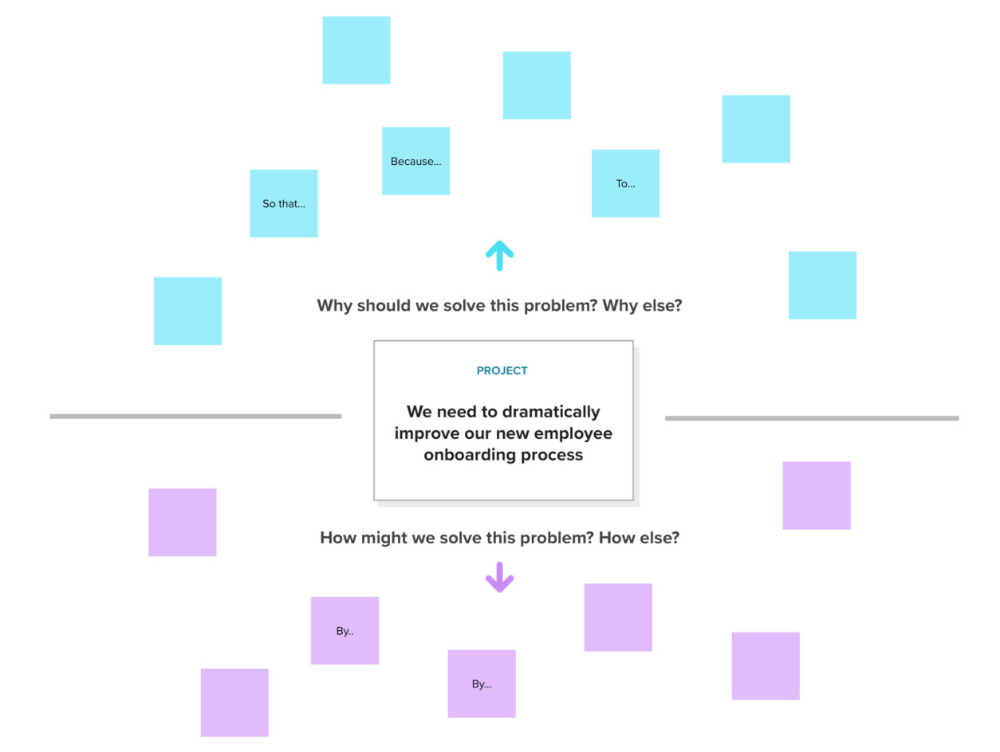

# Abstraction Laddering

<figure><figcaption>
Image by <a href="https://www.mural.co/templates/abstraction-laddering">Mural</a>
</figcaption></figure>

Abstraction laddering is a powerful tool for understanding and framing problems at different levels of detail. It helps you move between the big picture and the specific details, allowing you to see the forest for the trees and the trees for the forest.

#### How it Works

1. **Start with a problem statement**: Begin with a specific problem you want to solve. This is your starting point on the ladder.
2. **Move up the ladder**: Ask yourself "why" to move up the ladder. This helps you understand the underlying reasons and motivations behind the problem. For example, if the problem is "low customer satisfaction," you might ask why customers are dissatisfied. This could lead to answers like "poor product quality" or "lack of customer support."
3. **Move down the ladder**: Ask yourself "how" to move down the ladder. This helps you identify specific actions or solutions to address the problem. For example, if the problem is "poor product quality," you might ask how to improve product quality. This could lead to answers like "invest in better quality control" or "improve manufacturing processes."

#### Example

Let's say you want to improve your company's sales performance. Here's how abstraction laddering could help:

* **Start**: Low sales performance
* **Move up**: Why are sales low?
  * Poor product quality
  * Ineffective marketing
  * Lack of customer trust
* **Move down**: How can we improve product quality?
  * Invest in better quality control
  * Improve manufacturing processes
  * Train employees on quality standards

#### Benefits

* **Helps you see the big picture**: Moving up the ladder allows you to understand the broader context of the problem.
* **Identifies root causes**: By asking "why," you can uncover the underlying reasons for the problem.
* **Generates creative solutions**: Moving down the ladder encourages you to think of different ways to address the problem.
* **Improves communication**: It helps you communicate complex problems clearly and concisely.

#### Key Points

* You can move up and down the ladder as many times as needed to explore different levels of detail.
* There is no right or wrong way to use abstraction laddering.
* It is a collaborative tool that can be used with a team.

#### Further Reading










