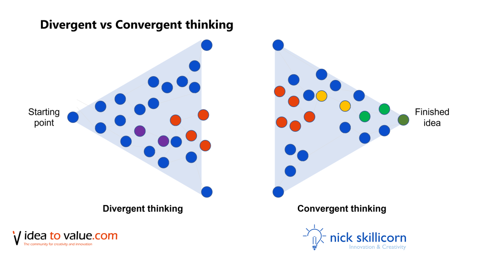

# Divergent & Convergent Thinking

<figure><figcaption>
Image by <a href="https://www.ideatovalue.com/crea/nickskillicorn/2021/11/what-is-divergent-thinking-vs-convergent-thinking/">Nick Skillicorn</a>
</figcaption></figure>

* **Divergent thinking** is the process of generating a wide array of ideas from a single starting point, such as a problem or challenge. It's about thinking outside the box and exploring multiple possibilities.
* **Convergent thinking**, on the other hand, involves evaluating and selecting the most suitable ideas from this pool. It's the process of narrowing down options and focusing on the most promising solutions.

Divergent thinking allows the exploration of a wide range of possibilities, brainstorming without constraint. This helps to generate innovative ideas and break free from conventional thinking. Considering diverse perspectives and experimenting with different approaches, unexpected solutions, that might otherwise be overlooked, can be uncovered.

Once the initial brainstorming phase is complete, convergent thinking refines thoughts. Generated ideas are carefully evaluated, considering factors such as feasibility, cost-effectiveness, and alignment with goals. Through further analysis and prioritisation, options can be narrowed down and the most promising selected to move forward.





#### Further Reading






