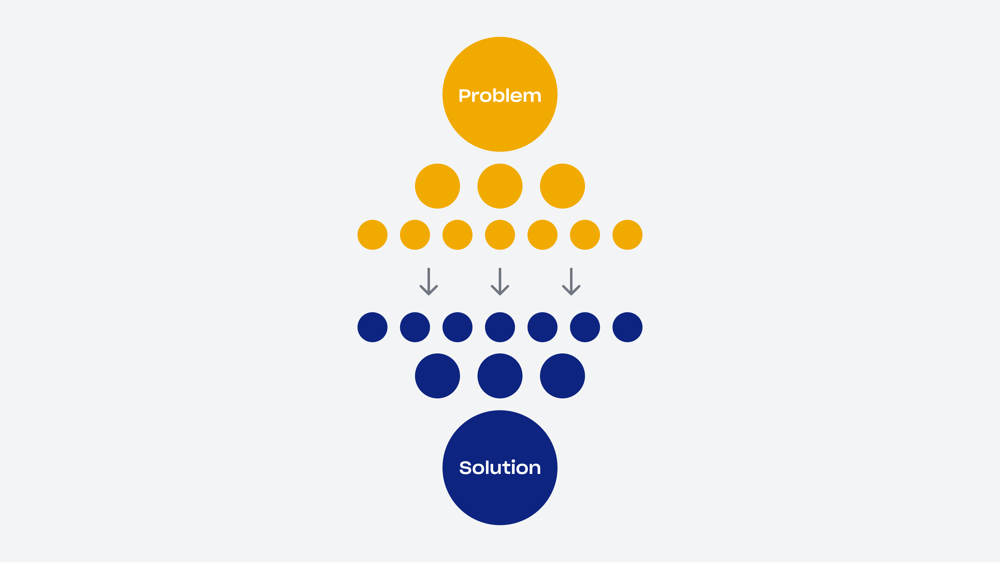

# First Principles Thinking

<figure><figcaption>
Image by <a href="https://dropbox.design/article/mental-models-for-designers">Dropbox</a>
</figcaption></figure>

First principles thinking is a method of reasoning that involves breaking down complex problems into fundamental truths or basic principles, and then building solutions from there. Instead of accepting conventional wisdom or existing assumptions, first principles thinking encourages individuals to question everything and seek out the underlying principles that govern a situation.

Imagine you're building a house. Instead of following a predetermined blueprint, you'd start by considering the fundamental elements: the materials you need, the laws of physics that govern structural stability, and the needs of the people who will live in the house. By understanding these basic principles, you can design a house that meets your needs more efficiently and creatively.

In essence, first principles thinking is about starting from scratch and reasoning up from the fundamentals rather than reasoning by analogy or following the status quo. It's a powerful tool for innovation and problem-solving because it allows you to challenge assumptions, think creatively, and find novel solutions to complex problems.

This method of reasoning starts by breaking down a complex problem into its most fundamental elements. It's like dismantling a machine to understand how each part works, and then reassembling it with a new understanding. First principles thinking is about starting from scratch, free from preconceived notions, to discover new and better ways of doing things. It's a powerful tool for problem-solving, innovation, and critical thinking.

#### Key Characteristics

* Reduction: Breaking down a complex problem into its simplest components.
* Questioning: Challenging assumptions and conventional wisdom.
* Rebuilding: Reconstructing the problem or solution from the ground up.

#### Example

Imagine you're trying to design a more efficient car. Instead of looking at existing car designs for inspiration, you might start by asking:

* What is the fundamental purpose of a car? To transport people and goods from one place to another.
* What are the essential components of a vehicle? Wheels, engine, frame, and seats.
* Can these components be redesigned or combined in new ways to improve efficiency? Perhaps a hybrid engine or lightweight materials could be used.

By starting with the most basic elements of the problem, you can explore innovative solutions that might not have been considered otherwise.

#### Benefits

* Innovation: It can lead to ground-breaking solutions by challenging conventional wisdom.
* Clarity: It can help you understand complex problems more deeply.
* Decision-making: It can provide a solid foundation for making informed choices.

#### The Smartest Person I Ever Worked With Taught Me One Thing

The article from simplest "[The Smartest Person I Ever Worked With Taught Me One Thing](https://medium.com/read-or-die/the-smartest-person-i-ever-worked-with-taught-me-one-thing-ccf99c808985)" reflects on the author's experience working with a highly intelligent and effective manager named Adam at a startup.&#x20;

Adam was an exceptional manager and programmer who stood out due to his unique problem-solving skills. He approached challenges by breaking down large problems into manageable parts and focusing on identifying and addressing the root causes of issues, rather than just dealing with surface-level symptoms.&#x20;

The author emphasises how this approach had a profound impact on his own thinking and problem-solving abilities. By learning from Adam, he realised the importance of adopting a strategic mindset that involves simplifying complex problems and preventing future issues by addressing their underlying causes.&#x20;

This experience taught him that intelligence is not just about innate ability but also about perspective and approach to learning and problem solving.



#### Further Viewing



#### Further Reading












