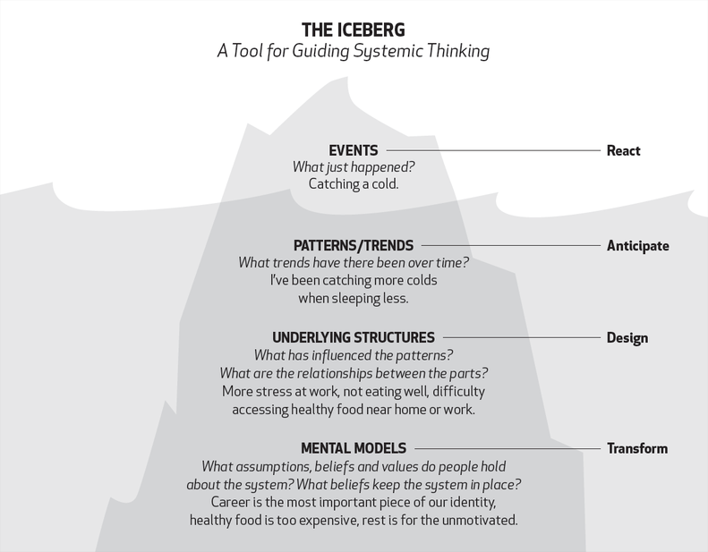

---
layout:
  width: default
  title:
    visible: true
  description:
    visible: true
  tableOfContents:
    visible: true
  outline:
    visible: false
  pagination:
    visible: true
  metadata:
    visible: true
---

# Iceberg Model

The Iceberg Model represents a conceptual framework, often employed in systems thinking, communication theory, and organisational analysis, that illustrates how observable events constitute only a small fraction of a larger, interconnected reality. The metaphor is derived from a physical iceberg, where a substantial majority of its mass remains hidden below the waterline, much like the root causes of systemic issues.

The model functions by encouraging analysis beyond surface-level symptoms, diving into deeper, more abstract layers to uncover the drivers of a problem.

The visible top of the iceberg is the Event Level. This is where most attention is focused, comprising immediate, noticeable incidents, like a sudden drop in sales or a manufacturing defect. Responding only at this level often results in temporary, reactive fixes that fail to prevent recurrence.

Just beneath the surface is the Pattern Level. This layer involves looking for trends, cycles, or recurring behaviours over time, such as a consistent decrease in customer satisfaction or a seasonal surge in product returns. Recognising these patterns moves the analysis from an isolated incident to a recognition of ongoing dynamics.

Deeper still is the Structure Level, which represents the systems, processes, policies, and organisational frameworks that create and perpetuate the observed patterns. These structures, whether formal laws, physical designs, or informal power dynamics, fundamentally influence how the system behaves. Addressing an issue at this level, for example, by redesigning a faulty process, offers greater leverage for sustained change.

The deepest, and largest, submerged layer consists of Mental Models. These are the deeply ingrained assumptions, beliefs, values, and mindsets held by individuals within the system. They are often unconscious, yet they fundamentally shape the design of the structures, thereby generating the entire chain of events above them. Enduring systemic transformation requires challenging and shifting these underlying mental models, as the failure to do so allows the flawed rationale to simply create new versions of the old structures and events.

This structured decomposition provides a means to transcend reactive firefighting, allowing for the identification of high-leverage intervention points that lead to sustainable, long-term improvement.

<figure><figcaption>
Image by <a href="https://about.ecochallenge.org/iceberg-model/">ecochallenge</a>
</figcaption></figure>








