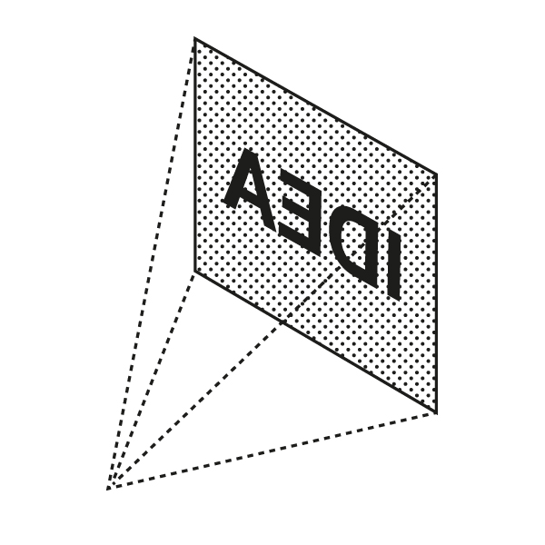

# Inversion Thinking

<figure><figcaption>
Image by <a href="https://fs.blog/inversion/">James Clear</a>
</figcaption></figure>

Inversion thinking is a powerful problem-solving technique that involves looking at a problem from the opposite perspective. Instead of focusing on how to achieve a desired outcome, it focuses on how to avoid a negative outcome. By identifying potential pitfalls and obstacles, we can take proactive steps to prevent them from happening.

For example, instead of asking "How can I become more productive?", we could ask "What is preventing me from being productive?". This shift in perspective can reveal hidden obstacles that we may not have considered otherwise.

Inversion thinking is a valuable tool for decision-making, problem-solving, and personal growth. It can help us to identify blind spots, avoid mistakes, and achieve our goals more effectively.

#### Further Reading
















