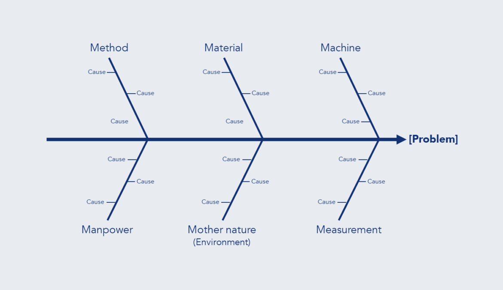

# Ishikawa Diagram

<figure><figcaption>
Image by <a href="https://kaizen.com/insights/ishikawa-diagram-root-cause-analysis/">Kaizen Institute</a>
</figcaption></figure>


AKA Fishbone Diagram, Cause-and-effect Diagram


The Ishikawa Diagram constitutes a graphical tool utilised in quality management and root cause analysis. It was developed by Japanese quality control statistician Kaoru Ishikawa and serves to systematically explore and visualise the many potential factors that contribute to a specific problem or outcome, referred to as the "Effect."

The diagram’s structure resembles the skeleton of a fish, which accounts for its common name. The "Effect," or problem statement, is written at the head of the fish, typically on the right side of the diagram, with a central horizontal line, the "spine," running to the left . Major categories of potential causes branch off from this spine, forming the main "bones." These major cause categories provide a framework for brainstorming, often encompassing standard groupings such as the 6 Ms in manufacturing, which include Manpower (people), Methods (processes), Machines (equipment), Materials, Measurement (inspection), and Mother Nature (environment). For service industries, common alternatives include the 4 Ps, such as Policies, Procedures, People, and Plant/Technology.

The process unfolds as a team brainstorms all conceivable contributors to the problem, placing each factor as a smaller line, or sub-branch, off the relevant major cause category. This systematic visual mapping compels a deep exploration of causality, moving beyond superficial symptoms to uncover underlying issues. By repeatedly asking "Why does this happen," increasingly detailed levels of cause and sub-cause are added to the diagram, ensuring a comprehensive analysis that ideally leads to the root causes of the "Effect," thereby allowing for the development of effective corrective actions. The resulting graphic serves to organise a complex array of ideas, fostering a shared understanding of the problem among all participants.












