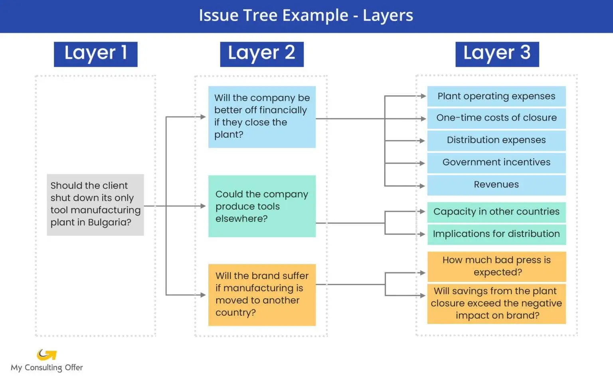

---
layout:
  width: default
  title:
    visible: true
  description:
    visible: true
  tableOfContents:
    visible: true
  outline:
    visible: false
  pagination:
    visible: true
  metadata:
    visible: true
---

# Issue Trees

<figure><figcaption>
Image by <a href="https://www.myconsultingoffer.org/case-study-interview-prep/issue-tree/">My Consulting Offer</a>
</figcaption></figure>


AKA Logic Tree, Hypothesis Tree


An Issue Tree is a powerful, visual framework used to dissect and structure a complex problem or question into its smaller, more manageable component parts, thereby facilitating systematic analysis and the identification of root causes. It essentially serves as a map for problem-solving, preventing confusion and ensuring comprehensive coverage of all relevant aspects.

The process operates by beginning with the main issue, which is positioned as the root question or core problem statement. This initial issue is then logically broken down into its primary contributing factors or sub-issues, which form the first level of branches. Each of these branches is, in turn, subjected to further breakdown into increasingly granular sub-components, repeating the branching process until the problem is decomposed to a level where the factors are actionable and can be effectively analysed. The goal is to ensure the structure adheres to the principle of Mutually Exclusive, Collectively Exhaustive (_MECE_), meaning that the branches at any given level do not overlap with one another, _mutually exclusive_, and collectively account for the entire scope of the higher-level issue, collectively exhaustive.

The utility of the Issue Tree lies in its ability to transform an overwhelming, ambiguous challenge into a series of focused, testable questions. By visualising the problem's architecture, analytical efforts can be systematically prioritised, typically focusing on the branches most likely to contain the solution or the largest impact, often guided by the [Pareto Principle](../prioritisation/the-pareto-principle.md). Once the tree is complete, the sub-components at the deepest level inform a structured work plan, allowing resources to be allocated to specific lines of inquiry and leading to the eventual identification of the fundamental causes and the development of robust, data-informed solutions. This logical decomposition provides a clear roadmap for inquiry, ensuring that all aspects of the original problem are addressed without redundancy or omission.












