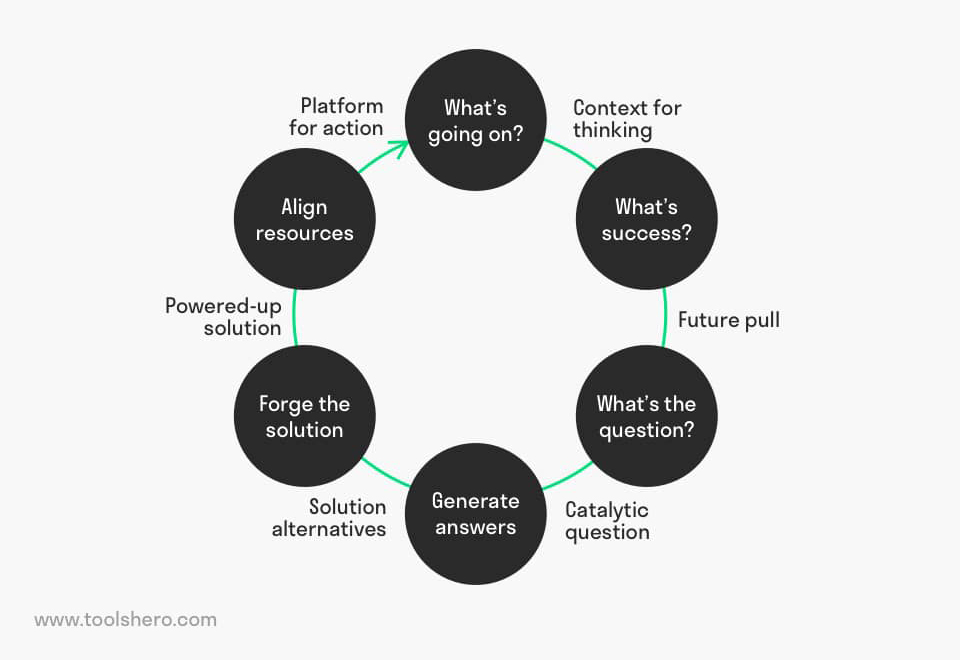

# Productive Thinking Model

<figure><figcaption>
Image by <a href="https://www.toolshero.com/problem-solving/productive-thinking-model/">toolshero</a>
</figcaption></figure>

The Productive Thinking Model, developed by Tim Hurson, is a structured framework intended to generate creative and efficient solutions to complex problems by systematically balancing critical and imaginative thinking. This method moves the problem-solver through a sequence of six distinct steps, ensuring a comprehensive understanding of the issue, a clear vision of success, and a concrete plan for implementation.

The initial phase, "What's Going On?", requires a thorough investigation to understand the problem's context, impact, existing information, involved stakeholders, and the ultimate desired outcome, referred to as the "Target Future." This step focuses on establishing a deep, unbiased understanding of the challenge.

Next, the model moves to "What's Success?", which involves clearly articulating the desired situation once the problem is resolved. This stage defines specific success criteria, often using a mnemonic tool to detail what the solution must do, what restrictions it must adhere to, the investment it can utilise, the values it must uphold, and the essential outcomes it must produce.

The third step, "What's the Question?", reframes the defined problem into one or more "catalytic questions." These questions are crafted to stimulate divergent thinking and unlock a broader range of potential answers, focusing the subsequent search for solutions.

Following this, the "Generate Answers" stage is a purely creative, divergent phase. Here, a multitude of potential solutions are brainstormed as answers to the catalytic questions, with emphasis placed on quantity and originality, deferring all judgment of ideas.

The fifth stage, "Forge the Solution", is a convergent process where the generated ideas are critically evaluated against the success criteria defined earlier. The most promising ideas are selected and developed further, often by exploring the positives, addressing objections, considering enhancements, and creating remedies for perceived weaknesses.

Finally, the "Align Resources" step translates the forged solution into a practical action plan. This involves identifying all necessary resources, including personnel, time, and materials, assigning responsibilities, and setting clear milestones to ensure the successful execution of the solution. By cycling between the initial definition, creative ideation, and final implementation, the model promotes a systematic approach to innovation.














