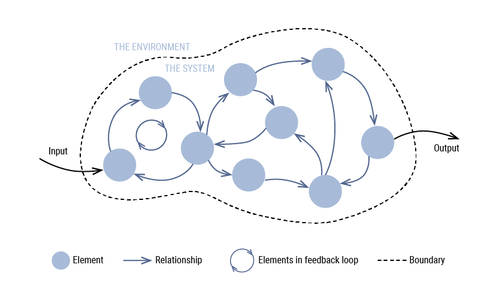

# Systems Thinking

<figure><figcaption>
Image by <a href="https://projectenportfolio.nl/wiki/index.php/LC_00359">Hans de Bruin</a>
</figcaption></figure>

A system as a whole is comprised of parts. Systems thinking is about understanding the interactions between the parts.

Systems thinking is an approach to problem-solving and analysis that considers the interconnected nature of components within a whole. Rather than examining each element of a system in isolation, systems thinking focuses on how parts interact, influence each other, and produce complex, often unexpected behaviours. Rooted in fields such as engineering, biology, and organisational management, systems thinking has become a valuable framework for navigating complexity in everything from global ecosystems to businesses, communities, and individual decision-making.

At its core, systems thinking teaches us to view challenges as part of a larger network, a perspective that fundamentally differs from linear or reductionist thinking. Instead of seeking a single cause or solution, systems thinking emphasises understanding patterns, feedback loops, and relationships that shape outcomes over time.&#x20;

For instance, if we were to examine an organisation’s performance, systems thinking would encourage us to look beyond individual employee productivity or departmental success and instead examine how culture, policies, team dynamics, external market forces, and leadership style collectively influence performance. This holistic approach offers a more accurate and nuanced understanding of how the system functions and where interventions might be most effective.

One of the core principles of systems thinking is the concept of feedback loops. In many systems, actions within the system produce results that circle back and impact the system itself, often creating reinforcing or balancing effects. For example, in environmental science, cutting down trees reduces carbon absorption, which leads to a warmer climate.&#x20;

A warmer climate, in turn, can impact vegetation growth, further altering the ecosystem. By recognising these feedback loops, systems thinking helps identify points of leverage, places where small changes can have significant impacts, whether in environmental policy, business strategy, or healthcare.

Another fundamental idea within systems thinking is that systems often exhibit “emergent behaviour.” Emergence describes the way complex behaviours and properties can arise from the interactions of simple components. A classic example of emergence is seen in a flock of birds flying in perfect synchronisation.&#x20;

Each bird follows a few simple rules based on its position relative to nearby birds, yet collectively, they produce intricate and coordinated patterns without a central leader. This principle has profound implications for human organisations, as it suggests that organisational culture, team morale, or market trends can emerge from small actions or behaviours that, when combined, create larger outcomes that were not easily predictable from the individual parts.

In practical terms, systems thinking provides a framework for tackling “wicked problems,” or problems that are complex, involve multiple stakeholders, and have no straightforward solutions. In the field of public health, for example, reducing obesity rates requires more than individual behavioural changes; it involves education, food industry practices, urban planning, socioeconomic factors, and healthcare policies.&#x20;

Systems thinking allows practitioners to address the web of contributing factors and identify solutions that consider these interconnected influences. By focusing on the system as a whole, solutions are more sustainable and impactful because they address root causes rather than just symptoms.

In organisational settings, systems thinking can be a powerful tool for leaders and managers. When a company experiences issues like low employee engagement or poor customer satisfaction, a systems thinker would approach the problem by looking at the interconnected factors contributing to these outcomes. This could include analysing team structures, communication patterns, resource allocation, and customer touchpoints. Rather than making quick, isolated fixes, systems thinking promotes sustainable changes that consider the entire ecosystem of the organisation.

Systems thinking also invites us to consider unintended consequences. When a change is made within a system, it can ripple through and cause unforeseen effects elsewhere. For instance, introducing a new technology in the workplace might streamline some processes but also disrupt others, create resistance among staff, or impact company culture in unexpected ways.&#x20;

Systems thinking encourages us to anticipate and monitor these potential effects, fostering adaptability and resilience as we learn from the system's response and make necessary adjustments.

One challenge with systems thinking is that it can be overwhelming. Complex systems have numerous variables and relationships, and it’s not always easy to determine which parts of the system are most influential or where the best intervention points lie.&#x20;

However, tools like causal loop diagrams, stock and flow models, and system archetypes can help visualise and map out relationships within the system, providing valuable insights and clarity. Systems thinkers often learn to start by observing patterns and identifying recurring behaviours, which can reveal underlying structures that drive the system.

In a world where the pace of change is faster than ever, systems thinking offers a lens through which to navigate complexity with more insight and agility. Whether addressing global challenges like climate change, optimising processes within a company, or even making personal life decisions, systems thinking equips us to make more informed and sustainable choices.&#x20;

By recognising the interconnected nature of systems, we are better able to identify solutions that consider the whole rather than just isolated parts. It's a way of thinking that prioritises long term impact and resilience, enabling us to engage with challenges more constructively and collaboratively. In essence, systems thinking is not only about understanding how systems work; it’s about creating a mindset that helps us thrive in an increasingly interconnected world.

#### In Simple Terms

Imagine you have a big puzzle with lots of pieces. You could try to put together just one piece at a time, but that wouldn't give you the whole picture, right?

Systems thinking is like looking at the whole puzzle and seeing how all the pieces fit together. It's about understanding that everything is connected, and that changing one piece can affect other pieces.

For example, let's say you want to build a sandcastle. You can't just build one tower and expect it to stay up. You need to think about the whole castle – the base, the walls, the towers. If you make one part too weak, the whole castle might fall down.

Systems thinking helps us solve problems by looking at the big picture, not just one small part. It's like being a detective who looks for clues everywhere, not just in one place. By understanding how things are connected, we can find better solutions.

Ultimately, systems thinking is about seeing the forest for the trees. It's a powerful tool for navigating complexity and creating positive change.

* **A Holistic Approach**\
  Systems thinking is a way of understanding how different parts of a system interact and influence each other. It focuses on the big picture rather than just individual elements.
* **Beyond Linear Thinking**\
  Unlike traditional problem-solving, which often looks for single causes and solutions, systems thinking recognizes that problems are often interconnected and have multiple causes.
* **Dynamic and Adaptive**\
  Systems are constantly changing and adapting. Systems thinking helps us understand these changes and how they impact the overall system.

#### Why is Systems Thinking Important?

* **Effective Problem-Solving**\
  By seeing the bigger picture, systems thinking helps us identify root causes and develop more sustainable solutions.
* **Better Decision-Making**\
  It enables us to anticipate the consequences of our actions and make informed choices.
* **Improved Collaboration**\
  Systems thinking fosters collaboration by encouraging different perspectives and understanding how everyone is connected.
* **Innovation**\
  It can spark new ideas and approaches by challenging traditional thinking.

#### How is Systems Thinking Used?

* **Business and Management**
  * Understanding complex organisational structures
  * Identifying bottlenecks and inefficiencies
  * Developing strategies that consider the whole system
* **Healthcare**
  * Improving patient outcomes by looking at the entire healthcare system
  * Identifying systemic issues that contribute to health disparities
* **Environmental Management**
  * Addressing complex environmental problems like climate change
  * Developing sustainable solutions that consider the interconnectedness of ecosystems
* **Social Change**
  * Understanding the root causes of social problems
  * Designing interventions that address the underlying issues

#### Key Concepts in Systems Thinking

* **Interconnectedness**\
  Everything is connected to everything else.
* **Feedback Loops**\
  Actions can have unintended consequences that can amplify or dampen the original effect.
* **Emergent Properties**\
  The whole is greater than the sum of its parts.
* **Systems Thinking Tools**\
  There are various tools and frameworks to help with systems thinking, such as:
  * Causal Loop Diagrams
  * System Dynamics Modelling
  * Root Cause Analysis
  * Systems Mapping

#### The Tools Used In Systems Thinking

Visit [untools.co](https://untools.co/systems-thinking/#tools) for a handy list of tools used for systems thinking including:

* [Iceberg Model](https://untools.co/iceberg-model/)
* [Connection Circles](https://untools.co/connection-circles/)
* [Concept Map](https://untools.co/concept-map/)
* [Balancing Feedback Loop](https://untools.co/balancing-feedback-loop/)
* [Reinforcing Feedback Loop](https://untools.co/reinforcing-feedback-loop/)

#### Further Reading




















