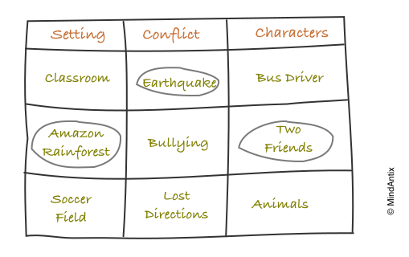

# Zwicky Box

<figure><figcaption>
Image by <a href="https://blog.mindantix.com/2015/11/thinking-outside-the-zwicky-box/">Mindantix</a>
</figcaption></figure>


AKA General Morphological Analysis, Morphological Boxes


The Zwicky Box, formally known as General Morphological Analysis, is a systematic, non-quantifiable problem-structuring and idea-generation method developed by the Swiss astrophysicist Fritz Zwicky in the 1960s. This tool is designed to explore the totality of possible solutions to a complex challenge by moving beyond conventional, linear thinking, which often overlooks innovative possibilities.

The process functions by breaking down a complex problem into its fundamental, logically independent parameters or dimensions, which are then listed, typically as rows in a matrix. For each parameter, a comprehensive set of all possible values, options, or characteristics is generated, forming the columns of the box. For instance, in designing a new product, parameters might include 'Material,' 'Power Source,' and 'Target Audience,' each with multiple corresponding values.

The resulting grid, the Zwicky Box, or morphological box, represents a vast, multi-dimensional solution space. Each cell in the matrix corresponds to a unique combination of one value from every parameter, and each unique path traced across the rows, selecting one value from each, represents a theoretically possible solution configuration. The total number of possible solutions equals the product of the number of values in each parameter.

Once the complete field of theoretical solutions is established, the box is analysed through a process called Cross-Consistency Assessment. This critical step involves systematically identifying and eliminating combinations that are logically impossible, empirically impractical, or internally inconsistent, thereby reducing the immense number of theoretical solutions to a smaller, more manageable set of viable concepts. The Zwicky Box thus serves as a powerful heuristic, ensuring that no potential solution, however unconventional, is overlooked due to pre-existing assumptions, ultimately leading to greater creative and strategic foresight.














