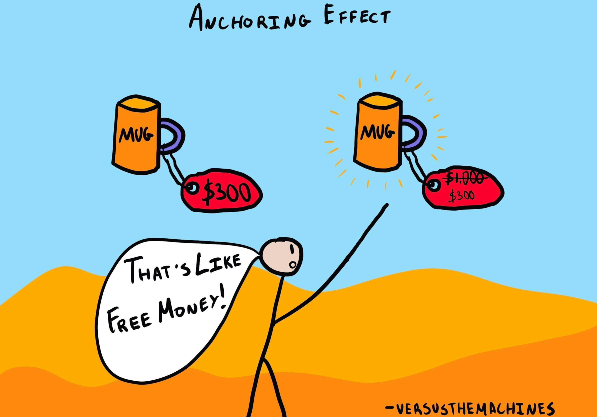

# Anchoring Bias


AKA Anchoring Principle, Anchoring Effect, Anchoring, Anchor Bias


The anchoring principle is a psychological heuristic that describes our tendency to rely too heavily on the first piece of information offered when making decisions. In the context of user experience, this initial piece of information acts as a mental hook, or an anchor, that sets the tone for all subsequent judgements. Once an anchor is set, other judgements are made by adjusting away from that point, which often leads to a bias because users rarely move far enough away from the original value.

You will frequently see this method applied in pricing tables where a premium option is listed first. By showing a high price point at the start, every other price shown afterwards seems significantly more affordable by comparison, even if those prices are objectively high. Designers also use anchoring in search filters or suggested donation amounts. If a website suggests starting a donation at $50, a user might feel that $20 is a small contribution, whereas if the anchor had been $5, that same $20 would feel quite generous.

Beyond just numbers, anchoring can influence how users perceive the quality or speed of a service. For example, if a loading screen provides a high initial estimate for a download time, the user feels a sense of relief and satisfaction when the actual progress bar moves faster than that first expectation. It is a powerful tool for managing expectations, but it must be used ethically. If the anchor is too far removed from reality, it can lead to frustration or a total loss of trust in the interface.

<figure><figcaption>
Image by <a href="https://thedecisionlab.com/biases/anchoring-bias">The Decision Lab</a>
</figcaption></figure>

**Example 1**

My husband and I were car shopping and found a used BMW that looked pristine and had only 10,000 miles on it. The price was shockingly low, only €2,000. We had to have it. Driving home, we smiled from ear to ear about our shiny used car, unknowing it would fall apart within 18 months. We had focused so much on the price and vehicle make, that we did not consider the possible issues (such as rusted parts in old, unused cars). This is anchoring bias at work.

**Example 2**

Imagine you're in a negotiation for a salary increase at work. You go into the meeting with a desired salary in mind, let's say €50,000 per year. Your boss starts the discussion by offering you a raise of €30,000 per year, a significant increase from your current salary. The initial offer of €30,000 becomes the anchor point for your salary negotiations. Because of the anchoring effect, you may find it challenging to ask for the €50,000 you originally had in mind. Instead, you might feel inclined to negotiate from the €30,000 base. In the end, you might agree on a salary of €40,000, which is significantly lower than your initial target but still higher than your current pay. In this scenario, the anchoring bias influenced your perception of what was a reasonable salary increase, causing you to settle for less than you initially aimed for.

**Example 3**

Imagine you're at a high-end restaurant and you're perusing the wine menu. The menu offers a range of wines, with prices that vary from €20 to €500 per bottle. You're not a wine connoisseur, so you're not quite sure which one to choose. However, you notice that there's a special "wine of the month" listed at €250 per bottle. This high price tag becomes the anchor point for your perception of what's expensive. Now, when you look at the rest of the wine options, you may consider the €100 bottle as a reasonable and even affordable choice in comparison to the €250 bottle, even though it's still quite expensive in absolute terms. You might end up ordering the €100 bottle, influenced by the anchoring effect, even though you initially intended to spend no more than €50 on wine. In this example, the initial high anchor price of the "wine of the month" influenced your perception of what constitutes an expensive wine, leading you to spend more than you originally intended.

#### Further Viewing





#### Further Reading











