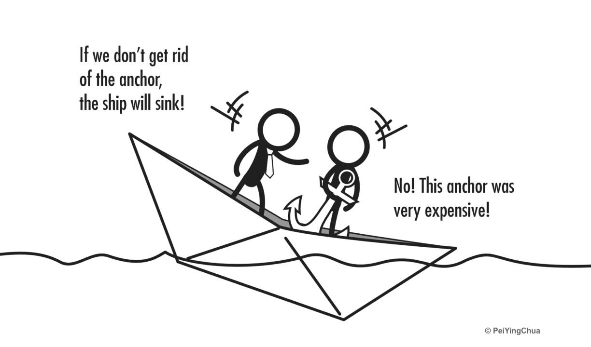

# The Sunk Cost Fallacy

<figure><figcaption>
Image by <a href="https://www.linkedin.com/pulse/sunk-cost-fallacy-lets-keep-digging-deeper-hole-pei-ying-chua/">Pei Ying Chua</a>
</figcaption></figure>

The Sunk Cost Fallacy is a common cognitive bias where people continue to invest in a decision, project, or action due to the amount of time, money, or resources they've already spent on it—despite evidence suggesting that future costs outweigh the benefits. Essentially, people fall into the trap of "throwing good money after bad" because they feel reluctant to abandon what's already been invested. Avoiding the sunk cost fallacy allows people to make decisions more rationally, ensuring resources are directed towards genuinely promising ventures.

#### 1. Sunk Costs Defined

A sunk cost is any past expense or effort that can't be recovered. For example, money spent on a product development project or hours devoted to a task are sunk costs because they’re irretrievable.

#### 2. How the Fallacy Works

Rather than focusing on the present and future value of a decision, people focus on past costs, which clouds their judgement. For example, if a business has already spent a significant amount on a failing project, they might keep funding it, hoping it will eventually turn around, even if the evidence shows it's unlikely to succeed.

#### 3. Why It Happens

The fallacy often stems from psychological factors such as loss aversion (the pain of losing what's already been invested), over-optimism (believing things will improve), or simply commitment to the original goal.

#### 4. Examples

* **Business**\
  A company continues to develop a product that shows little market demand because they've already spent heavily on research and development.
* **Personal Life**\
  Someone persists in a relationship or career path that makes them unhappy because they've already spent years in it.

#### 5. How to Avoid It

To counter the sunk cost fallacy, it helps to:

* **Focus on current and future value**\
  Make decisions based on potential future outcomes, not past investments.
* **Set clear criteria for continuation**\
  Define benchmarks to objectively assess if a project or decision is still viable.
* **Seek outside perspectives**\
  External advice can provide a more rational view, reducing emotional attachment to past investments.

#### Further Reading








