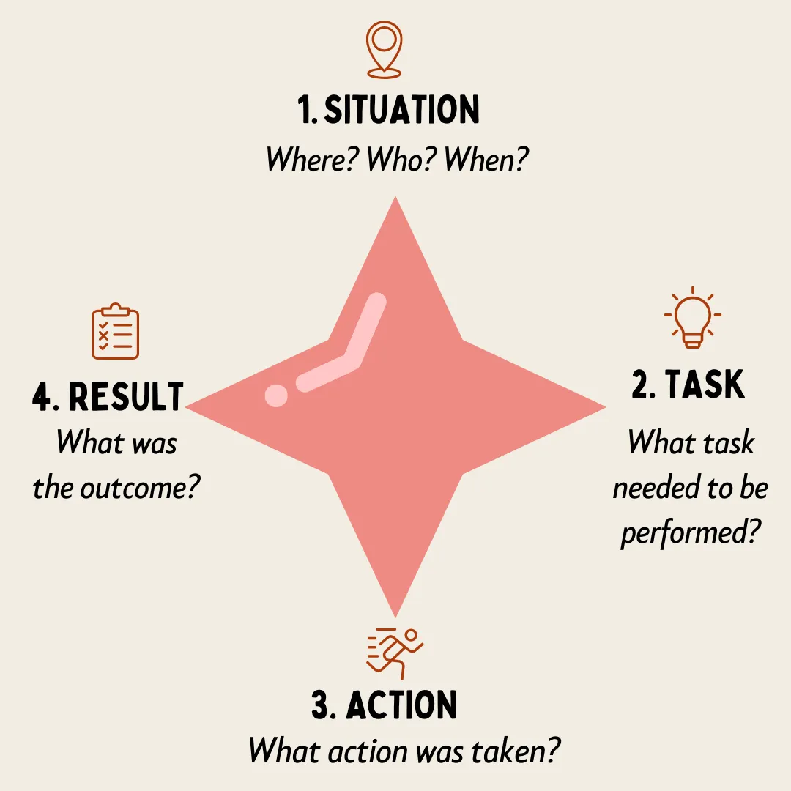

# Hiring

Hiring is one of the most important stages of building a team and creating a strong culture. It is a crucial element for the success of any organisation.&#x20;

The hiring process is typically broken down into the following stages:

1. **Defining the Role**\
   This involves defining the role and understanding the skills, experience, and competencies needed. It is crucial to work with stakeholders to clearly understand the expectations for the role.
2. **Sourcing Candidates**\
   Deciding where to find candidates (internally or externally) based on the needs of the role.
3. **Screening & Shortlisting**\
   Reviewing CVs, cover letters, and application materials to filter down to the most promising candidates.
4. **Interviewing**\
   Conducting interviews using appropriate methodologies to assess fit.
5. **Selection & Offer**\
   Making the final decision and extending an offer.
6. **Onboarding Process**\
   Integrating the new hire into the organisation with formal onboarding.

Managers must remain involved at each stage to ensure alignment between the role's needs and the candidates being assessed.

#### **1. Defining the Role**

Before beginning the hiring process, it is critical to ensure that the role is clearly defined. This stage sets the foundation for attracting the right candidates.

* **Job Description Writing**: Ensure that job descriptions are specific, concise, and clearly outline the duties and responsibilities of the role. Include required qualifications, skills, and experience, as well as any desirable attributes.\
  &#xNAN;_&#x54;ip: Avoid jargon or unnecessary technical language that may deter good candidates._
* **Competency Frameworks**: Use a competency framework to define the behaviours, knowledge, and skills required for the role. This helps to ensure that both technical and soft skills are assessed.
* **Skills Matrix**: A skills matrix helps assess which competencies are essential and which are desirable. This can also assist in planning for future skills needs and help managers hire for long-term growth rather than just immediate requirements.

#### **2. Sourcing Candidates**

Sourcing the right candidates involves deciding whether to focus on internal talent, external candidates, or both.

* **Internal Talent Mobility**\
  Promoting internal candidates offers a chance to grow talent already familiar with the company culture and processes. Create internal job postings and encourage employees to apply for open positions.\
  &#xNAN;_&#x54;ip: Consider internal candidates' potential and readiness for the role rather than solely focusing on past experience._
* **External Recruitment Channels**\
  If internal candidates aren't the right fit, external channels are necessary. Use:
  * Job boards (LinkedIn, Indeed)
  * Recruitment agencies for specialised roles
  * Employee referral programmes
  * Networking events and social media
  * University partnerships for graduate recruitment

#### **3. Screening & Shortlisting**

Once applications are received, the screening process begins. This is about identifying the most suitable candidates for interviews.

* **Application Tracking Systems (ATS)**\
  Many companies use ATS to help manage the influx of applications. This software helps sort through applications using keywords, ensuring only the most relevant CVs reach the hiring manager.
* **Initial Screening Methods**\
  Focus on key elements like:
  * Relevant experience
  * Qualifications
  * Key skills outlined in the job description
  * Cultural fit indicators
* **Pre-employment Testing**\
  Some companies opt for pre-employment tests to assess candidates' skills or personalities. These tests may include technical assessments, aptitude tests, or psychometric evaluations.

#### **4. Interviewing**

Interviews are one of the most critical parts of the hiring process, and it's important to use structured, fair, and effective methods to assess candidates.

#### Interview Methods

* **Behavioural Interviewing**\
  Behavioural questions are based on past experiences. They aim to understand how interviewees handled specific situations in the past, which can be indicative of future performance. The idea is that past behaviour is the best predictor of future behaviour.\
  Example: _"Can you tell me about a time when you had to manage a difficult project? How did you handle it, and what was the outcome?"_
* **Situational Interviewing**\
  Situational questions are hypothetical and ask the interviewee to imagine how they would handle a situation that could arise in the future. They are designed to assess problem-solving skills, creativity, and ability to think on your feet.\
  Example: "_What would you do if you were given a project with a tight deadline and limited resources?"_
* **Competency-Based Interviewing**\
  These focus on a specific set of competencies required for the role, such as communication, teamwork, or decision-making, and ask questions directly related to these competencies.
* **Structured vs. Unstructured Interviews**\
  A structured interview involves asking each candidate the same set of questions and rating their answers consistently. This method improves fairness and helps reduce bias. Unstructured interviews are more conversational, but can be harder to assess fairly.
* **Panel Interviews**\
  These involve multiple interviewers assessing the candidate simultaneously. Ensure that each panel member knows their role in the interview and that the questions are structured to cover different competencies.
* **Interview Bias**\
  Be aware of unconscious bias that can influence hiring decisions. Bias can emerge from factors like age, gender, ethnicity, or even similarities between the interviewer and candidate. Using structured interviews and competency-based assessments can help mitigate these biases.

#### Question Answering Methods

* **STAR Method**\
  This stands for Situation, Task, Action, Result. It's a framework for asking behavioural interview questions, where candidates are asked to describe a specific situation, the task they were involved in, the action they took, and the result of their efforts. This method is valuable in assessing problem-solving, leadership, and teamwork abilities.

<figure><figcaption>
Image by <a href="https://medium.com/illumination/10-powerful-leadership-tools-that-will-put-you-in-top-gear-a449181a9d47">Gaurav Jain</a>
</figcaption></figure>









* **CARDIO**

{% embed url="https://medium.com/design-bootcamp/when-hiring-product-designers-i-look-for-%E1%B4%84%E1%B4%80%CA%80%E1%B4%85%C9%AA%E1%B4%8F-764efdeb033" %}

#### **5. Selection & Offer**

**Decision-Making**

After the interviews, it's time to decide which candidate is the best fit.

* **Evaluating Candidates**\
  Use scoring systems or matrices to objectively evaluate candidates based on the competencies and criteria identified for the role. This helps compare candidates side-by-side and avoids subjective decisions.
* **Cultural Fit vs. Cultural Add**\
  It's important to consider both how a candidate fits with your company's culture and how they might add value by bringing diverse perspectives or skills. Hiring for "cultural add" helps foster innovation and diversity.
* **Legal Considerations**\
  Be mindful of employment laws regarding discrimination. Ensure that decisions are made solely based on the candidate's ability to fulfil the requirements of the role.

**Making an Offer**

Once you have selected your top candidate, the offer process begins.

* **Negotiation Tactics**\
  Be prepared to negotiate on salary, benefits, and other terms. Understand what the market rate is for the position, and be flexible within reasonable limits to ensure the offer is attractive.
* **Job Offer Letter Templates**\
  Managers should have access to standardised offer letter templates to ensure that all the necessary information is communicated clearly and consistently. This should include salary, benefits, start date, and any specific terms of employment.
* **Counteroffers**\
  If a candidate receives a counteroffer from their current employer, it's important to decide how far you're willing to negotiate to secure their acceptance.

### **6. Onboarding**

A successful hiring process does not end with a job offer. Onboarding is key to integrating new employees into your organisation.

* **Pre-boarding Strategies**\
  Engage with new hires before their official start date through welcome emails, sending company materials, or inviting them to meet their team.
* **Onboarding Plans**\
  Design a structured onboarding programme that includes key milestones for the first 30, 60, and 90 days. This should cover everything from understanding the company culture to job-specific training.
* **Buddy Systems and Mentorship**\
  Assigning a mentor or buddy to new hires can help them acclimatise more quickly to the team and culture, offering a support system for any questions or challenges.

#### Additional Notes

**Hiring for Diversity & Inclusion**

Diversity and inclusion are vital considerations in the hiring process to ensure your team reflects varied perspectives and experiences.

* **Diversity Hiring**\
  Use proactive strategies to ensure a diverse candidate pool. This may include reaching out to underrepresented groups or ensuring job descriptions are inclusive.
* **Bias-Free Job Descriptions**\
  Ensure that your job descriptions use neutral language. Avoid gendered terms or phrases that might unintentionally exclude certain groups of candidates.
* **Blind Recruitment**\
  Removing personal identifiers such as names, gender, and educational background from applications during the screening process can help reduce bias and ensure candidates are evaluated purely on their qualifications and skills.

**Candidate Experience**

How you treat candidates throughout the process can affect your company's reputation and long-term talent pool.

* **Communicating with Candidates**\
  Keep candidates informed at each stage of the process, even if they are unsuccessful. This shows respect for their time and effort and maintains your employer brand.
* **Feedback to Unsuccessful Candidates**\
  Provide constructive feedback to candidates who were not selected. This not only helps them improve but leaves them with a positive impression of your organisation.

**Tools and Technology**

Hiring is increasingly supported by technology, and managers should be aware of the tools available.

* **Hiring Software**\
  Applicant Tracking Systems (ATS) streamline the recruitment process, helping you manage applications, schedule interviews, and communicate with candidates.
* **AI and Automation in Hiring**\
  Artificial intelligence can help sift through large numbers of applications or even conduct initial video interviews, using algorithms to identify the best candidates. However, it's important to ensure that AI tools are free from bias and transparent in their methods.

#### Curated Library


