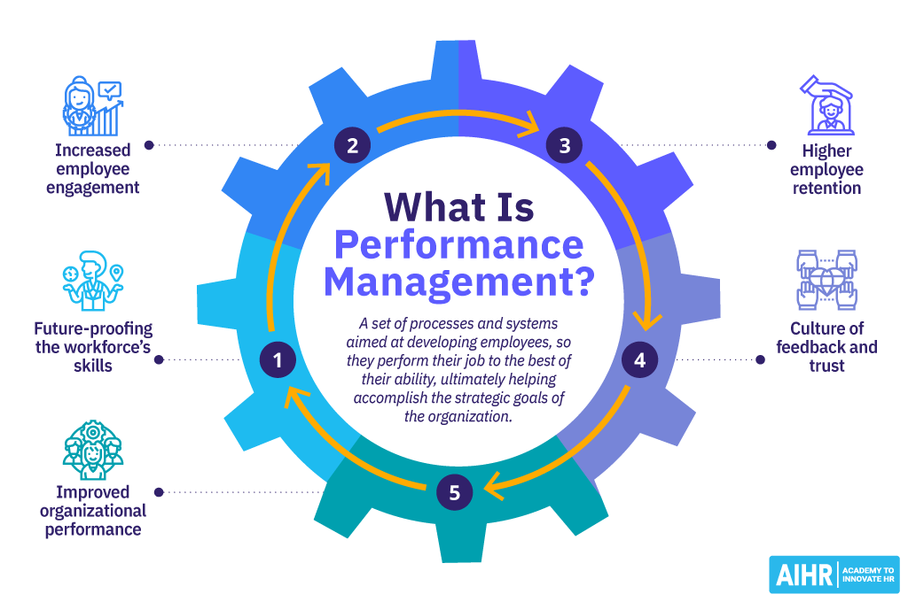

# Performance Management

<figure><figcaption>
Image by <a href="https://www.aihr.com/blog/what-is-performance-management/">Academy To Innovate HR</a>
</figcaption></figure>

Performance management refers to the ongoing process of maximising the contribution employees make to a company. It focuses on sustaining and enhancing employee performance according to company goals and objectives. Rather than being a single task, it encompasses a range of activities within a larger framework.


Performance management is an ongoing process involving regular meetings and check-ins between a manager and their employee, focused on setting, tracking, and assessing the employee's goals, long-term objectives, and contribution to the company.


Although it is sometimes viewed as an annual or twice-yearly performance review led by management, performance management is most effective when approached as a collaborative, year-round effort. Many organisations think of it as [Continuous Performance Management](https://www.workhuman.com/blog/back-to-basics-what-is-continuous-performance-management/).

Managers use tools like OKRs, feedback mechanisms like 360-degree reviews, and formal performance reviews to track and enhance performance. They should offer continuous support through coaching and mentoring and link performance to appropriate rewards or consequences. Formal tools like PIPs, when necessary, help manage underperformance, ensuring a structured and fair process for improvement.

Performance management can vary across companies but typically the steps are:

1. **Set Goals**\
   Establish objectives for individuals and teams, helping them understand their role in achieving the organisation's mission and strategy.
2. **Track Progress**\
   Improve performance of employees, teams and, the wider organisation. Provide ongoing feedback and coaching, track progress, and offer development opportunities.
3. **Evaluate Performance**\
   Ensure accountability by linking performance to rewards, career development, and addressing challenges through mechanisms such as performance improvement plans (PIPs), or, if necessary, contract termination.

#### **1. Set Goals**

This stage focuses on setting clear goals and expectations for both individuals and teams, ensuring alignment with the organisation's broader mission and strategy. It provides the foundation for effective performance management.

**Goal Setting**

Use OKRs (Objectives and Key Results) to define both high-level objectives and the measurable key results that will indicate success that align with company strategy and work with employees to create SMART (Specific, Measurable, Achievable, Relevant, Time-bound) goals that support the OKRs. Read an in depth overview of design management goal setting on the dedicated [Goal Setting](../strategy/vision-and-goals/goal-setting.md) page in the Strategy section.


[goal-setting.md](../strategy/vision-and-goals/goal-setting.md)


**Aligning Objectives**

Ensure that employee and team objectives are aligned with the company's strategic priorities.

**Action Planning**

Develop step-by-step action plans with employees to meet objectives.

**Role Clarity & Team Charters**

Ensure that every employee understands their role in the team and how it contributes to the organisation's broader objectives. Document roles and team goals using team charters.

**Balanced Scorecard**

Apply this methodology to align goals across financial, customer, internal processes, and learning/growth perspectives.

#### **2. Track Progress**

This stage is about tracking progress, providing feedback, and developing employees to meet their goals. It's an ongoing process of communication and support.

**Continuous Feedback**

Provide regular, constructive feedback to help employees stay on track or make course corrections. Use both formal and informal feedback sessions. Tools like Workday or BambooHR help in delivering structured feedback.

**Coaching & Mentoring**

Offer guidance and development opportunities, helping employees improve their skills and achieve their potential. Use the GROW model (Goal, Reality, Options, Way Forward) to guide development conversations. Identify areas for improvement and help employees explore their own solutions.

**Tracking OKRs & KPIs**

Regularly monitor progress against key results and adjust objectives if necessary. Tools like 15Five or CultureAmp can help track progress.

**Regular One-on-One Meetings**

Scheduling weekly or bi-weekly one-on-one sessions allows managers to address performance issues early and provide real-time feedback. Hold weekly or bi-weekly one-to-ones to address any performance concerns early and provide ongoing support and real-time feedback.

**360-Degree Feedback**

Implement multisource feedback to get a holistic view of employee performance from peers, managers, and subordinates.

**Identifying Development Needs**

Work with employees to identify areas for improvement or growth and set up training or development opportunities. Use Learning Management Systems (LMS) like Coursera for Business or Udemy to provide employees with training opportunities.

**Pulse Surveys**

Use quick, frequent surveys to gauge employee engagement, morale, and any areas where they need more support

**Performance Management Software**

Tools like Workday, BambooHR, or Trakstar can help with tracking progress, delivering feedback, and conducting performance reviews.

#### **3. Evaluate Performance**

This stage is where performance is formally evaluated, and employees are held accountable for their progress. It's also where rewards, career development opportunities, and, if necessary, corrective actions are implemented.

**Formal Performance Reviews**

Conduct comprehensive annual, mid-year or quarterly performance appraisals to compare actual performance with set objectives and to discuss progress, challenges, and future goals. Tools like Trakstar or Workday help structure these reviews.

**Rewarding Performance**

Link performance to rewards, including bonuses, promotions, or salary increases. Use compensation management tools like PayScale or CompTrak.

**Addressing Underperformance**

If employees are not meeting expectations, develop a plan to help them improve. For employees falling significantly short of expectations, implement Performance Improvement Plans (PIPs) to outline clear steps, timelines, and expectations for improvement.





**Recognition Platforms**

Tools like Bonusly or Kudos allow managers to offer regular recognition to employees for outstanding performance.

**9-Box Grid**

Utilise this talent management tool to evaluate employees' performance and potential, helping guide decisions on promotions, development, or succession planning.

**Managing Consequences**

When improvement plans don't yield results, address ongoing underperformance with clear consequences, including contract termination if necessary.

**Career Development Discussions**

Offer high performers the opportunity for career growth through stretch assignments, promotions, or learning opportunities.

**Succession Planning**

Identify and prepare high-performing employees for future leadership roles.

***

#### How You Are Perceived


Bonus insight from Shreyas Doshi


Shreyas Doshi [wrote the following](https://x.com/shreyas/status/1831859610715869523/?rw_tt_thread=True) on X:

As performance review season gets underway in many places now and through Q4, here's a rough model to help you think about how you are perceived in almost every mid-sized to large company.

Your work is generally observed and perceived by others along the following three dimensions:

1. **Content**\
   this is about the insights and ideas you have, the proposals you make, how you solve problems, the things you ship, the metrics you move in the short-term, the business impact you create in the long-term, etc...
2. **Confidence**\
   This is about the image you project as you do your work, do you seem to have things under control, do you seem to be able to tackle tough tasks, how you communicate, do you come across as "leadership material", are your peers and people above and below in the hierarchy confident in you, etc...
3. **Context**\
   This is about your sensibility around your company's implicit culture, how you adapt your approach to your organisation's power structure, that important executive's quirks and preferences, general biases of important peers and stakeholders, etc...

Now, here are some crucial observations to consider as you think about how you're perceived and how that affects your odds of getting promoted:

1. In most companies, if you are extremely good at just one of these and average or below average at the other two, you are going to "get stuck" beyond certain levels. Usually manager or senior manager will be your ceiling.\
   \
   This is unfortunately the cause of a lot persistent frustration for otherwise-talented people who are great at 'Content', but repeatedly get passed over for promotion to higher levels.\
   \
   They don't understand why this keeps happening. And usually no one explains to them the perception side of things i.e. no one explains that it is usually because they are not projecting as much 'Confidence' as they ought to for the next level and they are not as attuned to the 'Context' of the organisation and the company \[1].
2. To have a chance of getting Director or VP level scope, you must be very good at a minimum of two of these and you must not suck at the third one. And btw, this is how you get different types of leaders at the mid and upper management level of a company.\
   \
   e.g. a leader who spikes on 'Content' and 'Context' but not on 'Confidence' is going to have a very different style than a leader who spikes on 'Confidence' and 'Context' but not on 'Content'.\
   \
   This observation alone will explain a lot of confusing promotions, where someone seems not competent-enough to be a senior leader, but yet they somehow are chosen for the VP job \[3].
3. Employees who get promoted to and show longevity at the highest levels, like Executive or CEO, in top tier companies tend to be very good at all three, especially 'Context'.

Last but not the least: as with any model, this is by no means a perfect predictor of how things will always work everywhere. But hopefully this helps clarify some perpetually confusing things that happen in our career & in the careers of people around us.

**Footnotes:**

If you haven't already noticed, everything here, Content, Confidence, Context, is about how you are perceived i.e. how optics plays a role in who gets ahead in mid sized and large companies.

Naturally, no company will ever admit or explicitly tell you that this is directionally how things work. They will point to the career ladder and give you some technical reason why the committee's interpretation was that you did not fulfill one or more of the promo criteria.

\[1] This is not to say that this is right. In my opinion it is quite wrong. However, me just saying 'this is wrong' isn't going to change the long-held opinions and dogmas of the members of your organisation's promo committee in November 2024 or January 2025.

\[2] In an ideal world, it's your true 'impact' and your 'execution' that should dictate how you get recognised and rewarded.

Unfortunately though, in any sufficiently large group of humans the idea of 'just do good work and let your work speak for itself' doesn't work optimally. In good companies it will work for you early on, but even in those companies it will stop working at some point, at some level.

When you reach that level, it is fine to decide to opt out of this game. I did that at some point, just before I started this next chapter of my career. But if you do that, be clear on the reasons why you're doing it so you can remain steadfast while others seem to be playing silly games to get ahead.

And even if you want to opt-out at some point, the onus is on you to make sure that you are able to create the life you want to create for yourself from that point forward.

\[3] This is very likely the most interesting observation in this post for those of you who pay attention to why certain people get promoted or selected for certain senior roles.

***

#### Further Reading







#### Curated Library


