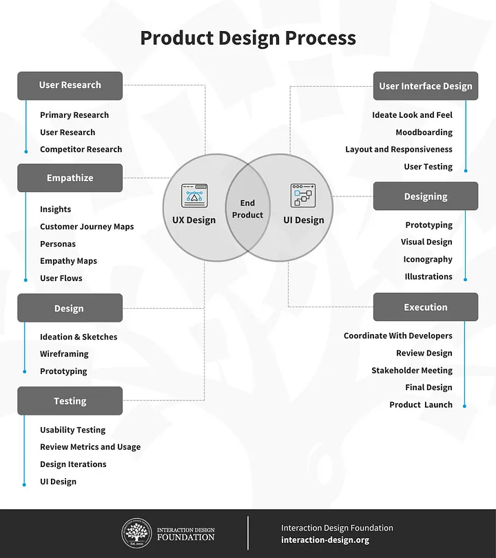

# Design/UX

Design teams are integral to ensuring that products meet both functional and aesthetic standards. Here's a closer look at typical design roles within an organisation.





#### Design Strategist

A Design Strategist aligns design vision with business goals, using research and innovation to shape a company's design direction. They develop high-level plans that guide user-centred projects and ensure that design solutions resonate with target audiences while supporting business objectives. By analysing market trends, user needs, and competitive landscapes, they identify opportunities for growth and improvement. This role often involves collaborating with executives, product managers, and designers to establish design principles, priorities, and strategies that drive impactful results. With a focus on the big picture, a Design Strategist plays a key role in steering design decisions across teams.



#### UX Researcher

A UX Researcher uncovers user needs, motivations, and behaviours through methods such as interviews, surveys, and usability tests. Their insights shape product design decisions, ensuring that solutions address real user problems. This role involves designing and conducting research studies, synthesising findings, and communicating insights to cross-functional teams. UX Researchers must have strong analytical and communication skills to translate complex data into actionable insights. They work closely with designers, product managers, and engineers, grounding design decisions in evidence-based user understanding. The ultimate goal is to create user-friendly, efficient products that enhance user satisfaction and support business goals.



#### CX Researcher

A CX (Customer Experience) Researcher studies the entire customer journey, focusing on interactions across all touchpoints, from first contact through to post-purchase support. By analysing user data, conducting customer interviews, and observing behaviours, they identify pain points and opportunities for enhancing the experience. CX Researchers ensure that every aspect of the customer's interaction with a brand or product is aligned and optimised for satisfaction. They work closely with teams across marketing, support, product, and design to implement improvements, fostering loyalty and increasing retention. Their role is essential in building a cohesive, positive, and impactful customer journey.

#### Product Designer

A Product Designer handles the end-to-end design of digital products, balancing user experience, functionality, and business objectives. They are involved in every stage, from user research and ideation to wireframing, prototyping, and user testing. Product Designers must have skills in UX and UI design, as well as a solid understanding of business and technical constraints. They collaborate closely with product managers, developers, and stakeholders to ensure cohesive, user-centred solutions. By focusing on the entire product journey, they create engaging, effective, and cohesive experiences that fulfil user needs while advancing strategic business goals.



<figure><figcaption>
Image source <a href="https://www.interaction-design.org/literature/article/difference-between-product-and-ux-designer">Interaction Design Foundation</a>
</figcaption></figure>

{% embed url="https://ansariparvez.medium.com/ux-design-is-pass%C3%A9-product-design-is-the-new-green-ae3374667a50" %}















#### UX Designer

A UX Designer focuses on creating user-friendly and accessible digital experiences. Through user research, wireframing, and prototyping, they design interactions and flows that help users achieve their goals with ease. UX Designers analyse user needs, conduct usability testing, and iterate designs to address pain points and optimise functionality. They collaborate closely with product and development teams to ensure designs are technically feasible and aligned with business objectives. Their primary aim is to improve the usability and overall satisfaction of digital products, making sure that each interaction is intuitive and contributes to a positive user journey.

{% embed url="https://ansariparvez.medium.com/ux-design-is-pass%C3%A9-product-design-is-the-new-green-ae3374667a50" %}



#### UX Architect

A UX Architect structures information and designs intuitive navigation systems to enhance user experience across complex digital platforms. They focus on organising content and creating logical paths that support users in finding information easily. UX Architects use tools like site maps, wireframes, and flow diagrams to map out a product's architecture, ensuring that each element supports user needs and business goals. They often work with UX Designers, developers, and stakeholders to implement information structures that are scalable and effective. Their work is critical for products with intricate navigation requirements, improving usability and the overall user experience.

#### UI Designer

A UI Designer specialises in crafting visually engaging and functional user interfaces that align with brand guidelines. They focus on the aesthetics of a product, designing layouts, colour schemes, typography, and interactive elements that enhance usability. UI Designers work with UX Designers to ensure that the visual design complements the overall user experience. They often use design software like Figma or Sketch and prototype interactions to create cohesive, visually appealing interfaces. A UI Designer's work is essential in shaping how users perceive a product, ensuring that it’s both accessible and aesthetically aligned with brand identity.

#### Design Engineer

A Design Engineer bridges the gap between design and engineering, working to implement UI components and interactions that align with design specifications. They collaborate with both designers and developers, translating design assets into functional, high-quality code. Design Engineers often have a strong background in front-end development, using languages like HTML, CSS, and JavaScript to build responsive and visually consistent components. They play a key role in maintaining design consistency and functionality across devices and platforms. This role requires a balance of technical skill and design sensibility, helping bring polished design concepts to life in a production environment. Read [Design Engineering 101](https://www.designdisciplin.com/p/design-engineering-101).











#### Service Designer

A Service Designer creates comprehensive, end-to-end service experiences that span various touchpoints and channels. They focus on designing the entire service journey, ensuring that each interaction is seamless, efficient, and user-centred. Service Designers use tools like journey mapping, stakeholder interviews, and prototyping to identify gaps and improve processes. They collaborate with multiple departments, such as marketing, customer service, and product development, to build cohesive, impactful service experiences. This role is vital in sectors with complex service ecosystems, as Service Designers ensure that every aspect of the user journey aligns with organisational objectives and user needs.

#### Interaction Designer

An Interaction Designer focuses on crafting engaging and responsive interactions within digital products. They design the behaviour and animations of interface elements, considering how users will interact with them across devices. This role involves creating prototypes, wireframes, and animations to demonstrate intended interactions, ensuring that the product feels intuitive and enjoyable. Interaction Designers work closely with UX and UI designers, as well as developers, to bring these elements to life. They focus on details like feedback, motion, and transitions to enhance user engagement and satisfaction, contributing to a dynamic and user-friendly digital experience.

### Visual Designer

A Visual Designer specialises in the aesthetics of digital products, ensuring a cohesive and visually appealing look and feel. They handle elements like colour palettes, typography, icons, and imagery, aligning these with brand guidelines and user experience goals. Visual Designers work closely with UX and UI teams to create visually compelling interfaces that enhance usability without compromising on brand integrity. They often produce high-fidelity mockups and design assets that developers use to build the final product. Their work shapes the first impression users have of a product, creating a polished and professional visual experience.

#### Motion Designer

A Motion Designer brings life to digital experiences through animation and transitions, enhancing usability and engagement. They design animations that guide users, provide feedback, and create an immersive experience within digital products. Motion Designers work with UX, UI, and Interaction Designers to create motion graphics that complement the interface and help communicate the brand's story. Using tools like After Effects and Principle, they prototype animations and build assets for development teams to implement. Their work adds a layer of sophistication to digital products, making interactions more intuitive and visually appealing, while improving the overall user experience.

#### Information Architect

An Information Architect organises and structures digital content to make it easily accessible and user-friendly. They focus on creating logical hierarchies and categorising information in a way that aligns with user needs and behaviours. Information Architects use tools like sitemaps, taxonomies, and wireframes to map out navigation and content flow. They work closely with UX Designers and developers to ensure that the information structure supports both user goals and business objectives. Their work is crucial for complex digital products, as a well-planned information architecture can significantly enhance usability and user satisfaction.

#### Systems Designer

A Systems Designer focuses on creating and maintaining cohesive design systems that ensure consistency across a brand's digital products. They develop a set of reusable design patterns, components, and guidelines that support efficient, scalable product development. Systems Designers collaborate with UX, UI, and development teams to implement and update the design system, ensuring it meets user needs and technical constraints. They also work to align components with accessibility and performance standards. This role is essential in organisations with multiple products, as it maintains a unified user experience while streamlining the design and development process across teams.

#### UX Writer

A UX Writer specialises in creating clear, concise, and user-friendly content that guides users through digital interfaces. Their writing appears in buttons, menus, error messages, and other key interface elements, helping users understand and navigate a product effortlessly. UX Writers work closely with designers, product managers, and researchers to ensure that the language used aligns with the product's tone, brand identity, and usability goals. They often use data and research to test and refine content, ensuring it resonates with users and supports their tasks. This role is key to enhancing user experience and reducing friction in digital products.
