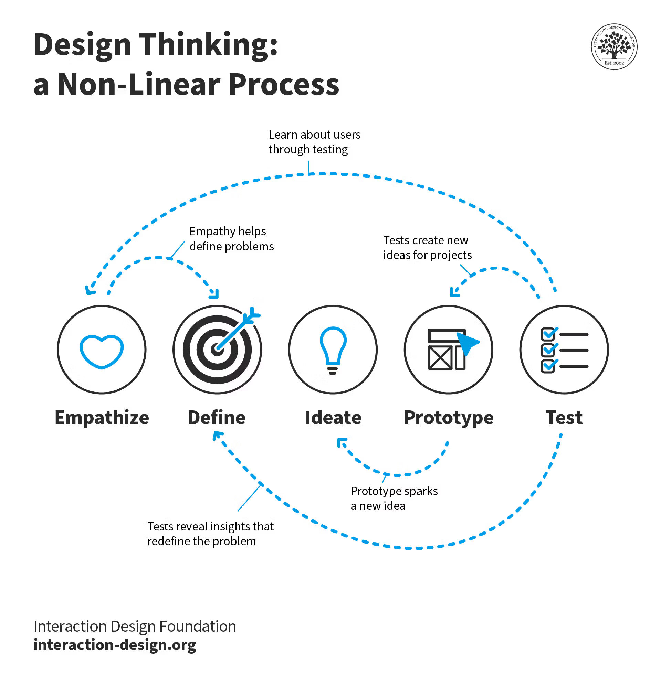

# Design Thinking (DT)

<figure><figcaption>
Image by <a href="https://www.interaction-design.org/literature/topics/design-thinking">Interaction Design Foundation</a>
</figcaption></figure>

Also widely known as Human-Cantered Design, Design thinking is a non-linear, iterative process that teams use to understand users, challenge assumptions, redefine problems and create innovative solutions to prototype and test. It is most useful to tackle ill-defined or unknown problems and involves five phases: Empathise, Define, Ideate, Prototype and Test.

Design thinking provides a holistic framework for addressing complex problems by putting the user at the center of the design process. It complements and enhances other design approaches by fostering innovation, empathy, and a focus on human needs.

#### Design Thinking: A Human-Cantered Approach

Design thinking is a creative problem-solving methodology cantered around understanding user needs and developing innovative solutions. It emphasizes empathy, experimentation, and iteration. The process is typically broken down into five phases:

1. **Empathise**: Immerse yourself in the user's world to gain deep insights into their needs, motivations, and pain points.
2. **Define**: Synthesise your research findings to identify the core problem you want to solve.
3. **Ideate**: Generate a wide range of creative solutions to the problem, encouraging out-of-the-box thinking.
4. **Prototype**: Create tangible representations of your ideas, whether it's sketches, wireframes, or physical prototypes.
5. **Test**: Gather feedback on your prototypes from users to refine and improve your solutions.

#### Design Thinking vs. Other Design Approaches

Design thinking differs from other approaches in a few key ways:

* Focus on Human Needs: Design thinking places a strong emphasis on understanding and addressing user needs, whereas other approaches might focus more on technical feasibility or business requirements.
* Iterative Process: Design thinking is highly iterative, with a constant cycle of learning, creating, and testing. This allows for flexibility and adaptability throughout the design process.
* Creative Mindset: Design thinking encourages a creative and open-minded approach to problem-solving, valuing divergent thinking and unconventional ideas.
* Collaboration: Design thinking often involves collaboration between diverse teams, including designers, engineers, marketers, and even users themselves.

#### Comparing Design Thinking to Lean UX and Agile Design/UX

* Lean UX: Focuses on building minimum viable products (MVPs) to quickly test assumptions and gather user feedback. Design thinking can be integrated into Lean UX to enhance the user-cantered aspect of the process.
* Agile Design/UX: Emphasises iterative development and collaboration between designers and developers. Design thinking can be used to inform the user-cantered design principles within Agile frameworks.

#### Further Reading



{% embed url="https://uxplanet.org/design-thinking-lean-ux-agile-%EF%B8%8F-8c65e888a9e9" %}









#### Further Viewing

























#### Curated Library


