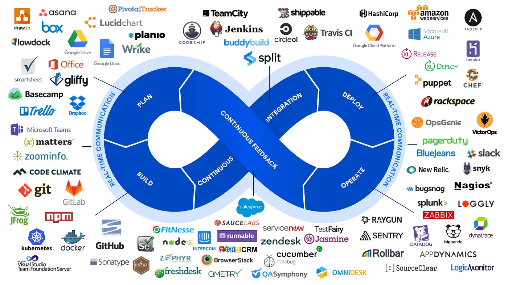

# DevOps

<figure><figcaption>
Image <a href="https://medium.com/cloud-native-daily/the-ultimate-guide-to-the-top-devops-tools-you-need-to-know-exploring-the-top-devops-tools-11e5f8aa9686">Source</a>
</figcaption></figure>

DevOps is a set of practices that combine software development (Dev) and IT operations (Ops). It aims to shorten the systems development life cycle and provide continuous delivery with high software quality. DevOps emphasises collaboration, automation, integration, and rapid feedback cycles.

Here's how DevOps compares to Agile, Lean Software Development, and others:

* **Agile**\
  Agile is a software development methodology that emphasises iterative development, teamwork, customer collaboration, and continuous improvement. DevOps builds on Agile principles by extending collaboration to include IT operations teams and focusing on automation to streamline the entire software delivery pipeline.
* **Lean Software Development**\
  Lean is a methodology that focuses on eliminating waste and maximising value. DevOps aligns with Lean principles by automating repetitive tasks, reducing manual intervention, and optimizing the flow of work through the delivery pipeline.
* **Continuous Integration/Continuous Delivery (CI/CD)**\
  CI/CD is a set of practices that automate the building, testing, and deployment of software. DevOps incorporates CI/CD as a core practice to enable frequent and reliable software releases.

DevOps is not a standalone methodology but rather a cultural shift and a set of practices that can be combined with other methodologies like Agile and Lean to achieve faster, more reliable, and higher-quality software delivery.

Imagine you are building a house.

Agile Company:

* Focus: Breaks down the house construction into smaller, manageable tasks (sprints).
* Approach: Works on one room at a time, getting feedback from the homeowner after each room is finished.
* Collaboration: Close collaboration between the architect, builders, and the homeowner.

DevOps Agile Company:

* Focus: Same as an Agile company, but with a stronger emphasis on automation and efficiency.
* Approach: Uses automated tools to streamline the building process. For example, robots might lay bricks, and 3D printers might create custom parts.
* Collaboration: Even closer collaboration, with the architect, builders, and even the suppliers working together seamlessly.

Key Difference: The DevOps Agile company delivers the house faster, with fewer errors, and can adapt to changes (like a sudden change in weather) more quickly due to automation and strong teamwork.

#### Further Reading














