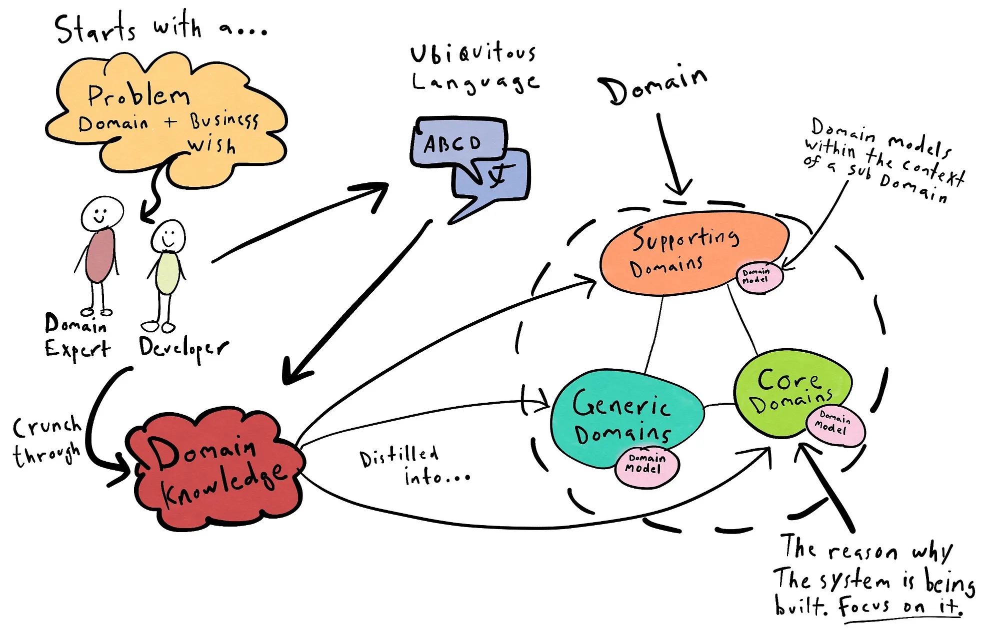

# Domain Driven Design

<figure><figcaption>
Image by <a href="https://medium.com/raa-labs/part-1-domain-driven-design-like-a-pro-f9e78d081f10">Anders Gill</a>
</figcaption></figure>

Domain-Driven Design is not a specific technology or a library. It is a philosophy and a way of working that ensures your software reflects the real-world business problems it is trying to solve.

In traditional software development, things often get "lost in translation" between business experts, designers, and developers. DDD provides a framework to bridge that gap, making sure everyone is building the same thing.

#### High-Level Overview

At its simplest, DDD is about focusing on the core business logic.

Think of a massive logistics company. They have trucks, warehouses, drivers, and customers. If you build their software by focusing only on "how to save data to a database," you miss the complexity of how a truck is assigned to a route.

DDD encourages you to:

1. Talk the same language: Use the same words in the code that the business experts use in the office.
2. Draw boundaries: Don't try to make one giant system. Break it into smaller, manageable "contexts."
3. Model the reality: Ensure the software behaves exactly like the business process it represents.

#### Strategic Design: The "Way of Working"

Strategic design is about the big picture. This is where Product Managers, Designers, and Stakeholders spend most of their time.

**The Ubiquitous Language**

This is the heartbeat of DDD. It is a rigorous agreement that the team will use a single, shared vocabulary.

* The Problem: Marketing calls a user a "Lead," Sales calls them a "Prospect," and the code calls them a "Record\_ID."
* The DDD Solution: The team agrees on one term (e.g., "Potential Customer"). This term is used in meetings, in the UI design, and in the variable names within the code.

**Bounded Contexts**

In a large organisation, a single word can mean different things. In a "Shipping" context, a "Product" is a box with weight and dimensions. In a "Sales" context, a "Product" is a price point and a marketing description.

DDD suggests we create Bounded Contexts, clear borders around parts of the system where a specific model applies. This prevents a "Big Ball of Mud" where everything is tangled together.

#### How It Works: The Activities

DDD is an active methodology. You don't just read about it; you do it.

**Event Storming**

This is the primary "process" or workshop used in DDD.

* What it is: A collaborative workshop involving "Domain Experts" (people who know the business) and "Technical Experts" (people who build it).
* How to do it: You use a massive wall and orange sticky notes. Each note represents a Domain Event (something that happened in the past, e.g., "Order Placed" or "Payment Declined").
* The Outcome: By mapping these events chronologically, you identify "hotspots" of complexity and naturally discover where your Bounded Contexts should be.

**Distilling the Core Domain**

Not every part of your software is equally important. DDD helps you categorise your features:

* Core Domain: The unique "secret sauce" that makes your business money. (Spend 80% of your effort here).
* Supporting Subdomain: Necessary but not unique (e.g., a custom booking calendar).
* Generic Subdomain: Things you can buy off the shelf (e.g., an email sending service).

#### Tactical Design: The Technical Building Blocks

Once the strategy is set, developers use specific patterns to implement the model.

* Entities: Objects with a unique identity (e.g., a User). Even if they change their name, they are the same User.
* Value Objects: Objects that have no identity and are defined only by their values (e.g., an Address or a Currency). If you change the street name, it’s a different address.
* Aggregates: A collection of objects that are bound together. For example, an "Order" and its "Order Items." You never change an item without going through the Order first. This ensures data integrity.
* Repositories: The interface used to retrieve these Aggregates from storage.

#### Further Reading







{% embed url="https://martinfowler.com/tags/domain%20driven%20design.html" %}



#### Further Viewing






