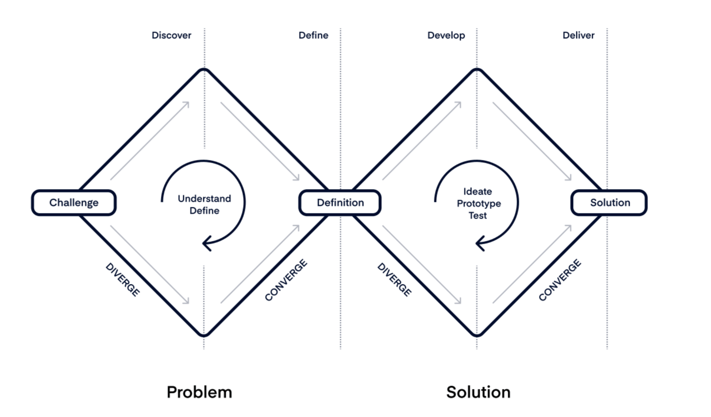

# Double Diamond

<figure><figcaption>
Image by <a href="https://www.productboard.com/blog/double-diamond-framework-product-management/?">ProductBoard</a>
</figcaption></figure>

A design process framework divided into two phases, exploring and defining problems, then ideating and delivering solutions.

The Double Diamond is a design thinking methodology developed by the Design Council, a British organisation. It's a problem-solving framework that helps teams navigate through the stages of identifying and defining a problem, exploring possible solutions, and ultimately delivering effective solutions.&#x20;

The Double Diamond approach emphasises iteration and flexibility, encouraging teams to revisit and refine their understanding of the problem and potential solutions throughout the process.

The Double Diamond model consists of four key phases, which are often represented as two diamonds:

1. **Discover**\
   In the first diamond, teams focus on understanding the problem space. This involves research, observation, and empathising with users to gain insights into their needs and challenges.
2. **Define**\
   Following the first diamond, the team synthesises the insights gathered and defines the specific problem or challenge they aim to address. This phase is about framing the problem in a way that guides the ideation process.
3. **Develop**\
   Moving into the second diamond, teams generate a wide range of ideas and potential solutions to the defined problem. This phase encourages creativity and divergent thinking to explore different possibilities.
4. **Deliver**\
   Finally, in the last phase, teams refine and prototype the most promising solutions identified during the development phase. Prototypes are tested and iterated upon based on feedback, leading to the delivery of a solution that effectively addresses the initial problem.

#### Further Reading






