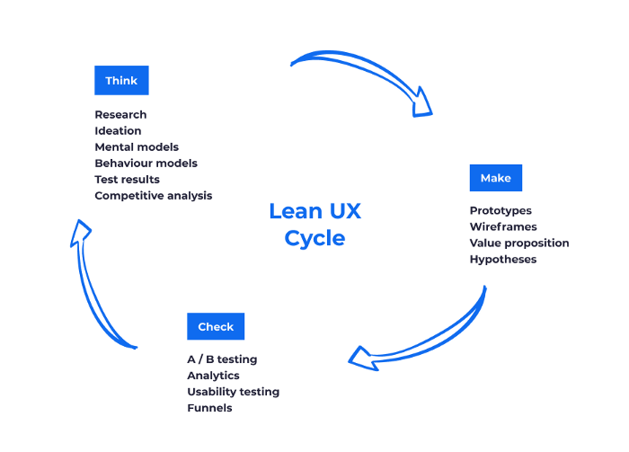
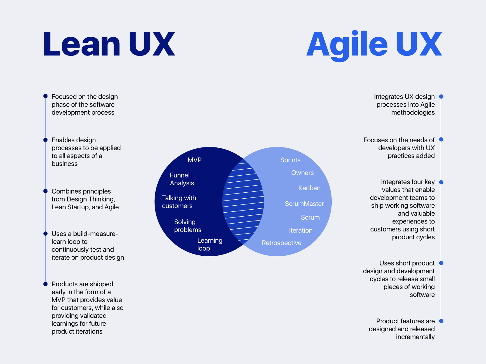
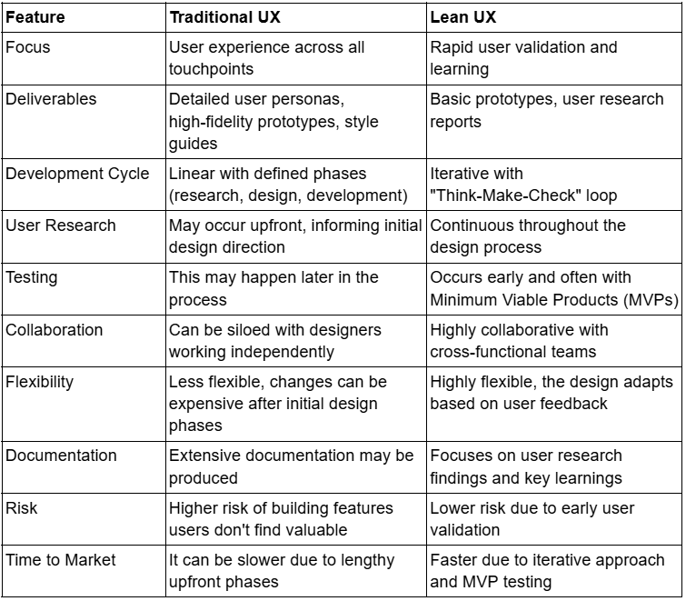
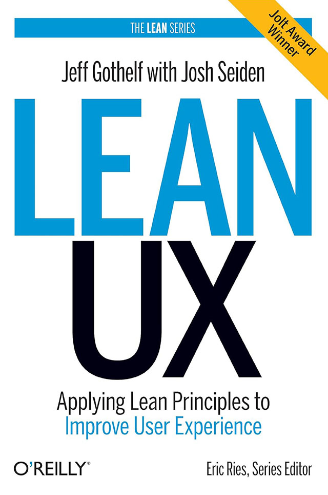

# Lean UX

<figure><figcaption>
Image by <a href="https://www.plainconcepts.com/lean-ux-methodology/">Plain Concepts</a>
</figcaption></figure>

Lean UX is a collaborative approach to user experience design that emphasises rapid iteration, continuous learning, and a focus on user needs. It combines elements of lean manufacturing and agile software development to streamline the design process and minimise waste.&#x20;

In summary, Lean UX is a powerful approach to user experience design that helps teams create better products faster.&#x20;

By focusing on collaboration, iteration, and user needs, Lean UX enables teams to deliver high-quality products that meet the needs of their users.

#### Key Principles of Lean UX

* **Cross-functional collaboration**\
  Designers, developers, product managers, and other stakeholders work closely together throughout the entire design process
* **Iterative design**\
  The design process is broken down into smaller iterations, allowing for quick feedback and adjustments
* **Minimum Viable Product (MVP)**\
  A minimal version of the product is built and tested with users early on to gather feedback and inform further development
* **User-centered design**\
  The needs and preferences of users are the driving force behind the design process.
* **Continuous learning**\
  The team continuously learns from user feedback and adapts the design accordingly.

#### Benefits of Lean UX

* **Faster time to market**\
  By focusing on building the most essential features first, Lean UX enables products to be released more quickly.
* **Reduced waste**\
  By eliminating unnecessary steps and focusing on what matters most, Lean UX helps to reduce waste of time, resources, and effort.
* **Improved user satisfaction**\
  By prioritising user needs and continuously gathering feedback, Lean UX helps to create products that users love.
* **Increased collaboration**\
  By fostering collaboration between different teams, Lean UX helps to break down silos and improve communication.

#### Lean UX and Lean Software Development

Lean UX and Lean Software Development are closely related methodologies, both stemming from the Lean manufacturing principles. They share a focus on eliminating waste, maximising efficiency, and delivering value quickly. However, they differ in their primary focus.

Lean UX prioritises the user experience, aiming to create products that are not only functional but also delightful to use. It emphasises user research, rapid prototyping, and iterative design to ensure the product meets user needs.

On the other hand, Lean Software Development focuses on the technical aspects of software development, aiming to streamline the development process, reduce defects, and increase delivery speed. It emphasises practices like continuous integration, test-driven development, and frequent feedback loops.

While Lean UX and Lean Software Development are distinct, they are often used together in a collaborative approach to deliver high-quality products efficiently. Lean UX doesn't necessarily fit within Lean Software Development, but it can be used alongside Lean Software Development in conjunction to achieve a more comprehensive approach to product development.

### Lean UX vs Agile UX

<figure><figcaption>
Image by <a href="https://dribbble.com/shots/5536730-Lean-UX-vs-Agile-UX">Riley Pelosi</a>
</figcaption></figure>

While Lean UX and Agile UX share a focus on iterative development and user-centered design, they have distinct approaches that influence a designer's role and responsibilities.

#### Lean UX

* **Focus on Learning**\
  Prioritises learning over delivering specific features.
* **Cross-Functional Collaboration**\
  Designers work closely with developers, product managers, and other stakeholders in cross-functional teams.
* **Minimal Documentation**\
  Emphasises hands-on experimentation and learning through building and testing.
* **Iterative Prototyping**\
  Rapidly creates and tests prototypes to validate assumptions and gather feedback.
* **User Research and Validation**\
  Continuously gathers user insights to inform design decisions.

#### Agile UX

* **Focus on Delivering Value**\
  Prioritises delivering value to users in short iterations.
* **User Stories and Backlogs**\
  Uses user stories to break down work into manageable chunks and prioritise features.
* **Time-boxed Iterations**\
  Works in short, time-boxed iterations (sprints) to deliver working software.
* **User Testing and Feedback**\
  Incorporates user feedback into each iteration.
* **Collaboration with Development Teams**\
  Works closely with development teams to ensure alignment on design and implementation.

**In essence**

* Lean UX designers are more focused on learning and experimentation, often working in a more fluid and less structured environment.
* Agile UX designers are more focused on delivering value within specific timeframes, often working within a more structured framework with defined deliverables.

Ultimately, the best approach for a designer will depend on the specific project and team context. Often, a combination of Lean UX and Agile UX principles can be effectively applied to achieve optimal results.



#### Lean UX vs Traditional UX

<figure><figcaption>
Image by <a href="https://www.thealien.design/insights/guide-to-lean-ux">Alien</a>
</figcaption></figure>

#### Lean UX Canvas


[lean-ux-canvas.md](../strategy/canvases/lean-ux-canvas.md)


<figure><figcaption></figcaption></figure>

#### [Lean UX](https://www.goodreads.com/en/book/show/13436116)

Applying Lean Principles to Improve User Experience\
by Jeff Gothelf (2012)

Lean UX by Jeff Gothelf is a guide to user experience (UX) design that emphasizes a collaborative, iterative approach. By focusing on building a shared understanding of the customer and their needs, teams can create products that truly meet user needs. This approach prioritises speed, collaboration, and continuous feedback, leading to faster, more efficient product development and better user experiences.

#### Further Reading

















#### Curated Library


