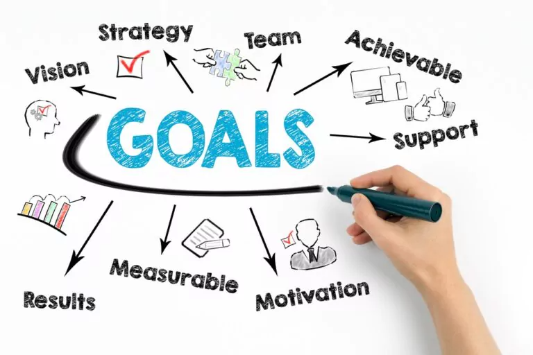
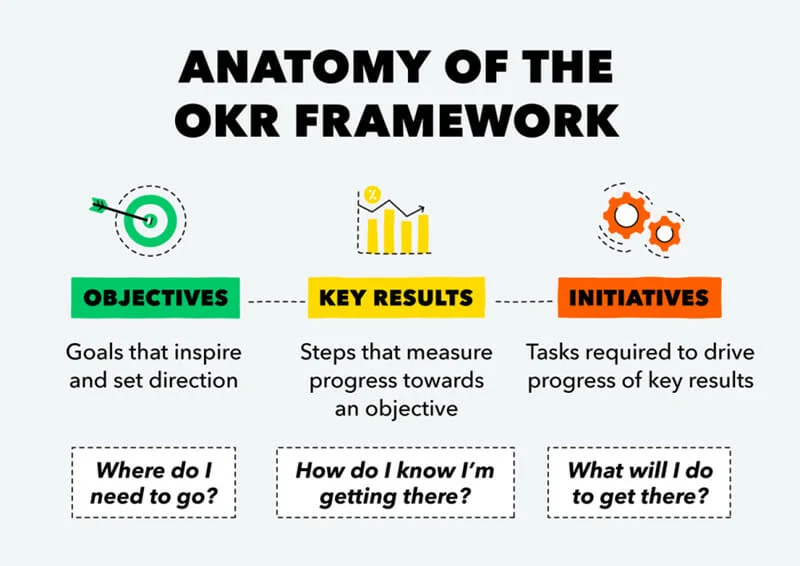
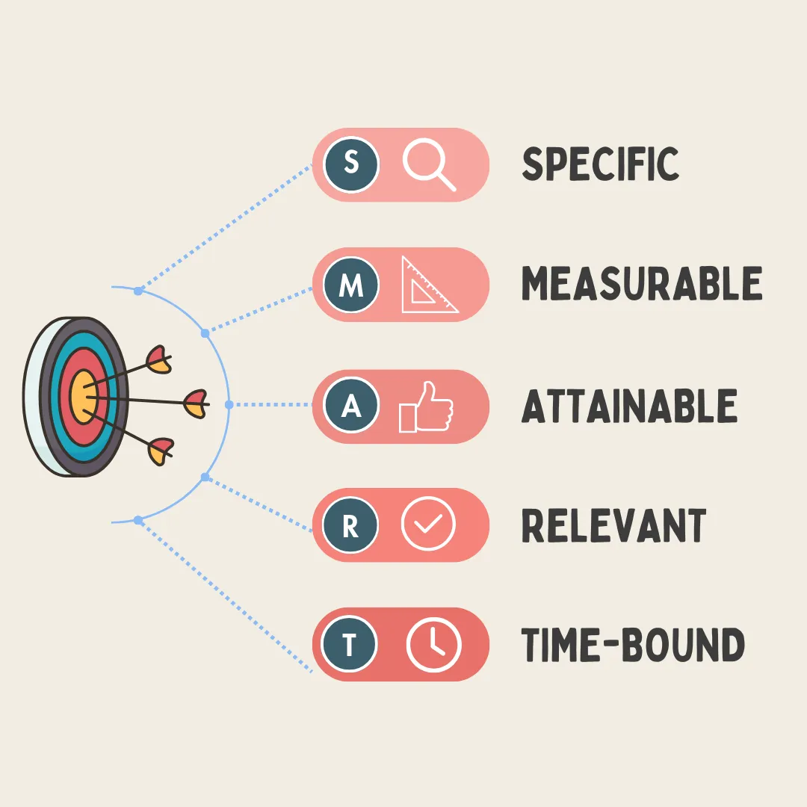
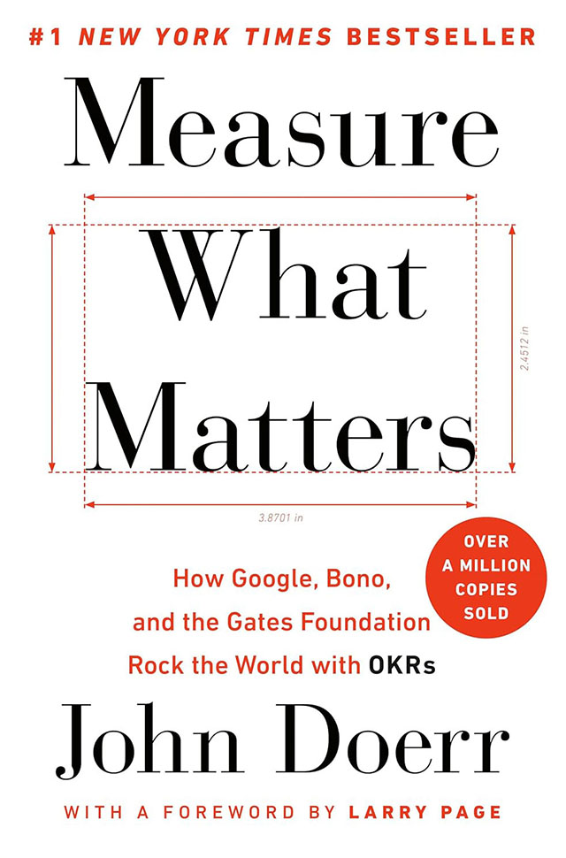

# Goal Setting

<figure><figcaption></figcaption></figure>


Effective goal setting is an essential component of Performance Management. Learn more about [Performance Management](../../managing-people/performance-management.md) in the Managing People section.


### Introduction

In modern organisations, effective goal-setting frameworks are essential for maintaining alignment, focus, and measurable progress across teams and individuals, while also driving impactful contributions to the overall business objectives by aligning individual and team goals with broader business goals and strategies.

Objectives and Key Results (OKRs) and SMART (Specific, Measurable, Achievable, Relevant, Time-bound) goals are two of the most widely used frameworks. Although each can be applied independently, organisations frequently use them together to achieve both high-level strategic clarity and detailed accountability.

#### Understanding OKRs and Their Role in Strategic Alignment

OKRs are a goal-setting system designed to set ambitious, outcome-driven objectives at the organisational or team level. An OKR framework typically includes broad, aspirational objectives that define what the organisation aims to achieve and a set of measurable key results that specify how success will be measured. This structure encourages teams to set challenging goals that inspire and align efforts toward a shared vision. Because OKRs are commonly defined at a high level, they help unify the organisation, directing resources and attention towards impactful results.

For instance, a company-wide OKR might be: "Enhance product usability by 30% by Q2." This goal does not specify each step required to achieve it but instead focuses on an ambitious, quantifiable improvement that requires cross-functional collaboration.

#### The Precision of SMART Goals

While OKRs focus on strategic alignment, SMART goals provide a framework for creating actionable, attainable, and time-sensitive objectives at a more granular level. SMART goals are particularly useful for individual or team-specific tasks and day-to-day operations. Each SMART goal is defined by its clarity and focus, ensuring that every goal is specific, measurable, achievable, relevant to the broader objectives, and bound to a specific timeline.

For example, under the broad OKR of "Enhance product usability," a SMART goal for a product design team might be: "Reduce page load time to under 2 seconds by March. This goal is specific and tied to a tangible, time-sensitive outcome that supports the broader OKR. SMART goals create focus by breaking down larger objectives into actionable steps, making them particularly useful for managers and employees who need clear deliverables and accountability measures.

> “Setting goals is the first step in turning the invisible into the visible.” — Tony Robbins

#### Benefits of Using OKRs and SMART Goals Together

Using OKRs and SMART goals in tandem enables organisations to address both strategic direction and operational execution. OKRs provide the 'big picture,' helping teams align with the company's vision and set targets that stretch their capabilities. Meanwhile, SMART goals translate these high-level objectives into specific, achievable tasks, ensuring that each step taken moves the team closer to the overarching goal.

Integrating these frameworks also encourages adaptability. While OKRs can be revisited and revised each quarter to reflect strategic changes, SMART goals keep daily operations focused and measurable. As a result, teams are empowered to pursue challenging objectives with the reassurance of clear, actionable steps that promote individual accountability and contribute directly to organisational success.

#### Practical Application: OKRs for Strategy, SMART Goals for Execution

For organisations to effectively implement both frameworks, it's important to establish a clear relationship between the two. One approach is to define OKRs at the company or team level and cascade them down, where managers can develop SMART goals that align directly with each key result. For example, if a key result within an OKR is to "increase user satisfaction scores by 15% by the end of the quarter," individual team members might set SMART goals such as "Conduct 5 user testing sessions per month to identify common pain points."

By creating SMART goals that directly support OKRs, organisations ensure that every action contributes meaningfully to the larger strategy, reinforcing both focus and accountability.

#### Conclusion

The combined use of OKRs and SMART goals allows organisations to benefit from both high-level ambition and day-to-day precision. OKRs set a strategic course, while SMART goals provide the tactical map for navigating it. This integration fosters alignment, measurable progress, and adaptable processes across all levels of the organisation. As companies seek to balance vision with execution, the complementary strengths of OKRs and SMART goals offer an ideal framework for translating strategy into sustained, measurable success.

#### OKRs

* Effective for setting ambitious, measurable goals that align with the company vision.
* Suitable for quarterly or annual planning, helping track progress on long-term objectives.
* Promotes a culture of innovation and high performance by encouraging stretch goals.
* Focuses on aligning individual and team efforts with broader organisational objectives.


A stretch goal is an ambitious target set to push individuals or teams beyond their comfort zones, inspiring innovation and driving exceptional performance.


#### SMART

* Ideal for setting clear, actionable and time-bound goals for short-term tasks with specific outcomes.
* Useful for daily, weekly, or monthly tasks.
* Emphasises specificity, measurability, achievability, relevance, and time constraints for structured goal-setting and progress tracking.
* Useful for tactical, individual, or team performance, with a focus on realistic, specific targets.

### Implementing OKRs and SMART Goals

<figure><figcaption>
Image by <a href="https://www.founderjar.com/what-is-okr/">Founder Jar</a>
</figcaption></figure>

OKRs consist of two main parts:

* Objectives – These are qualitative and inspirational goals that describe what you want to achieve.
* Key Results – These are quantitative and measurable outcomes that define how you know when you've reached your objective.

Example:

* Objective: Improve customer satisfaction in our support department.
* Key Results:
  1. Achieve a 90% positive feedback rating by the end of Q1.
  2. Reduce average response time to customer queries to under 24 hours.
  3. Train all support staff on conflict resolution skills by mid-Q1.

OKRs aim to stretch teams, challenging them to reach beyond what they're already achieving.

<figure><figcaption>
Image by <a href="https://medium.com/illumination/10-powerful-leadership-tools-that-will-put-you-in-top-gear-a449181a9d47">Gaurav Jain</a>
</figcaption></figure>

SMART is an acronym that represents five criteria for effective goal-setting:

* Specific: Clearly define what you want to achieve.
* Measurable: Define metrics to track progress.
* Achievable: Set realistic goals within your team’s capacity.
* Relevant: Ensure alignment with broader organisational goals.
* Time-Bound: Set a clear timeframe for achieving the goal.

Example:

* SMART Goal: "Increase customer satisfaction by achieving a 90% positive feedback rating within the next quarter by training all support staff on conflict resolution."

SMART goals are precise and realistic, guiding teams toward achieving attainable outcomes.

Managers should use OKRs for a team's high-level goals and SMART goals for individual and actionable tasks that help achieve the OKRs.

#### Step-by-Step Process

#### Step 1:

Define High-Level OKRs (Quarterly or Annual)

1. Meet with your team to identify areas for growth – These should align with company goals and your team's potential.
2. Set 1–3 OKRs per quarter – Any more, and they may dilute focus. Ensure each Objective is ambitious but achievable.
3. Define 2–4 Key Results per Objective – Make sure each Key Result is specific, measurable, and time-bound.

Example of a Good OKR:

* Objective: Lead the team to become a top performer in customer satisfaction.
  * Key Result 1: Increase positive customer feedback to 95% by the end of Q2.
  * Key Result 2: Complete two customer service training sessions by mid-Q2.
  * Key Result 3: Implement a feedback loop for customers within Q2.

Bad OKR:

* Objective: Be the best team.
  * Key Result 1: Make customers happy.
  * Key Result 2: Have fewer complaints.

Why it's bad: It's too vague and lacks measurable outcomes, making it hard to know if you've achieved the objective.

#### **Step 2:**

Translate OKRs into Team and Individual SMART Goals (Weekly or Monthly)

1. Break down Key Results into SMART goals – Each Key Result from your OKR should translate into specific actions.
2. Assign SMART goals to team members according to their roles and strengths, ensuring each goal is realistic and within their capacity.

Example:

* SMART Goal (for a Customer Support Rep based on OKR above): "Resolve 80% of customer tickets within 12 hours over the next month by prioritising high-severity cases."
* SMART Goal (for a Manager): "Conduct weekly one-on-one sessions with each team member to address challenges in response time by the end of the month."

#### **Step 3:**

Set Up Checkpoints for Tracking Progress

Establish regular check-ins (weekly or bi-weekly) to assess progress on SMART goals and OKRs. These check-ins are essential for tracking, realigning efforts if needed, and recognising any quick wins.

### Tips

1. **Make Goals Visible**\
   Create a dashboard or shared document to track OKRs and SMART goals. This visibility keeps goals top of mind and encourages accountability within the team.
2. **Encourage Collaboration**\
   OKRs work best when there’s a shared sense of purpose. Organise team brainstorming sessions or buddy systems so team members can support each other.
3. **Celebrate Progress, Not Just Outcomes**\
   Goal-setting is about growth. Celebrate the incremental steps towards your OKRs, not just the end results. This could mean giving a shout-out in meetings or awarding small recognitions for effort.
4. **Foster Flexibility**\
   If circumstances change, be open to adjusting OKRs and SMART goals. Adaptability is a strength, and sometimes revisiting goals mid-cycle keeps your team agile and motivated.
5. **Reflect & Improve**\
   At the end of each quarter or performance period:
   1. **Review OKRs** – Analyse what was achieved and what wasn't. Discuss reasons with your team and document key learnings.
   2. **Conduct Retrospectives on SMART Goals** – Gather insights from team members on what worked well and what could be improved.
   3. **Set New Goals** – Use insights gained to set fresh, relevant OKRs and SMART goals for the next cycle, aligning with any shifts in company strategy.
6. **Align on definitions**\
   Make sure everyone understands terms like "measurable" or "achievable" within the team context.
7. **Don't set too many goals**\
   Start small and manageable; you can always build as your team gets more comfortable with the frameworks.
8. **Don't forget the purpose of goals**\
   Goals should inspire improvement and progress, not act as rigid tasks to tick off.

### Book Recommendations

<figure><figcaption></figcaption></figure>

#### [Measure What Matters](https://www.goodreads.com/book/show/39286958-measure-what-matters)

How Google, Bono, and the Gates Foundation Rock the World with OKRs\
by John Doerr (2017)

Legendary venture capitalist John Doerr reveals how the goal-setting system of Objectives and Key Results (OKRs) has helped tech giants from Intel to Google achieve explosive growth and how it can help any organisation thrive.

### Example OKRs

**Good OKRs**

1. **Objective**: Improve customer satisfaction with our mobile app.
   * **Key Results**:
     * Increase App Store rating from 3.8 to 4.5.
     * Decrease customer support response time from 24 hours to under 6 hours.
     * Implement a customer feedback loop with at least 100 user inputs per month.
2. **Objective**: Enhance the team’s design skills and knowledge-sharing culture.
   * **Key Results**:
     * Hold bi-weekly knowledge-sharing sessions on latest design trends.
     * Each designer to complete a specialised course or training by the quarter's end.
     * Implement a team-wide resource library with at least 50 entries.
3. **Objective**: Reduce user churn rate.
   * **Key Results**:
     * Decrease churn rate by 20% over the next 6 months.
     * Conduct interviews with at least 30 users who churned to identify pain points.
     * Roll out top 3 feature requests identified in user feedback.
4. **Objective**: Improve accessibility of the product.
   * **Key Results**:
     * Complete WCAG 2.1 compliance audit with an external consultant.
     * Achieve an AA rating for all core screens by end of quarter.
     * Reduce accessibility-related customer complaints by 50%.
5. **Objective**: Speed up the design-to-development handover process.
   * **Key Results**:
     * Decrease design-to-dev handover time from 3 weeks to 1 week.
     * Standardise design documentation and reduce revision cycles by 30%.
     * Train designers on new tools and workflows for more streamlined handoffs.

**Bad OKRs**

1. **Objective**: Increase sales (vague and sales-oriented, not product design-specific).
   * **Key Results**:
     * “Boost sales by 15%” (without specifying design-related impact).
     * “Increase ad budget by 20%” (not tied to design responsibilities).
2. **Objective**: Improve team morale.
   * **Key Results**:
     * “Have regular team meetings” (without measurable outcomes).
     * “Schedule one team lunch” (low impact and too arbitrary).
3. **Objective**: Get feedback on new feature.
   * **Key Results**:
     * “Conduct a survey” (lacks detail on sample size or feedback goals).
     * “Fix bugs from feedback” (not specific about what kind of bugs or quantity).
4. **Objective**: Finish all projects on time.
   * **Key Results**:
     * “Meet all project deadlines” (not actionable or inspiring).
     * “Submit designs on time” (no breakdown on improvements or adjustments).
5. **Objective**: Reduce customer complaints.
   * **Key Results**:
     * “Handle all complaints” (no indication of how to measure reduction).
     * “Reduce complaints” (vague without quantitative goals).

### Example SMART Goals

**Good SMART Goals**

1. **Specific**: Develop a streamlined design system by the end of Q2.
   * **Measurable**: Include at least 50 reusable components.
   * **Achievable**: Allocate time in sprints specifically for design system work.
   * **Relevant**: Ensure all new products use the system by Q2 end.
   * **Time-bound**: Completed by Q2 end.
2. **Specific**: Conduct usability testing with real users.
   * **Measurable**: Conduct 10 sessions per month.
   * **Achievable**: Schedule 2 sessions weekly.
   * **Relevant**: Directly informs UX improvements.
   * **Time-bound**: Complete 30 sessions in the next 3 months.
3. **Specific**: Reduce the homepage bounce rate.
   * **Measurable**: Bring bounce rate down by 15%.
   * **Achievable**: Implement feedback-driven UI changes.
   * **Relevant**: Supports marketing and growth objectives.
   * **Time-bound**: Achieve reduction by quarter’s end.
4. **Specific**: Improve loading speed for the app.
   * **Measurable**: Decrease load time from 5 seconds to under 2 seconds.
   * **Achievable**: Conduct optimisation sprints with engineers.
   * **Relevant**: Directly impacts user experience.
   * **Time-bound**: Complete improvements within 6 weeks.
5. **Specific**: Increase adoption of new design tools.
   * **Measurable**: 100% of team using new tools for daily work.
   * **Achievable**: Provide onboarding training and resources.
   * **Relevant**: Enhances design consistency and speed.
   * **Time-bound**: Fully adopted within 2 months.

**Bad SMART Goals**

1. **Specific**: “Make the product better.”
   * **Measurable**: Not defined.
   * **Achievable**: Vague; lacks action items.
   * **Relevant**: Hard to determine due to vagueness.
   * **Time-bound**: Lacks a timeline.
2. **Specific**: “Increase efficiency in the team.”
   * **Measurable**: Vague; efficiency in what sense?
   * **Achievable**: No actionable steps.
   * **Relevant**: Too broad to connect to design work.
   * **Time-bound**: No timeline provided.
3. **Specific**: “Decrease time spent on meetings.”
   * **Measurable**: Not defined (how much decrease?).
   * **Achievable**: No baseline provided.
   * **Relevant**: Lacks a connection to tangible improvements.
   * **Time-bound**: Unspecified.
4. **Specific**: “Finish all projects this year.”
   * **Measurable**: Too broad; no way to track individual project timelines.
   * **Achievable**: Lacks prioritisation.
   * **Relevant**: Not directly focused on team improvement.
   * **Time-bound**: Poor timeline definition.
5. **Specific**: “Gather some user feedback.”
   * **Measurable**: No clear sample size or user goals.
   * **Achievable**: Too arbitrary; lacks depth.
   * **Relevant**: Not directed toward specific design improvements.
   * **Time-bound**: No deadline for action.

### Further Viewing





### Further Reading

#### General Goal Setting Articles





#### OKR Articles





















#### SMART Articles



#### General Performance Management & Goal Setting Articles


