# Books

View a curated list of books relating to [Product Design](https://raindrop.io/TonyODonohoe/books-37602031)

View a curated list of books relating to [Leadership & Management](https://raindrop.io/TonyODonohoe/books-37602031/search/sort=-created\&perpage=30\&page=0\&search=%22%23Books+\(Leadership\)%22)


Below are top picks for leadership books


<figure>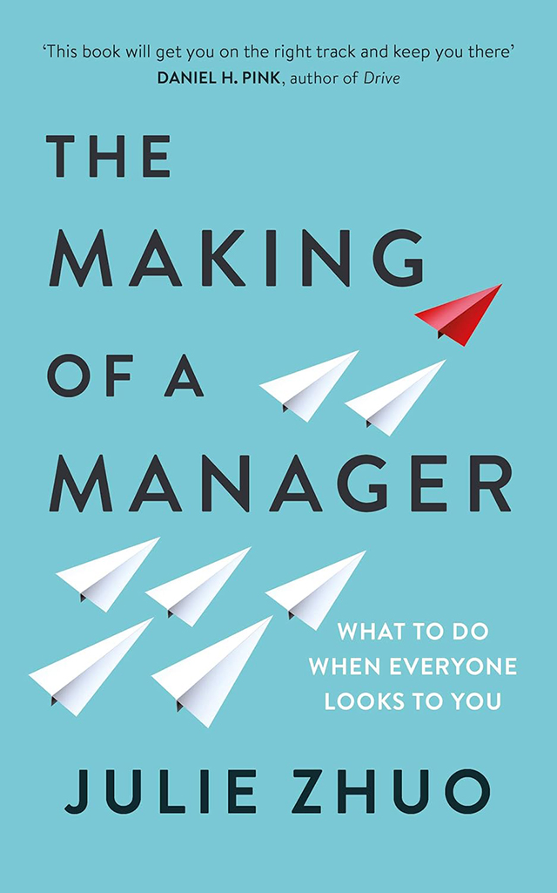<figcaption></figcaption></figure>

#### [The Making of a Manager](https://www.goodreads.com/book/show/38821039-the-making-of-a-manager)

What To Do When Everyone Looks to You\
by Julie Zhuo (2019)

"The Making of a Manager" by Julie Zhuo is a practical guide for aspiring and new managers. It offers insights into the challenges and rewards of leadership, covering topics such as building effective teams, giving feedback, and making tough decisions. Zhuo shares personal anecdotes and actionable advice to help readers develop their management skills and become more confident leaders.

<figure><figcaption></figcaption></figure>

#### [Liftoff!](https://www.goodreads.com/book/show/54426021-liftoff)

Practical Design Leadership to Elevate Your Team, Your Organisation, and You\
by Chris Avore, and Russ Unger (2020)

"Liftoff!" is a comprehensive guide for design leaders, offering practical advice on building and managing successful design teams. Authors Chris Avore and Russ Unger delve into various aspects of design leadership, from hiring and onboarding new talent to fostering team culture and scaling design efforts. The book covers essential topics like creating effective team charters, conducting meaningful one-on-one meetings, and providing constructive feedback through design critiques. It also explores strategies for presenting work effectively, saying no strategically, and growing individual designers within the team. Additionally, the book addresses broader organizational challenges, such as influencing stakeholders, escaping the trap of velocity, and advocating for the value of design. By sharing their insights and experiences, the authors provide a valuable resource for design leaders at all levels, empowering them to elevate their teams and organisations.

<figure>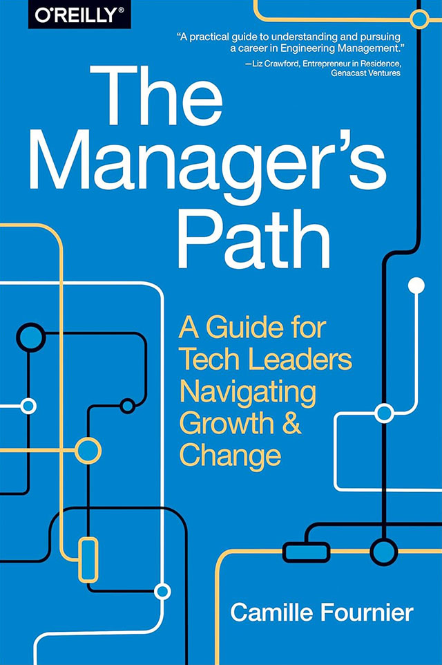<figcaption></figcaption></figure>

#### [The Manager's Path](https://www.goodreads.com/book/show/33369254-the-manager-s-path)

A Guide for Tech Leaders Navigating Growth and Change\
by Camille Fournier (2017)

"The Manager's Path" by Camille Fournier is a comprehensive guide for tech leaders navigating the complexities of management. It covers the various managerial roles, from mentoring and leading teams to managing managers and shaping organisational culture. Fournier offers practical advice on handling challenges like performance reviews, difficult conversations, and fostering a positive work environment. This book empowers aspiring and seasoned managers to excel in their roles and drive their teams toward success.

<figure>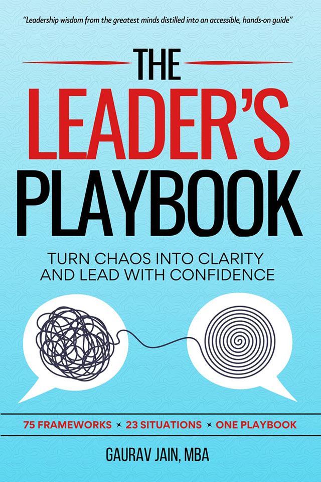<figcaption></figcaption></figure>

#### [The Leader's Playbook](https://www.goodreads.com/book/show/217219532-the-leader-s-playbook)

Turn Chaos Into Clarity and Lead With Confidence\
by Gaurav Jain (2024)

"The Leader's Playbook" by Gaurav Jain is a comprehensive guide for aspiring and experienced leaders. It presents a collection of 75 powerful leadership frameworks across 23 essential categories, offering a step-by-step blueprint to tackle various leadership challenges. From building high-performing teams and making informed decisions to navigating complex business landscapes and leading through change, this book provides actionable insights and real-world examples to help you become a more effective and confident leader.

<figure>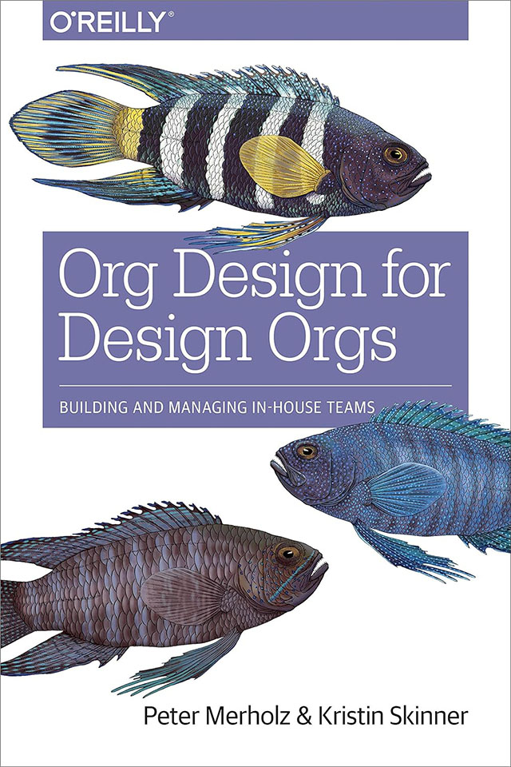<figcaption></figcaption></figure>

#### [Org Design for Design Orgs](https://www.goodreads.com/book/show/27968897-org-design-for-design-orgs)

Building and Managing In-House Design Teams\
by Peter Merholz and Kristin Skinner (2016)

"Org Design for Design Orgs" by Peter Merholz and Kristin Skinner is a practical guide for building and managing in-house design teams. It explores the evolution of design's role in organisations and provides insights into structuring design teams, recruiting and hiring designers, and managing and promoting professional growth. The book covers topics like design team roles, the centralised partnership model, and infusing design into product and service experiences. It offers actionable advice for design leaders to create effective and impactful design organisations.

<figure><figcaption></figcaption></figure>

#### [Measure What Matters](https://www.goodreads.com/book/show/39286958-measure-what-matters)

How Google, Bono, and the Gates Foundation Rock the World with OKRs\
by John Doerr (2017)

"Measure What Matters" by John Doerr is a guide to achieving ambitious goals through OKRs (Objectives and Key Results). This framework, popularised by companies like Intel and Google, helps organisations align their teams, track progress, and set ambitious targets. Doerr shares real-world examples and insights into how OKRs can drive innovation, focus effort, and accelerate growth. The book provides practical advice for implementing OKRs and measuring what truly matters to achieve success.

<figure>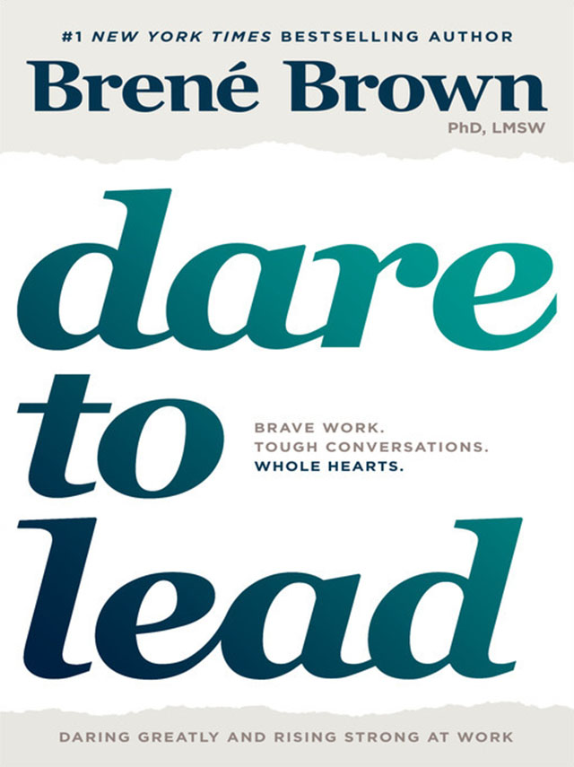<figcaption></figcaption></figure>

#### [Dare to Lead](https://www.goodreads.com/book/show/40109367-dare-to-lead)

by Brené Brown (2018)

"Dare to Lead" by Brené Brown is a practical guide to courageous leadership. Brown draws on her research and personal experiences to explore the importance of vulnerability, courage, and empathy in leadership. She provides a framework for building brave cultures, having difficult conversations, and leading with authenticity. This book offers actionable insights and tools to help leaders develop their leadership skills and create more meaningful and impactful organisations.

<figure>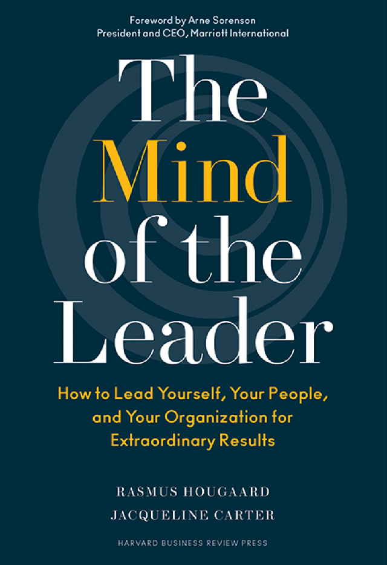<figcaption></figcaption></figure>

#### [The Mind of the Leader](https://www.goodreads.com/book/show/36598419-the-mind-of-the-leader)

How to Lead Yourself, Your People, and Your Organisation for Extraordinary Results\
by Jacqueline Carter, Rasmus Hougaard (2018)

"The Mind of the Leader" by Jacqueline Carter and Rasmus Hougaard covers the inner workings of effective leadership. It explores the importance of emotional intelligence, mindfulness, and self-awareness in achieving extraordinary results. The book provides practical tools and techniques to help leaders develop their emotional intelligence, cultivate positive mindsets, and build strong, resilient teams. By focusing on the inner game of leadership, this book empowers leaders to unlock their full potential and drive positive change.

<figure>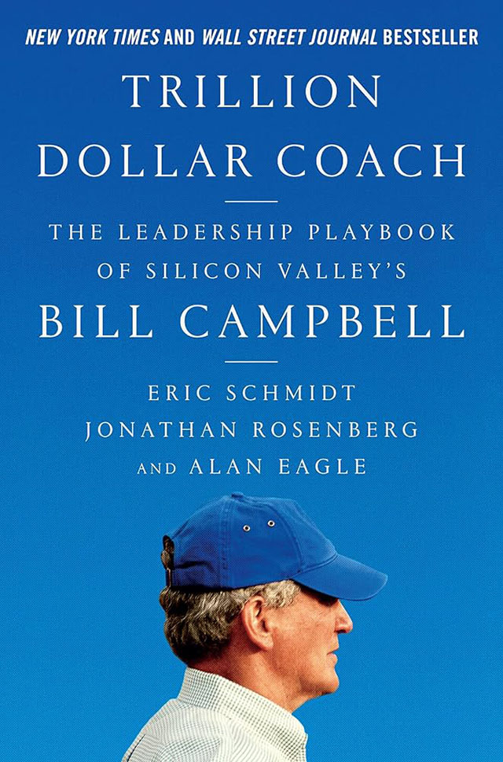<figcaption></figcaption></figure>

#### [Trillion Dollar Coach](https://www.goodreads.com/book/show/42118073-trillion-dollar-coach)

by Eric Schmidt, Johnathan Rosenberg, Alan Eagle (2019)

"Trillion Dollar Coach" offers insights into the coaching philosophy of Bill Campbell, a legendary Silicon Valley executive coach. The book highlights key principles and practices that Campbell used to mentor and guide some of the most successful tech leaders, including Steve Jobs, Eric Schmidt, and Sheryl Sandberg. Through real-world examples and anecdotes, the authors explore the power of effective coaching, the importance of asking the right questions, and the value of building strong relationships. This book provides valuable lessons for leaders at all levels, inspiring them to become better coaches and mentors.

<figure>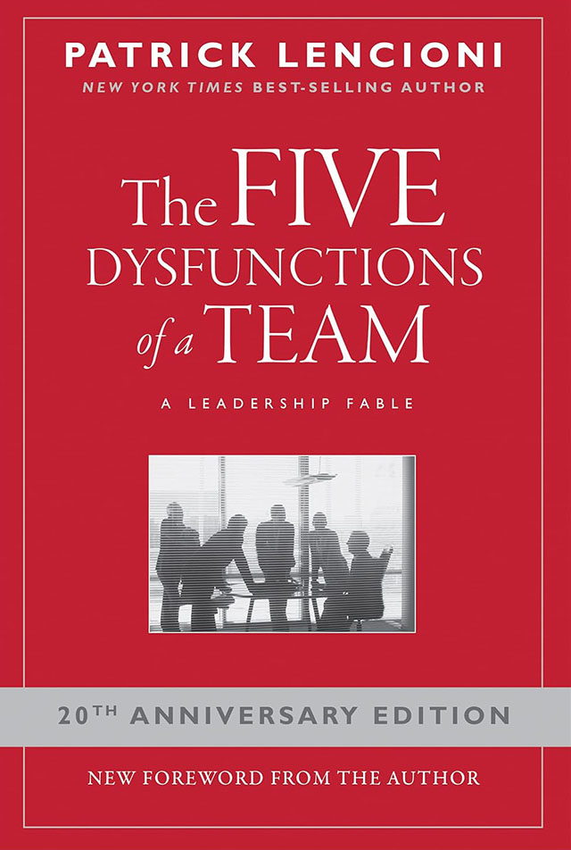<figcaption></figcaption></figure>

#### [The Five Dysfunctions of a Team](https://www.goodreads.com/book/show/21343.The_Five_Dysfunctions_of_a_Team)

A Leadership Fable\
by Patrick Lencioni (2002)

"The Five Dysfunctions of a Team" by Patrick Lencioni is a classic leadership book that identifies five common dysfunctions that hinder team performance: absence of trust, fear of conflict, lack of commitment, avoidance of accountability, and inattention to results. Lencioni provides a framework for diagnosing and addressing these dysfunctions, enabling teams to improve their effectiveness and achieve their goals. By focusing on building trust, engaging in constructive conflict, committing to decisions, holding each other accountable, and focusing on collective results, teams can overcome these dysfunctions and become high-performing units.

<figure>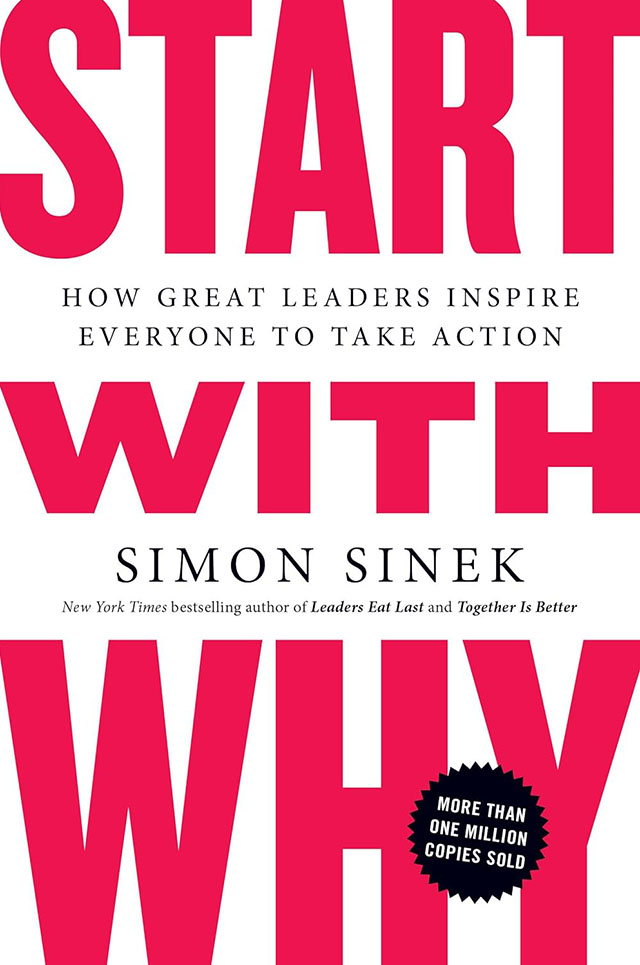<figcaption></figcaption></figure>

#### [Start with Why](https://www.goodreads.com/book/show/7108725-start-with-why)

How Great Leaders Inspire Everyone to Take Action\
by Simon Sinek (2009)

"Start With Why" by Simon Sinek explores the power of inspiring leadership. Sinek argues that great leaders inspire action by starting with a clear sense of purpose and communicating it effectively. By understanding and articulating their "why," leaders can motivate and engage their teams, customers, and stakeholders. The book provides a framework for identifying and communicating one's purpose, and offers practical advice for inspiring others to follow.

<figure>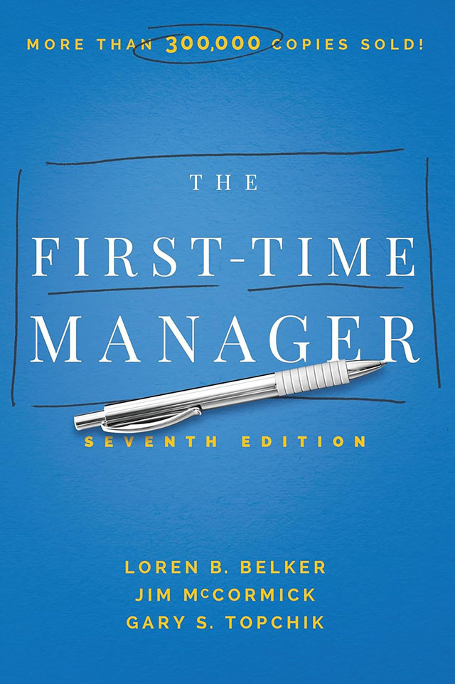<figcaption></figcaption></figure>

#### [The First-Time Manager](https://www.goodreads.com/book/show/12037994-the-first-time-manager)

by Loren B. Belker, Jim McCormick, Gary S. Topchik (1978)

"The First-Time Manager" is a classic guide for those newly stepping into leadership roles. It provides practical advice on a wide range of managerial topics, from setting goals and delegating tasks to motivating teams and resolving conflicts. The book emphasises the importance of effective communication, building strong relationships, and developing leadership skills. While some of the specific examples may be outdated, the core principles and advice remain relevant for first-time managers today.

<figure>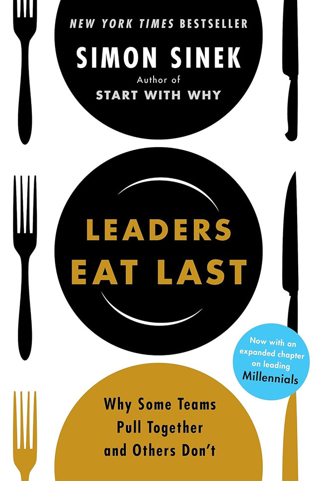<figcaption></figcaption></figure>

#### [Leaders Eat Last](https://www.goodreads.com/book/show/16144853-leaders-eat-last)

Why Some Teams Pull Together and Others Don't\
by Simon Sinek (2014)

"Leaders Eat Last" by Simon Sinek covers the importance of trust and safety in building high-performing teams. Sinek argues that leaders who prioritise the well-being of their teams create a culture of trust and loyalty. By putting the needs of their team members first, leaders inspire dedication, innovation, and extraordinary results. The book explores the concept of the "Circle of Safety" and provides practical advice for building trust, fostering collaboration, and creating a positive work environment.

<figure>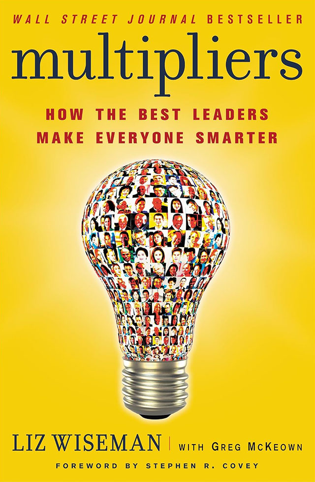<figcaption></figcaption></figure>

#### [Multipliers](https://www.goodreads.com/book/show/8310410-multipliers)

How the Best Leaders Make Everyone Smarter\
by Liz Wiseman (2010)

"Multipliers" by Liz Wiseman explores the concept of leadership as a multiplier, where leaders empower and amplify the intelligence of their teams. Wiseman identifies two types of leaders: Diminishers, who drain energy and stifle creativity, and Multipliers, who inspire and multiply the talent of their teams. The book provides a framework for becoming a Multiplier, focusing on five key behaviors: questioning, listening, challenging, teaching, and expecting more. By adopting these practices, leaders can create high-performing teams and achieve extraordinary results.

<figure>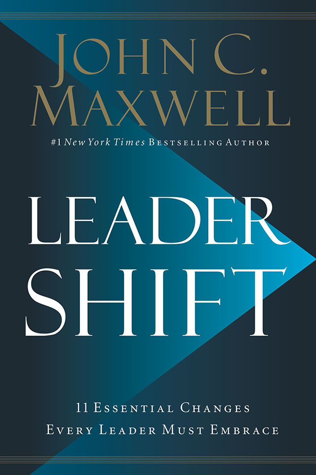<figcaption></figcaption></figure>

#### [Leadershift](https://www.goodreads.com/book/show/40590293-leadershift)

The 11 Essential Changes Every Leader Must Embrace\
by John C. Maxwell (2019)

"Leadershift" by John C. Maxwell outlines the 11 key shifts that leaders must embrace to achieve lasting success. These shifts cover various aspects of leadership, including personal growth, team building, and organisational development. Maxwell provides practical advice and inspiring stories to help leaders develop the necessary skills and mindset to lead effectively. By focusing on these essential changes, leaders can transform themselves and their organisations.

<figure>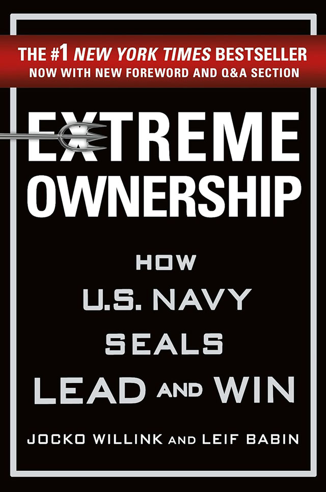<figcaption></figcaption></figure>

#### [Extreme Ownership](https://www.goodreads.com/book/show/23848190-extreme-ownership)

How U.S. Navy SEALs Lead and Win\
by Jocko Willink and Leif Babin (2015)

"Extreme Ownership" by Jocko Willink and Leif Babin is a leadership guide based on the principles and practices of the U.S. Navy SEALs. It emphasises the importance of taking ownership of one's actions, decisions, and mistakes. The book encourages leaders to embrace challenges, adapt to changing circumstances, and hold themselves and their teams accountable. By adopting a mindset of extreme ownership, leaders can build high-performing teams, overcome obstacles, and achieve extraordinary results.

<figure>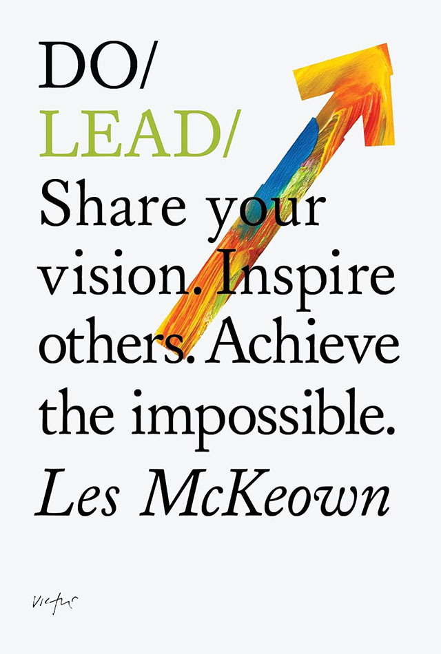<figcaption></figcaption></figure>

#### [Do Lead](https://www.goodreads.com/book/show/18722365-do-lead)

Share your vision. Inspire others. Achieve the impossible.\
by Les McKeown (2014)

"Do Lead" by Les McKeown offers a practical approach to leadership, debunking common myths and providing actionable insights. It emphasises that effective leadership is about achieving goals and empowering others, rather than focusing solely on personal charisma. The book provides tools and techniques to help leaders identify their natural leadership style, build strong teams, and inspire their organisations to achieve great things.

<figure>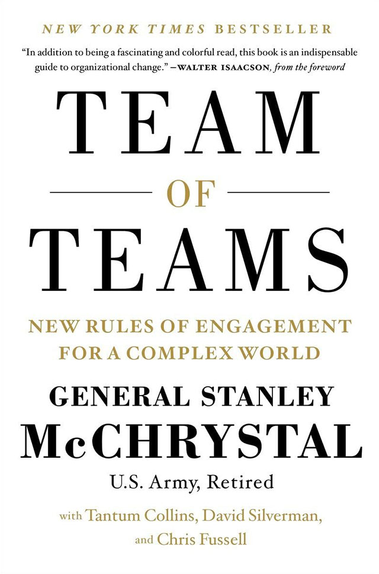<figcaption></figcaption></figure>

#### [Team of Teams](https://www.goodreads.com/book/show/22529127-team-of-teams)

New Rules of Engagement for a Complex World\
by General Stanley McChrystal (2015)

"Team of Teams" by Stanley McChrystal offers insights into the challenges of leading large, complex organisations in a rapidly changing world. McChrystal draws on his experiences as a U.S. Army General leading counterinsurgency operations in Iraq to highlight the importance of breaking down organisational silos, fostering collaboration, and empowering teams. The book provides a framework for building agile, adaptive organisations that can respond quickly to challenges and opportunities.

#### [The Servant](https://www.goodreads.com/book/show/181736.The_Servant)

Simple Story About the True Essence of Leadership\
by James C. Hunter (1998)

James C. Hunter's "The Servant" is a parable about leadership and service. John Daily, a successful but arrogant businessman, finds his life unraveling. Sent on a week-long retreat to a monastery, he encounters Simeon, a former businessman turned monk. Simeon teaches John that true leadership is not about power or control, but about serving others. Through a series of profound lessons, John learns the importance of humility, empathy, and putting the needs of others before his own. This transformative experience challenges John's traditional notions of leadership and inspires him to become a more effective and compassionate leader.

### Relevant Books

#### [Noise](https://www.goodreads.com/book/show/55339408-noise)

A Flaw in Human Judgement\
by Daniel Kahneman, Olivier Sibony, Cass R. Sunstein (2021)

From the bestselling author of Thinking, Fast and Slow and the co-author of Nudge, a groundbreaking exploration of why most people make bad judgments, and how to control for that noise.​

#### [Drive](https://www.goodreads.com/book/show/6452796-drive)

The Surprising Truth About What Motivates Us\
by Daniel H. Pink (2009)

"Drive" by Daniel H. Pink challenges traditional notions of motivation. Pink argues that extrinsic rewards, such as money and bonuses, are not the most effective motivators. Instead, he proposes that intrinsic motivation, fueled by autonomy, mastery, and purpose, is key to driving high performance and job satisfaction. The book provides a new perspective on motivation and offers practical advice for leaders to create environments that foster creativity, innovation, and engagement.

#### [The 7 Habits of Highly Effective People](https://www.goodreads.com/book/show/36072.The_7_Habits_of_Highly_Effective_People)

Powerful Lessons in Personal Change\
by Stephen R. Covey (1989)

"The 7 Habits of Highly Effective People" by Stephen R. Covey is a timeless classic that offers a holistic approach to personal and professional development. The book outlines seven habits that can help individuals achieve greater effectiveness in their lives. These habits include being proactive, beginning with the end in mind, putting first things first, thinking win-win, seeking first to understand, synergising, and sharpening the saw. By practicing these habits, individuals can improve their relationships, increase their productivity, and achieve their goals.

#### [Good Strategy, Bad Strategy](https://www.goodreads.com/book/show/11721966-good-strategy-bad-strategy)

The Difference and Why It Matters\
by Richard Rumelt (2011)

In "Good Strategy, Bad Strategy," Richard Rumelt provides a framework for evaluating the quality of strategic thinking. He distinguishes between good strategy, which involves a clear diagnosis, a guiding policy, and coherent action, and bad strategy, which lacks these essential elements. Rumelt argues that many organisations fall into the trap of bad strategy, often relying on buzzwords, wishful thinking, and grandiose visions. He emphasises the importance of focusing on real problems, developing concrete solutions, and executing them effectively. By understanding the principles of good strategy, individuals and organisations can make better decisions, allocate resources wisely, and achieve sustainable success.

#### [Essentialism](https://www.goodreads.com/book/show/18077875-essentialism)

The Disciplined Pursuit of Less\
by Greg McKeown (2011)

In "Essentialism: The Disciplined Pursuit of Less," Greg McKeown advocates for a minimalist approach to life and work. He argues that by focusing on the essential tasks and eliminating distractions, individuals can achieve greater productivity, fulfillment, and peace of mind. McKeown introduces the concept of "essentialism," which involves making conscious choices about what to do and what to let go of. He provides practical strategies for prioritising tasks, setting boundaries, and saying no to non-essential activities. By embracing essentialism, individuals can create more meaningful and fulfilling lives.

#### [Just Listen](https://www.goodreads.com/book/show/6547576-just-listen)

Discover the Secret to Getting Through to Absolutely Anyone\
by Mark Goulston (2009)

In "Just Listen," Mark Goulston emphasises the power of active listening in building strong relationships and achieving personal and professional goals. He argues that by truly listening to others, we can gain valuable insights, resolve conflicts, and inspire action. Goulston provides practical techniques for effective listening, such as paying attention to nonverbal cues, asking open-ended questions, and refraining from interrupting. He also discusses the importance of empathy, understanding, and building trust. By mastering the art of listening, individuals can improve their communication skills, strengthen their relationships, and become more persuasive leaders.

#### [The Power of Full Engagement](https://www.goodreads.com/book/show/68985.The_Power_of_Full_Engagement)

Managing Energy, Not Time, Is the Key to High Performance and Personal Renewal\
by Jim Loehr (2003)

In "The Power of Full Engagement," Jim Loehr introduces a framework for optimising performance and well-being by managing energy, rather than time. He argues that traditional time management techniques are insufficient for achieving peak performance and lasting fulfillment. Instead, Loehr emphasizes the importance of focusing on four key energy sources: physical, emotional, mental, and spiritual. By understanding and managing these energy sources, individuals can enhance their productivity, creativity, and overall quality of life. The book provides practical strategies for building resilience, reducing stress, and cultivating a positive mindset. Loehr's approach offers a holistic perspective on personal and professional development, empowering readers to unlock their full potential.

#### [Crucial Conversations](https://www.goodreads.com/book/show/15014.Crucial_Conversations)

Tools for Talking When Stakes are High\
by Joseph Grenny and Kerry Patterson (2002)

In "Crucial Conversations," Joseph Grenny and Kerry Patterson provide a practical framework for handling difficult conversations. They emphasise the importance of open dialogue, active listening, and respectful communication. The book offers strategies for staying calm under pressure, asking powerful questions, and building trust. By focusing on the underlying issues rather than personalities, individuals can navigate challenging conversations more effectively. The authors also discuss the role of emotions in communication and provide techniques for managing emotional responses. Ultimately, "Crucial Conversations" equips readers with the tools they need to have productive and meaningful discussions, even in high-stakes situations.

#### [Feel the Fear and Do It Anyway](https://www.goodreads.com/book/show/653396.Feel_the_Fear_and_Do_It_Anyway)

How to Turn Your Fear and Indecision into Confidence and Action\
by Susan Jeffers (1987)

In "Feel the Fear and Do It Anyway," Susan Jeffers offers a practical guide to overcoming fear and taking action. She encourages readers to acknowledge their fears rather than trying to suppress them. By embracing fear as a natural human emotion, individuals can learn to manage it effectively and move forward. Jeffers provides a variety of techniques and exercises to help readers challenge limiting beliefs, build self-confidence, and take steps toward their goals. Her book emphasises the power of positive thinking, self-compassion, and the importance of taking action, no matter how small.

#### [Creativity Inc](https://www.goodreads.com/book/show/18077903-creativity-inc)

Overcoming the Unseen Forces That Stand in the Way of True Inspiration\
by Ed Catmull and Amy Wallace (2014)

In "Creativity, Inc.," Ed Catmull and Amy Wallace delve into the secrets behind Pixar's success as a creative powerhouse. They explore the unique culture and organisational principles that have enabled Pixar to consistently produce groundbreaking films. The book emphasises the importance of fostering a creative environment where ideas can flourish and individuals feel empowered to take risks. Catmull and Wallace discuss the role of leadership, collaboration, and the power of storytelling in driving innovation. They also address challenges such as failure, criticism, and the fear of the unknown. By sharing insights from Pixar's journey, the authors provide valuable lessons for organizations seeking to unlock their creative potential.

#### [Empowered](https://www.goodreads.com/book/show/53481975-empowered)

Ordinary People, Extraordinary Products\
by Marty Cagan and Chris Jones (2020)

In "Empowered," Marty Cagan and Chris Jones advocate for a product management approach that empowers teams to make decisions and drive innovation. They argue that traditional hierarchical models often stifle creativity and slow down product development. Instead, they propose a framework where product managers act as coaches, guiding and supporting cross-functional teams. By empowering teams to take ownership of their work, organisations can foster a culture of innovation, improve product quality, and accelerate time to market. The book provides practical advice on how to implement this approach, including strategies for effective team collaboration, product discovery, and prioritisation.

#### [Radical Candor](https://www.goodreads.com/book/show/39313439-radical-candor-paperback-jan-01-2018-kim-scott)

How to get what you want by saying what you mean\
by Kim Scott (2018)

In "Radical Candor," Kim Scott advocates for a communication style that combines directness with empathy. She argues that effective leaders should both care personally for their team members and challenge them directly. This approach, she contends, fosters a culture of trust, innovation, and high performance. Scott outlines a framework for giving and receiving feedback, emphasising the importance of being both kind and clear. She also discusses the risks of various communication styles, such as ruinous empathy, manipulative insincerity, and obnoxious aggression. By embracing radical candor, leaders can create environments where individuals feel empowered to speak up, take risks, and achieve their full potential.

#### [Good to Great](https://www.goodreads.com/book/show/76865.Good_to_Great)

Why Some Companies Make the Leap… and Others Don't\
by Jim Collins (2001)

In "Good to Great," Jim Collins delves into the question of why some companies make the leap from good to great, while others remain merely good. Through rigorous research, Collins identifies key characteristics that differentiate these two types of companies. He emphasises the importance of leadership, technology, and culture, and highlights the need for a disciplined approach to execution. Collins argues that great companies are built on a foundation of strong leadership, a culture of discipline, and a relentless focus on achieving greatness. By analysing case studies of companies that have made the transition from good to great, Collins provides valuable insights for businesses seeking to achieve sustained success.

#### [The Lean Startup](https://www.goodreads.com/book/show/10127019-the-lean-startup)

How Today's Entrepreneurs Use Continuous Innovation to Create Radically Successful Businesses\
by Eric Ries (2011)

In "The Lean Startup," Eric Ries introduces a methodology for building and running startups efficiently. This approach emphasises the importance of building a minimum viable product (MVP) and iteratively testing it with customers to gather feedback and make improvements. Ries argues that by focusing on rapid experimentation and learning, startups can reduce the risk of failure and increase their chances of success. He encourages entrepreneurs to embrace a culture of experimentation, failure, and continuous improvement. The Lean Startup methodology has become a popular framework for startups and established businesses alike, providing a practical guide for navigating the challenges of innovation and growth.

#### [The Innovator's Dilemma](https://www.goodreads.com/book/show/2615.The_Innovator_s_Dilemma)

When New Technologies Cause Great Firms to Fail\
by Clayton M. Christensen (1997)

In "The Innovator's Dilemma," Clayton M. Christensen introduces the concept of disruptive innovation, which challenges established companies to adapt to technological advancements. He argues that successful companies often prioritise their existing customers and markets, leading them to neglect emerging technologies that could potentially disrupt their business models. Christensen explains how disruptive innovations, initially targeting niche markets, can rapidly evolve to challenge the dominance of established players. By analysing case studies of companies that have both thrived and failed in the face of disruptive innovation, Christensen provides valuable insights for businesses seeking to maintain their competitive edge in a rapidly changing technological landscape.

#### [Principles: Life and Work](https://www.goodreads.com/book/show/34536488-principles)

by Ray Dalio (2017)

In "Principles: Life and Work," Ray Dalio, the founder of Bridgewater Associates, shares his insights into the principles that have guided his life and business success. Dalio outlines a systematic approach to understanding reality and making effective decisions, emphasising the importance of radical truth and open-mindedness. He explores various principles related to leadership, management, decision-making, and personal development. Dalio encourages readers to adopt a scientific approach to life, constantly testing their assumptions and seeking feedback to improve their understanding. By sharing his experiences and lessons learned, Dalio provides a framework for individuals and organizations to achieve their goals and navigate challenges.

#### [Team of Rivals](https://www.goodreads.com/book/show/2199.Team_of_Rivals)

The Political Genius of Abraham Lincoln\
by Doris Kearns Goodwin (2005)

In "Team of Rivals," Doris Kearns Goodwin delves into the political genius of Abraham Lincoln, focusing on his ability to unite a deeply divided nation during the Civil War. Goodwin highlights Lincoln's skill in assembling a cabinet of former rivals, including William Seward, Salmon P. Chase, and Edwin Stanton, who initially opposed his presidency. Through careful diplomacy and strategic appointments, Lincoln transformed these potential adversaries into loyal supporters, creating a powerful and effective team. Goodwin explores the complex dynamics within the cabinet, the challenges they faced, and the significant contributions they made to the Union's victory. By examining Lincoln's leadership style and his ability to navigate political intrigue, Goodwin offers a fascinating insight into one of the most pivotal periods in American history.

#### [Science of Storytelling](https://www.goodreads.com/book/show/43183121-the-science-of-storytelling)

Why Stories Make Us Human, and How To Tell Them Better\
by Will Storr (2019)

In "The Science of Storytelling," Will Storr delves into the psychological underpinnings of storytelling, exploring how narratives can captivate our attention and shape our beliefs. By drawing on research from neuroscience, psychology, and anthropology, Storr reveals the powerful impact of stories on our emotions, behaviors, and understanding of the world. He analyses the techniques used by skilled storytellers to create compelling narratives, from the use of vivid imagery to the manipulation of suspense and surprise. Ultimately, Storr argues that by understanding the science of storytelling, we can become more effective communicators and critical thinkers.

#### [Discipline is Destiny](https://www.goodreads.com/book/show/60018575-discipline-is-destiny)

The Power of Self-Control\
by Ryan Holiday (2022)

In "Discipline is Destiny," Ryan Holiday argues that self-discipline is the key to achieving success and fulfillment in life. Drawing on Stoic philosophy and historical examples, Holiday explores the concept of discipline in various aspects of life, including physical health, mental focus, and emotional control. He emphasizes the importance of developing habits and routines to cultivate self-discipline, and offers practical advice on how to overcome obstacles and distractions. Ultimately, Holiday contends that by mastering self-discipline, individuals can take control of their lives and achieve their full potential.

#### [Hell Yeah or No](https://www.goodreads.com/book/show/52523856-hell-yeah-or-no)

What's Worth Doing\
by Derek Sivers (2020)

A collection of thoughts around re-defining yourself, changing focus, and saying yes to less. In "Hell Yeah or No," Derek Sivers advocates for a minimalist approach to decision-making. He suggests that instead of saying "yes" to every opportunity, we should only commit to things that truly excite us. By setting a high bar and saying "hell yeah" only to the most compelling opportunities, we can focus our energy and avoid feeling overwhelmed. Sivers argues that this approach leads to greater productivity, happiness, and fulfillment. He encourages readers to prioritise their time and energy, and to let go of anything that doesn't truly inspire them.

#### [Never Eat Alone](https://www.goodreads.com/book/show/84699.Never_Eat_Alone)

And Other Secrets to Success, One Relationship at a Time\
by Keith Ferrazzi (2005)

The secret, master networker Keith Ferrazzi claims, is in reaching out to other people. As Ferrazzi discovered early in life, what distinguishes highly successful people from everyone else is the way they use the power of relationships, so that everyone wins.

#### [Free Will](https://www.goodreads.com/book/show/13259270-free-will)

by Sam Harris (2012)

In "Free Will," Sam Harris argues that the concept of free will is an illusion. He suggests that our actions are determined by factors beyond our conscious control, such as genetics, upbringing, and environmental influences. While this may seem counterintuitive, Harris contends that understanding this truth can lead to a more compassionate and rational approach to morality and justice. He emphasizes that even without free will, we can still be held accountable for our actions based on factors like intention and the potential consequences of our choices. Harris explores the implications of this perspective on various aspects of life, including personal responsibility, criminal justice, and the nature of consciousness.

### Special Mention

#### [Smashing UX Design](https://jameschudley.co.uk/2023/11/21/free-download-of-smashing-ux-design/)

Foundations for Designing Online User Experiences\
by Jesmond Allen, James Chudley (2012)

<figure>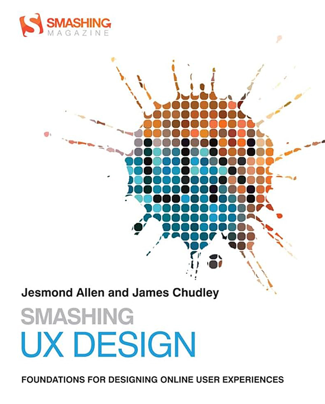<figcaption></figcaption></figure>

A special thanks to [Jesmond Allen](https://x.com/jesmond) and [James Chudley](https://x.com/chudders) for making 'Smashing UX Design' freely available to the public [via PDF download](https://jameschudley.co.uk/2023/11/21/free-download-of-smashing-ux-design/). Initially published in 2012, this book quickly became a cornerstone resource for countless UX designers, myself included. After selling over 10,000 copies, it went out of print, causing second-hand copies to skyrocket to eye-watering prices, such was its demand. Despite being over a decade old, 'Smashing UX Design' is still well worth a read today, offering practical insights into UX design principles and practices. It covers a wide range of topics, such as user research, information architecture, interaction design, and usability testing.
