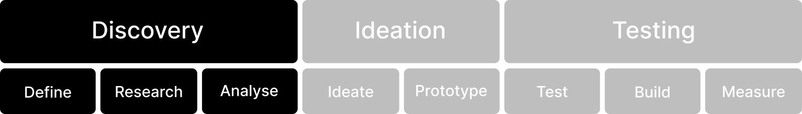

# Discovery

<figure><figcaption></figcaption></figure>


Use the expanded 'Discovery' menu to browse methods for the discovery phase


#### Define

The first phase of UX design is 'Define'. In this stage, it is vital to understand the project's goals, identify the target audience, and establish clear objectives. This sets the foundation for the entire design process, guiding decisions throughout. Defining the scope of the project, the problems to solve, and the value to be delivered.

1. **Clarify project goals**: Understand the purpose, goals, and success metrics from stakeholders.
2. **Identify user needs**: Develop initial user personas or segments to define primary user requirements.
3. **Set scope and constraints**: Establish boundaries, timelines, budget, and technical limitations.
4. **Determine KPIs**: Set key performance indicators to measure project success post-launch.
5. **Align stakeholders**: Ensure all relevant parties have a shared understanding of the project’s purpose.

#### Research

After defining the project's scope and objectives, the 'Research' phase begins. Here, insights should be gathered through various research methods like surveys, interviews, and data analysis. Understanding user needs, preferences, and pain points is crucial. This information forms the basis for design decisions and helps create solutions that resonate with audiences.

1. **Conduct user research**: Perform qualitative and quantitative research, such as interviews, surveys, or observational studies.
2. **Analyse competitors**: Study competitor solutions to identify industry standards and gaps.
3. **Document findings**: Organise insights and observations, ensuring they're accessible and actionable.
4. **Identify pain points**: Pinpoint specific challenges users face that the project could address.
5. **Map user journeys**: Outline how users currently interact with similar products or services.

#### Analyse

In the 'Analyse' phase, data and research findings should be scrutinised. Patterns, trends, and user behaviours should be identified to inform the design. This step ensures that design aligns with user needs and expectations. Collaborate with teams to make data-driven decisions and refine the design direction.

1. **Synthesise research data**: Identify trends and patterns from collected data to gain user insights.
2. **Define user personas**: Create detailed personas based on research to guide design decisions.
3. **Map user journeys**: Highlight user goals, challenges, and emotional responses.
4. **Identify opportunities**: Highlight areas for innovation or improvement based on unmet user needs.
5. **Prioritise insights**: Rank findings by impact on user experience and feasibility to guide the next stages.

#### Further Viewing



#### Further Reading










