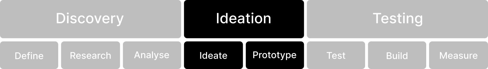

# Ideation

<figure><figcaption></figcaption></figure>


Use the 'Ideation' menu to browse methods for the ideation phase


### Ideate

The 'Ideate' phase encourages creativity and brainstorming. Generate a wide range of ideas for solving the problems identified in the previous phases. Use techniques like mind mapping, storyboarding, or brainstorming sessions to stimulate innovation. This phase is all about exploring possibilities without constraints.

1. Brainstorm solutions: Generate a broad set of potential solutions, encouraging creative thinking.
2. Explore design concepts: Begin creating low-fidelity sketches or wireframes for visual direction.
3. Collaborate cross-functionally: Engage with product, engineering, and other stakeholders to refine ideas.
4. Evaluate feasibility: Ensure ideas are technically and financially viable.
5. Narrow down concepts: Select the most promising ideas that align with user needs and project goals.





### Prototype

Once you have a set of promising ideas, it's time to create prototypes. Prototypes are preliminary versions of your design that allow you to test and validate concepts. These can range from low-fidelity sketches to high-fidelity interactive mock-ups. Prototyping helps you visualise your ideas and gather feedback before committing to a final design.

1. Build interactive prototypes: Create clickable prototypes to simulate user interaction and flow.
2. Ensure UX consistency: Align design elements to brand guidelines and established UI patterns.
3. Incorporate feedback: Quickly iterate based on input from team members and stakeholders.
4. Prepare test scenarios: Define specific user tasks and flows to evaluate in user testing.
5. Identify technical dependencies: Outline requirements or adjustments needed for the engineering team.
