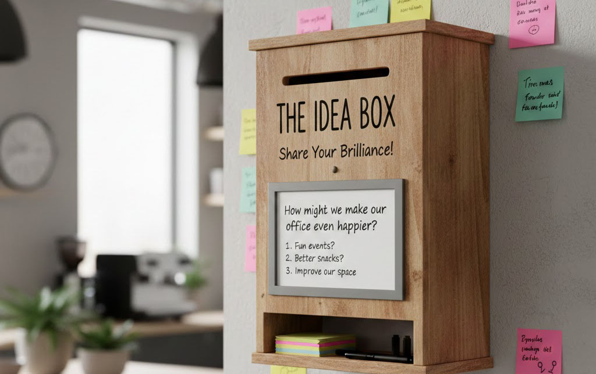

# Idea Box

<figure><figcaption>
Image by DesignReference.xyz
</figcaption></figure>

The Idea Box is a simple yet effective way to gather creative thoughts and fresh perspectives from everyone within an organisation or community.

It acts as a shared space where team members or users drop off thoughts on how to improve a product, solve a specific problem, or enhance the general environment. By opening the floor to everyone, the process becomes much more collaborative, pulling in unique viewpoints that might not surface during a formal meeting or a standard workday.

Setting up a physical Idea Box is straightforward and works well in a shared office or workshop space. A container is placed in a spot where people naturally gather, such as near a kitchen area or in a communal lounge. Small slips of paper and pens are left right next to the box so that a thought can be jotted down the moment it strikes. It is helpful to allow for anonymous submissions to make sure people feel comfortable sharing experimental thoughts or honest critiques without any pressure.

For teams that work remotely or prefer a paperless version, a digital Idea Box serves as a great alternative. This is often established using a simple online form, a shared digital whiteboard, or a specific channel in a messaging app. The benefit of a digital version is that it remains accessible at all times, regardless of location. It also allows for the inclusion of links, photos, or quick sketches to explain an idea more clearly. Digital tools often permit others to add a reaction or a quick comment, which helps the team see which suggestions are resonating most with the group.

The Idea Box is a versatile tool that extends beyond specific design projects to support long-term goals and general improvements. It is frequently used to monitor company culture, office wellbeing, or ongoing operational changes. In these cases, the box remains a permanent fixture, providing a constant channel for feedback. This ensures that the habit of sharing remains part of the daily routine, even when there is no active project deadline.

Once the box contains a collection of entries, the next step involves sorting through the submissions to decide what to act on. The ideas are gathered and reviewed at regular intervals. Each suggestion is looked at to see how much value it adds and how much work it would take to implement. The most promising ones are moved into development or prototyping, while other interesting thoughts are kept in a backlog for future inspiration. Sharing a quick update on which ideas are being moved forward helps everyone feel that their contributions are truly valued.

#### Further Reading


