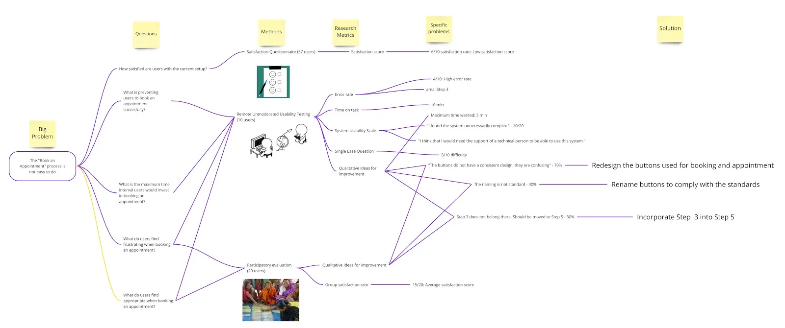

# Mind Maps


Mind Maps along with Concepts Maps are two commonly used types of Cognitive Map.&#x20;


<figure><figcaption>
Image by <a href="https://uxdesign.cc/a-mind-map-for-gaining-clarity-in-ux-research-601beb724e82">MagdaDigital</a>
</figcaption></figure>

#### What are Cognitive Maps?

A cognitive map is an internal, mental process. It refers to the way the human brain naturally encodes and perceives the world. For instance, when a person navigates their hometown without a GPS, they are using their internal cognitive map. In a UX context, a user's cognitive map is their personal understanding of how an application is structured, which exists entirely inside their head.

#### Mind Maps

Mind mapping serves as a visual technique for structuring information, helping user experience designers to brainstorm and explore complex concepts or relationships. This method begins with a single central idea or problem statement, which is then expanded upon through a radial network of related thoughts and sub-topics. It facilitates a non-linear thinking process, allowing for the rapid externalisation of ideas before they are subjected to rigorous analysis or refinement. By organising data in this manner, patterns and connections that might remain hidden in a standard list or document often become apparent.

The facilitation of a mind mapping session requires a large blank surface, such as a whiteboard or a digital canvas, and various writing tools. A core theme or problem is placed at the very centre of the workspace to act as the anchor for all subsequent branches. From this central node, primary branches are drawn to represent major categories or themes related to the main topic. These primary branches are typically labelled with single words or short phrases to maintain clarity and encourage further expansion.

Once the primary structure is established, secondary and tertiary levels of detail are added. Participants are encouraged to work quickly, adding branches as ideas occur without worrying about hierarchy or perfection in the initial stages. Use of different colours, symbols, or icons is often employed to differentiate between types of information or to highlight specific priorities within the map. This visual variety assists in cognitive processing and makes the final map easier to navigate during the review phase.

After the initial brainstorming concludes, the map undergoes a period of refinement and synthesis. Related branches are grouped together, and redundant ideas are removed or merged. The resulting diagram provides a holistic view of the subject matter, which can then be used to inform site maps, user flows, or feature prioritisation. The final output acts as a shared mental model for the design team, ensuring that all stakeholders have a common understanding of the project scope and the interconnected nature of its various components.

#### Further Viewing





#### Further Reading












